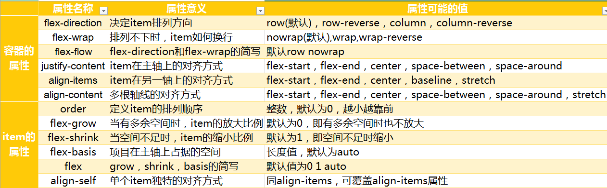
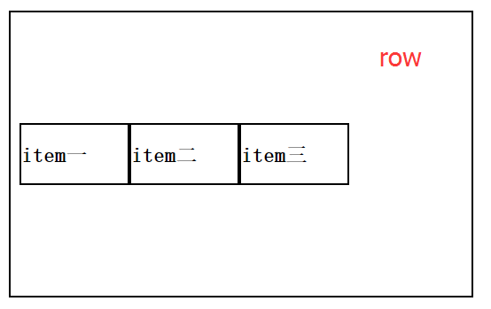
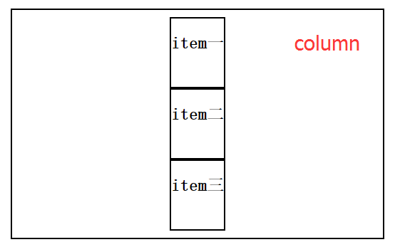
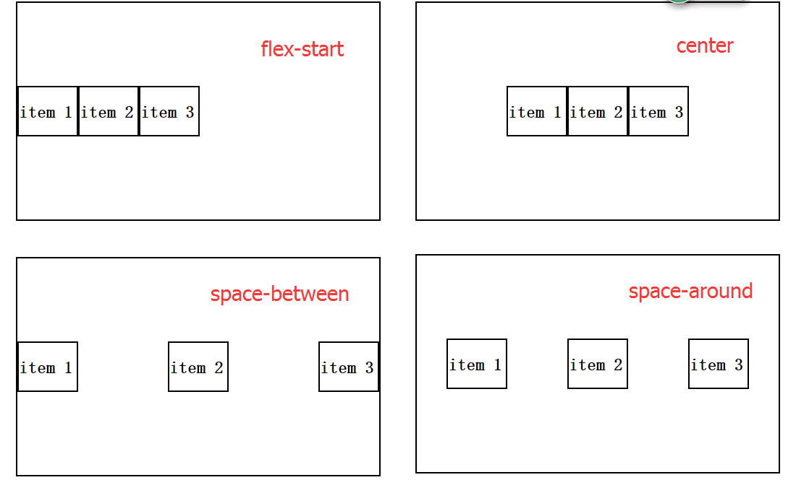
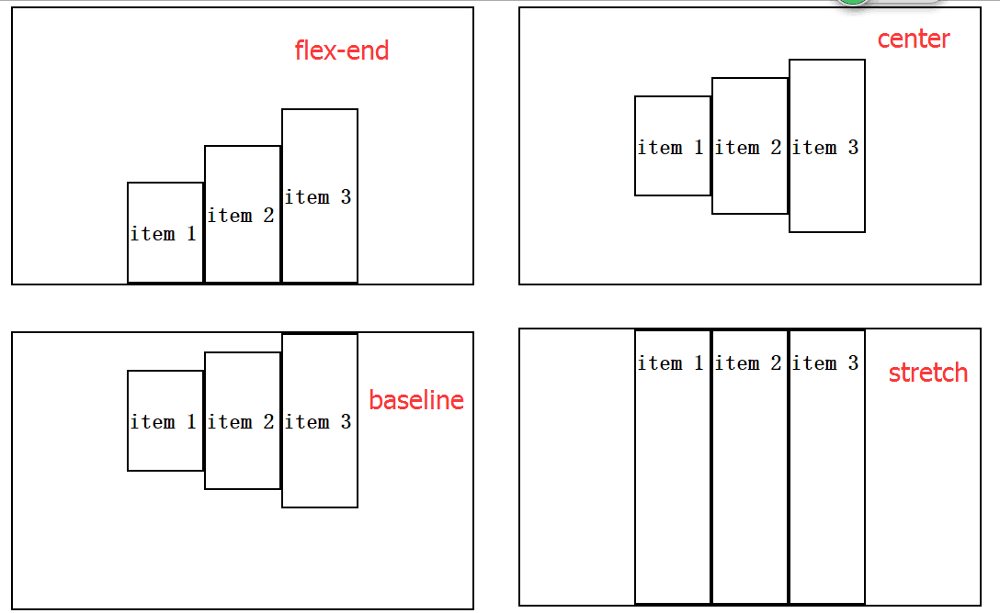
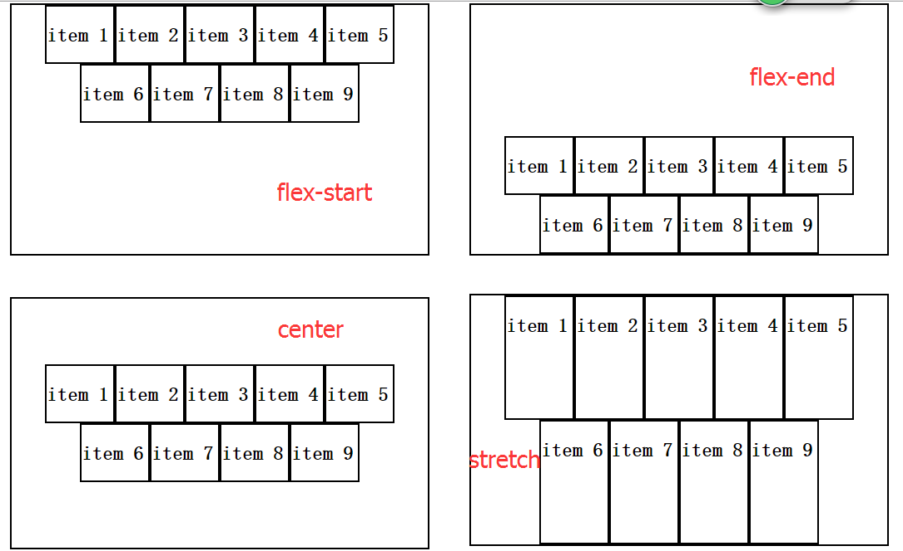
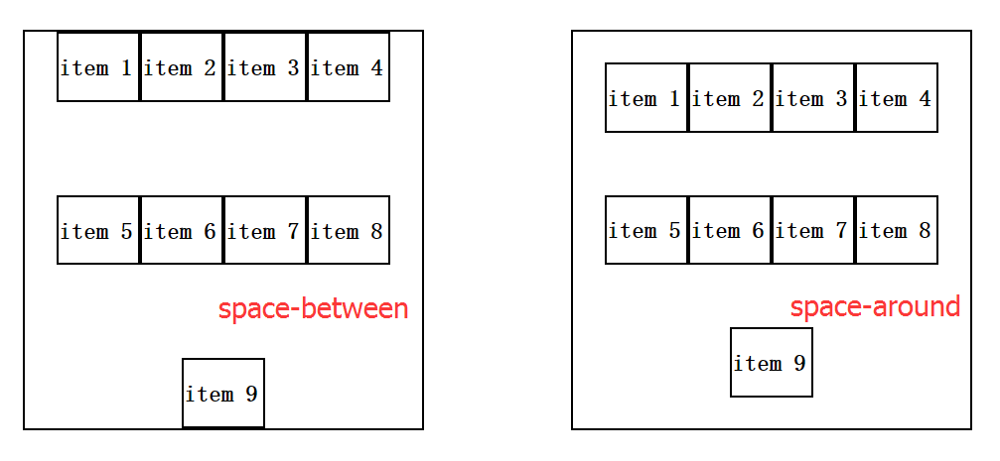
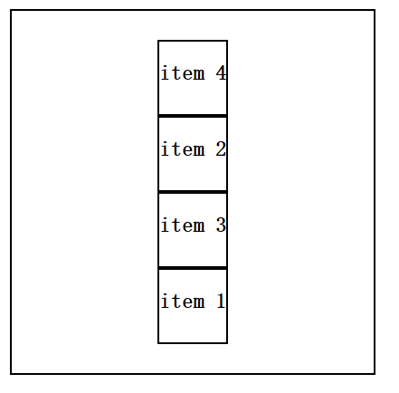
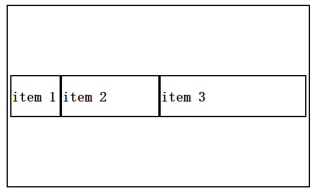
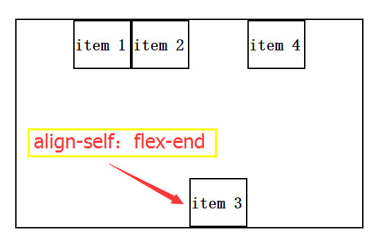

# FlexBox

- 该布局模型的目的是提供一种更加高效的方式来对容器中的条目进行布局、对齐和分配空间。<br>
在传统的布局方式中，block 布局是把块在垂直方向从上到下依次排列的；而 inline 布局则是在水平方向来排列。<br>
弹性盒布局并没有这样内在的方向限制，可以由开发人员自由操作。

- 简单、方便、快速

## 属性


1. flex-direction

决定主轴的方向，即项目排列的方向，有四个可能的值：row(默认)|row-reverse|column|column-reverse

 - row:主轴为水平方向，项目沿主轴从左至右排列

- column：主轴为竖直方向，项目沿主轴从上至下排列

- row-reverse：主轴水平，项目从右至左排列，与row反向

- column-reverse：主轴竖直，项目从下至上排列，与column反向



2. flex-wrap

默认情况下，item排列在一条线上，即主轴上，flex-wrap决定当排列不下时是否换行以及换行的方式，可能的值nowrap(默认)|wrap|wrap-reverse

- nowrap：自动缩小项目，不换行

- wrap：换行，且第一行在上方

- wrap-reverse：换行，第一行在下面



3. flex-flow

是flex-direction和flex-wrap的简写形式，如：row wrap|column wrap-reverse等。默认值为row nowrap，即横向排列 不换行。

4. justify-content

决定item在主轴上的对齐方式，可能的值有flex-start（默认），flex-end，center，space-between，space-around。当主轴沿水平方向时，具体含义为

- flex-start：左对齐

- flex-end：右对齐

- center：居中对齐

- space- between：两端对齐

- space-around：沿轴线均匀分布



　　

5. align-items

决定了item在交叉轴上的对齐方式，可能的值有flex-start|flex-end|center|baseline|stretch，当主轴水平时，其具体含义为

- flex-start：顶端对齐

- flex-end：底部对齐

- center：竖直方向上居中对齐

- baseline：item第一行文字的底部对齐

- stretch：当item未设置高度时，item将和容器等高对齐



　　


 6. align-content

该属性定义了当有多根主轴时，即item不止一行时，多行在交叉轴轴上的对齐方式。注意当有多行时，定义了align-content后，align-items属性将失效。align-content可能值含义如下（假设主轴为水平方向）：

- flex-start：左对齐

- flex-end：右对齐

- center：居中对齐

- space- between：两端对齐

- space-around：沿轴线均匀分布

- stretch：各行将根据其flex-grow值伸展以充分占据剩余空间






### flex item属性

item的属性在item的style中设置。item共有如下六种属性

1. order

order的值是整数，默认为0，整数越小，item排列越靠前，如下图所示代码如下

````
<div class="wrap">
    <div class="div" style="order:4"><h2>item 1</h2></div>
    <div class="div" style="order:2"><h2>item 2</h2></div>
    <div class="div" style="order:3"><h2>item 3</h2></div>
    <div class="div" style="order:1"><h2>item 4</h2></div>
</div>
````

　　

2. flex-grow

定义了当flex容器有多余空间时，item是否放大。默认值为0，即当有多余空间时也不放大；可能的值为整数，表示不同item的放大比例，如
````
<div class="wrap">
    <div class="div" style="flex-grow:1"><h2>item 1</h2></div>
    <div class="div" style="flex-grow:2"><h2>item 2</h2></div>
    <div class="div" style="flex-grow:3"><h2>item 3</h2></div>
</div>
````
即当有多余空间时item1、item2、和item3以1：2:3的比例放大。

3. flex-shrink

定义了当容器空间不足时，item是否缩小。默认值为1，表示当空间不足时，item自动缩小，其可能的值为整数，表示不同item的缩小比例。flex-grow

4. flex-basis

表示项目在主轴上占据的空间，默认值为auto。
````
<div class="wrap">
    <div class="div" style="flex-basis:80px"><h2>item 1</h2></div>
    <div class="div" style="flex-basis:160px"><h2>item 2</h2></div>
    <div class="div" style="flex-basis:240px"><h2>item 3</h2></div>
</div>
````


　　

5. flex

flex属性是flex-grow、flex-shrink和flex-basis三属性的简写总和。

6. align-self

align-self属性允许item有自己独特的在交叉轴上的对齐方式，它有六个可能的值。默认值为auto

- auto：和父元素align-self的值一致

- flex-start：顶端对齐

- flex-end：底部对齐

- center：竖直方向上居中对齐

- baseline：item第一行文字的底部对齐

- stretch：当item未设置高度时，item将和容器等高对齐


