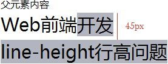

# line-height

代码：
````
<div style="line-height:150%;font-size:16px;">    
    父元素内容   
    <div style="font-size:30px;">      
        Web前端开发<br />          
        line-height行高问题    
    </div>
</div>
````
下图是当line-height:150%的效果，父元素的行高为150%时，会根据父元素的字体大小先计算出行高值然后再让子元素继承。所以当line-height:150%时，子元素的行高等于16px * 150% = 24px：


下图是当line-height:1.5em的效果，父元素的行高为150%时，会根据父元素的字体大小先计算出行高值然后再让子元素继承。所以当line-height:1.5em时，子元素的行高等于16px * 1.5em = 24px：


下图是当line-height:1.5的效果，父元素行高为1.5时，会根据子元素的字体大小动态计算出行高值让子元素继承。所以，当line-height:1.5时，子元素行高等于30px * 1.5 = 45px：


## 总结：
line-height 四种不同取值
1. normal，父、子元素的行高由浏览器分别计算得到。
2. number，父、子元素根据各自的 font-size * number 计算得到行高。
3. length（带有 css 单位，如 em，px 等），子元素直接继承父元素的行高。
4. %，子元素直接继承父元素的行高，父元素的行高根据自己的 font-size 计算得到。

- % 和 em 是按照声明 line-height 处的 font-size 计算的，<br>
line-height 为数字则是按每个元素继承或声明的 font-size 计算得到的

