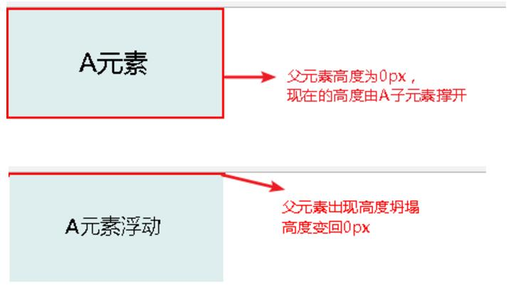
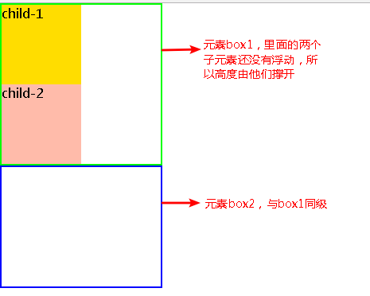
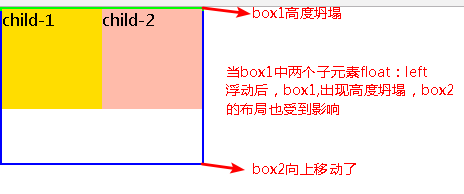
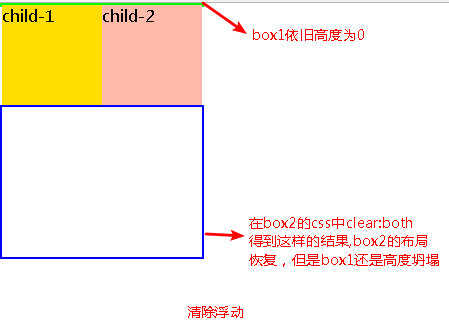
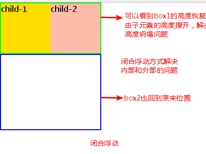

# 浮动

### 原理
使当前元素脱离普通流，相当于浮动起来一样，浮动的框可以左右移动，直至它的外边缘遇到包含框或者另一个浮动框的边缘

### 影响
- 对附近的元素布局造成改变，使得布局混乱
- 浮动后的元素可以设置宽度和高度等，也就是说元素浮动后会变成块级元素，但我更倾向于说元素变成inline-block类型的元素，即同时拥有块级与行内元素的特征
- 因为浮动元素脱离了普通流，会出现一种高度坍塌的现象：原来的父容器高度是当前元素A撑开的，但是当A元素浮动后，脱离普通流浮动起来，那父容器的高度就坍塌（前提是父容器高度小于A元素高度），<br>
下面用图来说明一下高度坍塌：



### 消除影响
- 清除浮动：使用clear元素清除外面浮动，解决外面浮动对自己的影响
- 闭合浮动：当前块级中，其子元素使用了浮动，会给当前块内部和块外部的布局带来影响，所以将当前块中的浮动闭合，能将影响最大化清除\

例子：
````
<style type="text/css">
.box1{
        width: 200px;
        border: 2px solid #0f0;
        /*overflow: hidden;*/
    }
    .box1 .child-1{
        float: left;
        height: 100px;
        width: 100px;
        background: #fd0;
    }
    .box1 .child-2{
        float: left;
        height: 100px;
        width: 100px;
        background: #fba;
    }
    .box2{
        width: 200px;
        height: 150px;
        border: 2px solid #00f;
        /* clear: both; */
    }
</style>
<body>
    <div class="box1">
        <div class="child-1">child-1</div>
        <div class="child-2">child-2</div>
    </div>
    <div class="box2"></div>
</body>
````



child-1 和 child-2 进行浮动



清除浮动：对box2使用：clear：both;【在外面解决问题，内部问题未解决】


闭合浮动：对box1使用overflow：hidden【在内部解决问题：同时解决外部问题】


### 推荐方法
- 使用伪元素：after,给box1添加上clearfloat这class即可
````
.clearfloat:after{
display:block;
height:0;
content:"";
clear:both;
visibility:hidden;
}
````
