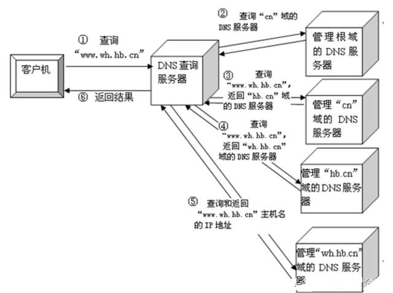
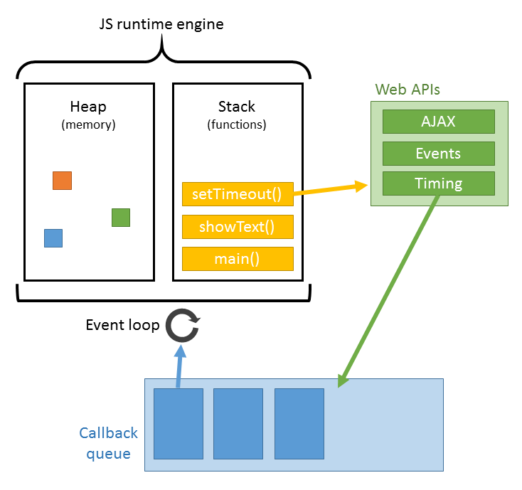

# 从输入URL到页面加载发生了什么

1. 浏览器的地址栏输入URL并按下回车。
2. 浏览器查找当前URL是否存在缓存，并比较缓存是否过期。
3. DNS解析URL对应的IP。
4. 根据IP建立TCP连接（三次握手）。
5. HTTP发起请求。
6. 服务器处理请求，浏览器接收HTTP响应。
7. 渲染页面，构建DOM树。
8. 关闭TCP连接（四次挥手）。

### URL

　　我们常见的URL是这样的:http://www.baidu.com。这个域名由三部分组成：协议名、域名、端口号，这里端口是默认所以隐藏。除此之外URL还会包含一些路径、查询和其他片段，例如：http://www.tuicool.com/search?kw=%E4%。我们最常见的的协议是HTTP协议，除此之外还有加密的HTTPS协议、FTP协议、FILe协议等等。URL的中间部分为域名或者是IP，之后就是端口号了。通常端口号不常见是因为大部分的都是使用默认端口，如HTTP默认端口80，HTTPS默认端口443。说到这里可能有的面试官会问你[同源策略](同源策略.md)，以及跨域问题。

### 缓存
HTTP缓存有多种规则，根据是否需要重新向服务器发起请求来分类，我将其分为强制缓存，对比缓存。
#### 强制缓存
　　强制缓存判断HTTP首部字段：[cache-control，Expires](Expires&cache-control.md)

　　Expires是一个`绝对时间`，即服务器时间。浏览器检查当前时间，如果还没到失效时间就直接使用缓存文件。但是该方法存在一个问题：服务器时间与客户端时间可能不一致。因此该字段已经很少使用。

　　cache-control中的max-age保存一个`相对时间`。例如Cache-Control: max-age = 484200，表示浏览器收到文件后，缓存在484200s内均有效。 如果同时存在cache-control和Expires，浏览器总是优先使用cache-control。
#### 对比缓存
   对比缓存通过HTTP的last-modified，Etag字段进行判断。

　　last-modified是第一次请求资源时，服务器返回的字段，表示最后一次更新的时间。下一次浏览器请求资源时就发送if-modified-since字段。服务器用本地Last-modified时间与if-modified-since时间比较，如果不一致则认为缓存已过期并返回新资源给浏览器；如果时间一致则发送304状态码，让浏览器继续使用缓存。

　　Etag：资源的实体标识（哈希字符串），当资源内容更新时，Etag会改变。服务器会判断Etag是否发生变化，如果变化则返回新资源，否则返回304。

### DNS解析

   域名解析的过程实际是将域名还原为IP地址的过程。

　　首先浏览器先检查本地hosts文件是否有这个网址映射关系，如果有就调用这个IP地址映射，完成域名解析。

　　如果没找到则会查找本地DNS解析器缓存，如果查找到则返回。

　　如果还是没有找到则会查找本地DNS服务器，如果查找到则返回。

　最后迭代查询，按根域服务器 ->顶级域名->二级域名 ->三级域名的顺序找到IP地址。

### TCP连接
HTTP协议是使用TCP作为其传输层协议的，当TCP出现瓶颈时，HTTP也会受到影响。

#### 连接过程
在通过第一步的DNS域名解析后，获取到了服务器的IP地址，在获取到IP地址后，便会开始建立一次连接，这是由TCP协议完成的，主要通过三次握手进行连接。

　　- 第一次握手： 建立连接时，客户端发送syn包（syn=j）到服务器，并进入SYN_SENT状态，等待服务器确认； 

　　- 第二次握手： 服务器收到syn包，必须确认客户的SYN（ack=j+1），同时自己也发送一个SYN包（syn=k），即SYN+ACK包，此时服务器进入SYN_RECV状态；

　　- 第三次握手： 客户端收到服务器的SYN+ACK包，向服务器发送确认包ACK(ack=k+1），此包发送完毕，客户端和服务器进入ESTABLISHED（TCP连接成功）状态，完成三次握手。

　　完成三次握手，客户端与服务器开始传送数据。

### HTTP请求
这部分又可以称为前端工程师眼中的HTTP，它主要发生在客户端。 
发送HTTP请求的过程就是构建HTTP请求报文并通过TCP协议中发送到服务器指定端口(HTTP协议80/8080, HTTPS协议443)。 
HTTP请求报文是由三部分组成: 请求行, 请求报头和请求正文。 

### 浏览器接收响应
服务器在收到浏览器发送的HTTP请求之后，会将收到的HTTP报文封装成HTTP的Request对象，并通过不同的Web服务器进行处理，处理完的结果以HTTP的Response对象返回。
HTTP响应报文也是由三部分组成: [状态码](HTTP状态码.md), 响应报头和响应报文。

### 浏览器解析渲染页面

浏览器是一个边解析边渲染的过程。 
首先浏览器解析HTML文件构建DOM树，然后解析CSS文件构建渲染树，等到渲染树构建完成后，浏览器开始布局渲染树并将其绘制到屏幕上。这个过程比较复杂，涉及到两个概念: reflow(回流)和repain(重绘)。 
DOM节点中的各个元素都是以盒模型的形式存在，这些都需要浏览器去计算其位置和大小等，这个过程称为reflow; 
当盒模型的位置,大小以及其他属性，如颜色,字体,等确定下来之后，浏览器便开始绘制内容，这个过程称为repain。 
页面在首次加载时必然会经历reflow和repain。 
reflow和repain过程是非常消耗性能的，尤其是在移动设备上，它会破坏用户体验，有时会造成页面卡顿。所以我们应该尽可能少的减少reflow和repain。

JS的解析是由浏览器中的JS解析引擎完成的。 
JS是单线程运行，也就是说，在同一个时间内只能做一件事，所有的任务都需要排队，前一个任务结束，后一个任务才能开始。但是又存在某些任务比较耗时，如IO读写等。 
所以需要一种机制可以先执行排在后面的任务，这就是：同步任务(synchronous)和异步任务(asynchronous)。 
[JS的执行机制](../Js/JS运行机制.md)就可以看做是一个主线程加上一个任务队列(task queue)。同步任务就是放在主线程上执行的任务，异步任务是放在任务队列中的任务。 
所有的同步任务在主线程上执行，形成一个执行栈;异步任务有了运行结果就会在任务队列中放置一个事件；脚本运行时先依次运行执行栈，然后会从任务队列里提取事件，运行任务队列中的任务，这个过程是不断重复的，所以又叫做事件循环(Event loop)。

### 关闭连接
通过四次挥手关闭连接(FIN ACK, ACK, FIN ACK, ACK)。

　　第一次挥手是浏览器发完数据后，发送FIN请求断开连接。

　　第二次挥手是服务器发送ACK表示同意，如果在这一次服务器也发送FIN请求断开连接似乎也没有不妥，但考虑到服务器可能还有数据要发送，所以服务器发送FIN应该放在第三次挥手中。

　　这样浏览器需要返回ACK表示同意，也就是第四次挥手。

