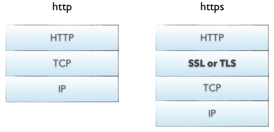

# HTTPS
HTTP报文是包裹在TCP报文中发送的，服务器端收到TCP报文时会解包提取出HTTP报文。但是这个过程中存在一定的风险，HTTP报文是明文，如果中间被截取的话会存在一些信息泄露的风险。那么在进入TCP报文之前对HTTP做一次加密就可以解决这个问题了。HTTPS协议的本质就是HTTP + SSL(or TLS)。在HTTP报文进入TCP报文之前，先使用SSL对HTTP报文进行加密。从网络的层级结构看它位于HTTP协议与TCP协议之间。



HTTPS过程

- HTTPS在传输数据之前需要客户端与服务器进行一个握手(TLS/SSL握手)，在握手过程中将确立双方加密传输数据的密码信息。TLS/SSL使用了非对称加密，对称加密以及hash等。具体过程请参考经典的阮一峰先生的博客TLS/SSL握手过程。
- HTTPS相比于HTTP，虽然提供了安全保证，但是势必会带来一些时间上的损耗，如握手和加密等过程，是否使用HTTPS需要根据具体情况在安全和性能方面做出权衡。

````
https的握手过程(简易版）
参考自:https://www.cnblogs.com/fengfengyang/p/9852481.html
1.客户端提交https请求
2.服务器响应客户,并把服务器公钥发给客户端
3.客户端验证公钥的有效性
4.有效后，客户端会生成一个会话密钥(一个随机数)
5.用服务器公钥加密这个会话密钥后，发送给服务器
6.服务器收到公钥加密的密钥后，用私钥解密，获取会话密钥
7.客户端与服务器利用会话密钥对传输数据进行对称加密通信
````

#### HTTPS 防范中间人攻击原理
HTTPS因为增加了CA证书，可以在会话前通过证书验证证明通信的彼此就是所声称的人，因此可以防范中间人攻击。
这种防范中间人攻击的前提是在HTTPs协议的双向认证上。如果仅仅实现了HTTPs的单向认证，如不验证客户端，只验证服务器，这种情况下还是不能抵御中间人攻击的，
这种情况下就会出现SSL剥离攻击（SSLTrip）和SSL劫持攻击（使用各种代理软件，如burpsuit或Filder等）。

SSL剥离攻击剥离SSL协议，表现为用户和攻击者之间使用HTTP，攻击者和服务器之间使用https协议。

SSL劫持攻击表现为用户和攻击者之间使用攻击者伪造的CA证书使用其https协议进行通信，（其中重要的步骤是把burpsuit的CA根证书导入用户浏览器，这样用户浏览器就能信任假CA发给中间人的证书(即信任中间人burpsuit)，建立客户端和中间人之间的会话信道）。
而攻击者和服务器之间使用真正的CA证书创建的对称秘钥进行加密，攻击者收到客户端信息先用前者会话秘钥解密，再使用后者之间的会话秘钥加密。这样使得客户端和服务器都以为是和真正的对方通信。

为了防止SSL剥离攻击，可以
（1）在服务器上开启HSTS(HTTP Strict Transport Security, HTTP 严格传输安全)，使服务器只接收使用HTTPS的连接。
（2）将 HSTS 站点列表内置到浏览器中，这样只要浏览器离线判断该站点启用了 HSTS，就会跳过原先的 HTTP 重定向，直接发起 HTTPS 请求。

为了防止SSL劫持攻击，目前我只能想到使用https双向认证，其他还没想到。