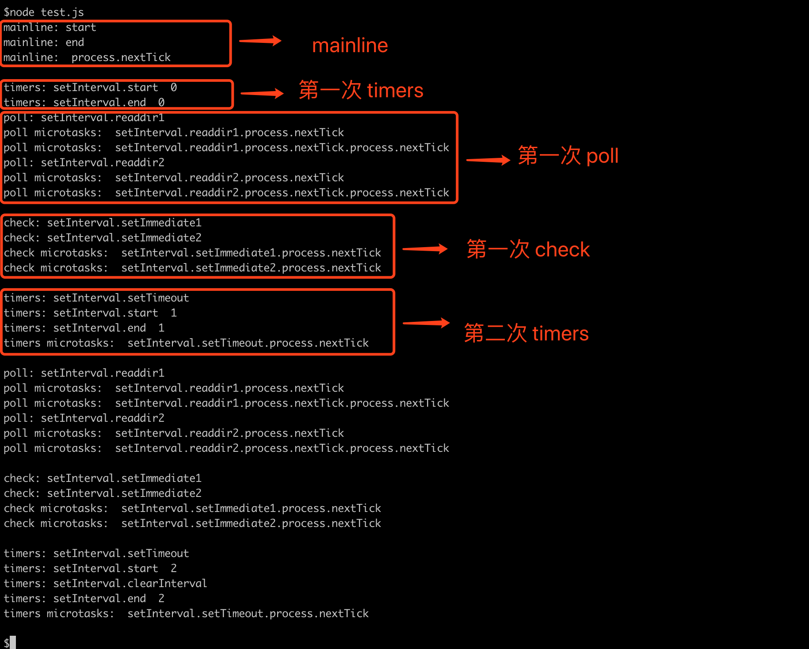

+ 浏览器端和node端的eventLoop有什么不同？
````
1. 浏览器端和node端的eventLoop是不同的，实现的机制也不太一样
2. node端的eventLoop的可以理解成有4个宏任务队列（timer、poll（I/O）、check、close callbacks）和两个微任务队列(next tick task和other microTask)，
   但执行的宏任务有6个阶段
3. node中先执行全局的script代码，执行完同步代码以后清空栈后，先从nextTick queue中依次取出所有的任务放到调用栈中执行，再从other microTask
    queue中依次取出所有的任务放到调用栈中执行。然后开始宏任务的6个阶段，每个阶段都将该宏任务队列的所有任务取出来执行（浏览器端不一样，只取一个）。
    每个阶段执行完毕后，开始执行微任务，再开始执行下一阶段的宏任务。
````

+ nextTick
````
是当前阶段执行调用 不属于6个阶段中的任何一个阶段
在node v11中，当前阶段不把nextTick执行完是不会进到下一个阶段的

setTimeout(() => {
    console.log(1);
})
setImmediate(() => {
    console.log(2);
    process.nextTick(() => {
        console.log(3);
    })
})
// 2 3 1

可以把promise当成nextTick理解
setTimeout(() => {
    console.log(1);
})
setImmediate(() => {
    console.log(2);
    Promise.resolve().then(() => {
        console.log(3);
    })
})
// 2 3 1
````

+ setTimeout 和 setImmediate
````
setTimeout(() => {
  console.log('timeout');
}, 0);

setImmediate(() => {
  console.log('immediate');
});
这样运行两个方法的执行顺序是不确定，因为可能受到其他执行程序的影响。
因为 setTimeout中的callback是在timer phase中执行的，而setImmediate是在check阶段执行的，eventLoop的开始会检查timer阶段，但是在开始之前到timer会消耗一定的时间，
所以就会出现两种情况：
1. timer前的准备时间超过1ms，则执行timer阶段(setTimeout)的回调函数
2. timer前的准备时间小于1ms，则先执行check阶段（setImmediate）的回调函数

setTimeout(() => {
  console.log('timeout');
}, 0);

setImmediate(() => {
  console.log('immediate');
});
const start = Date.now();
while(Date.now() - start < 10); // 执行时间小于10ms的情况延时到10ms
运行的结果是：timeout，immediate


但是在I/O模块中，setImmediate一定会在setTimeout之前执行：
const fs = require('fs');

fs.readFile(__filename, () => {
  setTimeout(() => {
    console.log('timeout');
  }, 0);
  setImmediate(() => {
    console.log('immediate');
  });
});
运行的结果是：immediate， timeout
````

+
````
console.time('start');

setTimeout(function(){
  console.log(2)
}, 10)

setImmediate(function() {
  console.log(1)
})

new Promise(function(resolve) {
  console.log(3)
  resolve()
  console.log(4)

}).then(function() {
  console.log(5)
  console.timeEnd('start')
})

console.log(6)
process.nextTick(function() {
  console.log(7)
})
console.log(8)

3 4 6 8 7 5 1 2
````

+ poll阶段：若回调中触发了相应的微任务，这里的微任务执行时机和其他地方有所不同，不会等到所有回调执行完毕后才执行，而是针对每一个回调执行完毕后，就执行相应微任务。

````
 // test.js
 const fs = require('fs');

 console.log('mainline: start')
 process.nextTick(() => {
   console.log('mainline: ', 'process.nextTick\n')
 })

let counter = 0;
const interval = setInterval(() => {
  console.log('timers: setInterval.start ', counter)
  if(counter < 2) {
    setTimeout(() => {
      console.log('timers: setInterval.setTimeout')
      process.nextTick(() => {
        console.log('timers microtasks: ', 'setInterval.setTimeout.process.nextTick\n')
      })
    }, 0)

    fs.readdir('./', (err, files) => {
      console.log('poll: setInterval.readdir1')
      process.nextTick(() => {
        console.log('poll microtasks: ', 'setInterval.readdir1.process.nextTick')
        process.nextTick(() => {
          console.log('poll microtasks: ', 'setInterval.readdir1.process.nextTick.process.nextTick')
        })
      })
    })

    fs.readdir('./', (err, files) => {
      console.log('poll: setInterval.readdir2')
      process.nextTick(() => {
        console.log('poll microtasks: ', 'setInterval.readdir2.process.nextTick')
        process.nextTick(() => {
          console.log('poll microtasks: ', 'setInterval.readdir2.process.nextTick.process.nextTick\n')
        })
      })
    })

    setImmediate(() => {
      console.log('check: setInterval.setImmediate1')
      process.nextTick(() => {
        console.log('check microtasks: ', 'setInterval.setImmediate1.process.nextTick')
      })
    })

    setImmediate(() => {
      console.log('check: setInterval.setImmediate2')
      process.nextTick(() => {
        console.log('check microtasks: ', 'setInterval.setImmediate2.process.nextTick\n')
      })
    })
  } else {
    console.log('timers: setInterval.clearInterval')
    clearInterval(interval)
  }

  console.log('timers: setInterval.end ', counter)
  counter++;
}, 0);

 console.log('mainline: end')
 
 
如图 mainline：可以看到，主线程中的 process.nextTick 是在同步代码执行完之后以及在事件循环之前执行，符合预期。

如图 第一次 timers：此时事件循环第一次到 Timers 阶段，setInterval 的 delay 时间到了，所以执行回调，由于没有触发直接相应的微任务，所以直接进入后面的阶段。

如图 第一次 poll：此时事件循环第一次到 Poll 阶段，由于之前 Timers 阶段执行的回调中，触发了两个非阻塞的I/O操作（readdir），在这一阶段时I/O操作执行完毕，直接执行了对应的两个回调。从输出可以看出，针对每一个回调执行完毕后，就执行相应微任务，微任务中再次触发微任务也会继续执行，并不会等到所有回调执行完后再去触发微任务，符合预期。执行完毕所有回调之后，因为还有调度了计时器，所以 Poll 阶段结束，进入 Check 阶段。

如图 第一次 check：此时事件循环第一次到 Check 阶段，直接触发对应的两个 setImmediate 执行。从输出可以看出，微任务是在所有的回调执行完毕之后才触发执行的，符合预期。执行完微任务后，进入后面阶段。

如图 第二次 timers：此时事件循环第二次到 Timers 阶段，首先输出了 "timers: setInterval.setTimeout" ，这是为什么？不要忘了，之前第一次执行 setInterval 的回调时，其实已经执行了一次其内部的 setTimeout(..., 0)，但由于它并不能触发微任务，所以其回调没有被执行，而是进入到了后面的阶段，而是等到再次来到 Timers 阶段，根据FIFO，优先执行之前的 setTimeout 的回调，再执行 setInterval 的回调，而最后等所有回调执行完毕，再执行 setTimeout 的回调里面触发的微任务，最后输出的是 "timers microtasks: setInterval.setTimeout.process.nextTick"，符合预期（所有回调执行完毕后，再执行相应微任务）。
````

