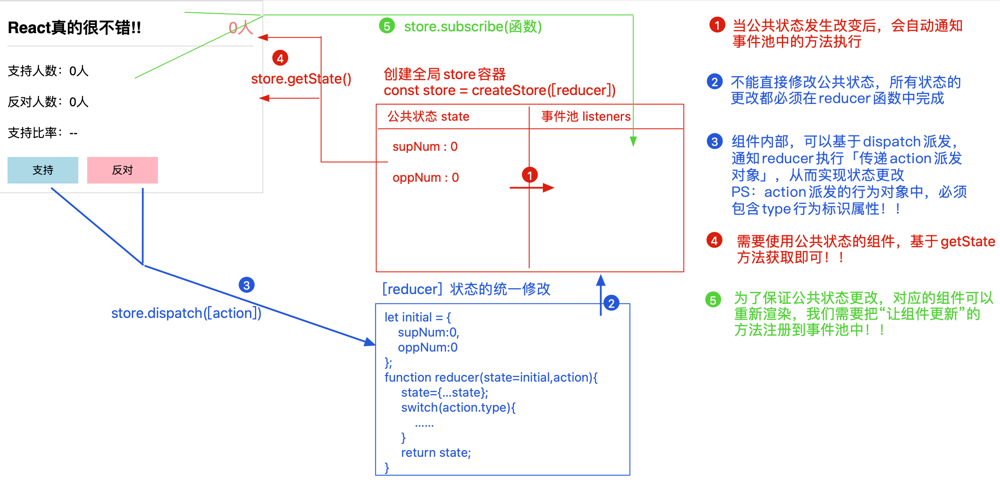

+ JSX语法底层渲染机制
````
三步：
1. 基于babel-preset-react-app语法包，可以把jsx语法渲染解析为React.createElement格式
    遇到"HTML标签/调用组件标签"，就会创建为createElement格式
    React.createElement(
        标签名/组件,
        属性对象：对象中包含标签上设置的各个属性（没有则为null），
        后续参数都是其子节点
    )
    
2. 把React.createElement方法执行，创建出'JSX元素对象/虚拟DOM对象/React child'
    {
      $$typeof: Symbol(react.element)，
      type: "div", // 标签名/组件
      props: {
        含解析出来的各个属性，
        如果有子节点，则多一个children属性（没有子节点就没有这个属性），属性可能是一个值或者是一个数组
      }，
      ref： null，
      key： null
    }
    
3. root.render 把虚拟dom对象转换为真实dom对象，放在浏览器中渲染
````

+ 组件
````
三种形式：
1. 函数组件 是静态组件
   + 不具备状态、生命周期函数、ref等内容
   + 第一次渲染完毕，除非父组件控制其重新渲染，否则内容不会再更新
   + 优势： 渲染速度快
   + 弊端： 静态组件，无法实现组件动态更新
   
    // Demo.jsx
    import React from 'react';
    import PropTypes from 'prop-types';
    
    const Demo = function Demo(props) {
        // let children = props.children; // 获取到的值有可能是undefined/一个值/一个数组
        let children = React.Children.toArray(props.children), // 将子节点转换成数组形式，可以保证children是个数组
            headSlot = children.filter(item => item.props.slot === 'head'), // 筛选出对应的slot 模拟实现具名插槽
            footSlot = children.filter(item => item.props.slot === 'foot')
        let {x} = props
        return <div>
            {headSlot}
            {x}
            {footSlot}
         </div>
    }
    // 给props设置默认值
    Demo.defaultProps = {
        num: 100
    }
    // 给props设置规则
    Demo.propTypes = {
        x: PropTypes.number.isRequired,
        y: PropType.string,
        arr: PropType.array
    }
    
    export default Demo;
    
    // index.jsx
    ...
    root.render(
    <>
        <demo x={100} y='30' arr={[10,20,30]}>
            <div slot='head'>head</div>
            <div slot='foot'>foot</div>
        </demo>
    </>
);
````
````
2. 类组件 是动态组件
    + 具备属性及规则校验
    + 具备状态、修改状态可以控制视图更新：setState、forceUpdate
    + 具备ref可以获取dom元素或者组件实例
    + 具备周期函数可以灵活掌控不同阶段处理不同事情
    + 流程繁琐，渲染速度相对较慢
    + 基于面向对象编程思想设计，更方便实现继承
    
    // Demo.jsx
    improt React from 'react';
    import PropTypes from 'prop-types';
    
    class Demo extends React.Component{
        // 属性规则处理
        static defaultProps = {
            x: 0,
            y: 0
        }
        static propTypes = {
            x: PropTypes.number,
            y: PropTypes.number
        }
        
        // 状态
        state = {
            num: 10
        }
    
        constructor(props) {
            super(); // 根据es6继承原则 一旦写了constructor就要先执行super
            
        }
        
        componentDidMount() {
            console.log('第一次渲染完')
        }
        
        shouldComponentUpdate(nextProps, nextState) {
            console.log(this.props, this.state); // 原有的属性和状态
            console.log(nextProps, nextState); // 即将要修改的属性和状态
            return true;
        }
        
        componentDidUpdate() {
            console.log('视图更新完毕')
        }
        
        render() {
            let { num } = this.state;
            return <div>
                {num}
                <br/>
                <button onClick={() => {
                    // this.state.num = 200;
                    // this.forceUpdate(); // 控制视图强制更新
                    
                    this.setState({
                        num: 200
                    }, () => {
                        console.log('setState回调函数')
                    }) // setState修改状态的同时，也可以控制视图的更新
                }}>
            </div>
        }
    };
    export default Demo;


流程：
new Demo([props]){
    1. getDefalutProps && 属性规则校验
    2. 初始化
        + 把constructor执行，把处理好的props传递给constructor
            + super()等价于React.Component.call(this) 
                -> 这样的this.props = undefined
            + super(props) 此处直接把传递进来的props挂载到实例上
                -> this.props = {...}
        + 初始化状态 this.state = {...}
    3. 初始化结束后，会把props/context这些信息挂载到实例上
    4. 触发一个周期函数 componentWillMount：第一次渲染之前
                        + 不安全的周期函数 建议放弃这个周期函数
    5. 触发render周期函数
        + 把render执行返回的jsx元素对象(虚拟dom对象)进行渲染解析
        + render必须要有，必选返回jsx
    6. 触发componentDidMount周期函数：第一次渲染完
        + 获取真实dom元素
        + 从服务器获取数据
        + 设置定时器或者监听器
        + ...
}
````

+ setState
````
基于setState修改状态，通知更新视图
    1. 触发shouldComponentUpdate：是否允许更新
        + 返回true：允许更新，继续执行后续步骤
        + 返回false：停止更新，状态/属性值也不会修改，视图不会更新
        + 可以基于这个周期函数做项目优化
        + 进行到这一步，状态和属性还没有改为最新的值
    2. 触发componentWillUpdate：不安全的
        + 进行到这一步，状态和属性还没有改为最新的值
    3. 修改状态/属性值为最新值，基于this.state/this.props访问获取到也是最新值
    4. 触发render：让视图按照最新的值进行渲染更新
    5. 触发componentDidUpdate：视图更新完毕
    6. 如果setState设置了回调函数，则把回调函数触发执行 类似于vue中的$nextTick()
        + 及时shouldComponentUpdate返回的是false，此回调函数也会触发执行

在react18中，对于setState操作采用了批处理（异步更新）：
+ 构建了队列机制
+ 统一更新，提高视图更新的性能
+ 处理流程更加稳健

...
state = {
    num: 0
}
componentDidMount() {
    for(let i = 0; i < 10; i++) {
        this.setState((prevState) => {
            return {
                num: prevState.num + 1 // 因为是批处理，还没统一更新，所以prevState是上一次更改的状态值
            }
        })
    }
}


使用flushSync强制刷新
import {flushSync} from 'react-dom'
...
state = {
    x: 10, y: 5, z: 0
}
handler = () => {
    let {x, y, z} = this.state
    this.setState({x: x+1})
    flushSync(() => {
        this.setState({y: y+1})
    }) 
    // flushSync回使队列强制更新一次 x->11 y-> 6 render
    
    this.setState({z: z+ 1})
    console.log(this.state) // {x: 11, y: 6, z: 0}
    
    // 当前上下文代码执行完成 刷新一次队列 z -> 1 render
}

````

````
基于forceUpdate强制让视图更新
    1. 直接跳过触发shouldComponentUpdate，继续下一步操作
    ...跟setState一样
````

````
组件销毁
    1. 触发componentWillUnmount周期函数：销毁之前
        + 把手动设置的事件、定时器、监听器..手动释放掉来优化性能
        + 对目前组件中的一些信息做缓存（例如做草稿箱）
        + ...
    2. 销毁
````

+ pureComponent
````
继承React.PrueComponent，会默认创建一个shouldComponentUpdate周期函数，他默认在这个
周期函数中，做了一个浅比较：拿最新要修改的属性和状态和之前的属性状态进行比较，如果一样则不更新
````

+ ref相关操作：
````
    1.ref={函数}，在视图渲染的时候，会把这个函数执行，传递进来的实参就是当前标签的dom元素对象，我们把其赋值给实例的一个私有属性即可
    ...
    handler = () => {
        console.log(this.box); // <span>0</span>
    }
    render() {
        return <div>
            <span ref={x => this.box = x}>0</span>
        </div>
    }
    ...
    
    2. 基于createRef创建一个ref对象，把对象赋值给元素标签的ref属性；这样对应的dom元素会绑定给ref对象的current属性
    ...
    box = createRef();
    handler = () => {
        console.log(this.box.current); // 对应实例
    }
    render() {
        return <div>
            <span ref={this.box}>0</span>
        </div>
    }
    ...
    
    基于ref获取子组件实例
        把ref赋值给标签：获取dom元素
        把ref赋值给类组件： 获取类组件实例
        把ref赋值给函数组件： 报错 
        (遇到ref赋值给函数组件往往不是为了获取函数组件本身的东西，而是基于forwardRef实现ref的转发，既是获取函数组件内部的某些元素)
    ...
    ch1 = createRef();
    ch2 = createRef();
    render() {
        return <div>
            <Child ref={this.ch1} />
            <Child ref={this.ch2} />
    }
    ...
    
    //Child2.jsx
    const Child2 = function Child(props, ref) {
        return <div>
            <div className="box" ref={ref}></div>
        </div>
    };
    export default forwardRef(Child2);


````

+ 合成事件
````
...
handler = (x, y, ev) => {
    console.log(x, y, ev)
}
render() {
    return <div>
        <button onClick={this.handler.bind(null, 10, 20)}>点击</button> 
        // 利用bind的预处理原则 如果不用bind则在编译时候就执行了handler函数而不是点击才执行
    </div>
}

事件的执行顺序为原生事件先执行，合成事件后执行，合成事件会冒泡绑定到 document 上，所以尽量避免原生事件与合成事件混用，如果原生事件阻止冒泡，可能会导致合成事件不执行，
因为需要冒泡到document 上合成事件才会执行。

````

````
3. Hooks组件 基于React中提供的Hook函数，可以让函数组件动态化
基础Hook
+ useState 使用状态管理
+ useEffect 使用周期函数
+ useContext 使用上下文信息

额外的Hook
+ useReducer useState的替代方案，借鉴Redux处理思想，管理更复杂的状态和逻辑
+ useCallback 构建缓存优化方案
+ useMemo 构建缓存优化方案
+ useRef 使用ref获取DOM
+ useImperativeHandle 配合forwardRef一起使用
+ useLayoutEffect 与useEffect相同，但会在所有DOM变更之后同步调用effect
...
````

+ useState
````
作用：在函数组件中使用状态，修改状态值可让函数组件更新，类似于类组件中的setState
eg：const [num, setNum] = useState(10);// 返回一个state 以及更新state的函数
+ 更新state的函数不像类组件中的this.setState一样，他不支持部分状态修改

...
let [state, setState] = useState({
    x: 10,
    y: 20
})
const handler = () => {
    setState({
        ...state,
        x: state.x + 1
    })
}
return <div>
    {state.x}{state.y}
    <button onClick={handler}></button>
</div>
...
+ 推荐分开使用useState，实现多状态管理
...
let [x, setX] = useState(10), [y, setY] = useState(20)
...
+ react18 建立了更新队列，实现批处理（修改状态方法是异步操作的）
+ react16 出现在合成事件、周期函数中的状态更新，使用的是更新队列和批处理；但是出现在其他异步操作中，更新状态的方法是同步处理的

+ 如果下一个方法执行的时候可以获取上个方法已经处理好的值 => 函数式更新
...
const handler = () => {
    for (let i = 0; i < 10; i++) {
        setNum(num => {
            return num + 1;
        })
    }
}
...
+ 可以基于flushSync刷新渲染队列

+ 惰性初始state
如果初始state需要通过复杂计算获得，可以传入一个函数，在函数中计算并返回初始的state，此函数只在初始渲染时被调用
...
export default function demo(props) {
    let [num, setNum] = useState(() => {
        let {x, y} = props;
        return x + y
    })
}
...

+ 性能优化
调用state hook的更新函数，并传入当前state时(更新的值跟当前的值一样)，react将跳过组件的渲染（函数不会执行）（因为react使用Object.is比较算法来比较新老state，不是因为dom-diff!）
【类组件中，当新老状态值相同，在没有设置shouldComponentUpdate或者继承pureComponent的前提下，render还会执行，重新生成新的虚拟dom，只不过和之前的虚拟dom一模一样，不需要更新真实dom】
````

+ useEffect
````
作用： 在函数组件中使用生命周期函数
useEffect只能出现在函数组件的最外层，不能嵌套在判断、循环等操作中

...
// 第一次渲染完 && 每一次更新完 触发更新
useEffect(() => {
    console.log()
})
...
...
// 第一次渲染完 触发更新
useEffect(() => {
    console.log()
}, []) // 没填依赖项
...
...
// 第一次渲染完 && num状态改变 触发更新
useEffect(() => {
    console.log()
}, [num]) // 依赖项为num
...

...
let [data, setData] = useState([])
// 第一次渲染完成 从服务器获取数据
useEffect(() => {
    queryData().then(value => {
        setData(value)
    })
}, [])
...
...
let [data, setData] = useState([])
// 第一次渲染完成 从服务器获取数据
useEffect(() => {
    const next = async () => {
        let result = await queryData();
        setData(result);
    }
    next();
}, [])
// 不可以直接将async/await写在useEffect的callback函数上面
...

useEffect里面的callback的return相当于vue里面的unmounted，是在销毁后执行的

useEffect原理：
函数组件在渲染/更新期间，遇到useEffect操作，会基于MountEffect方法把callback和依赖项加入到effect链表中

在视图渲染完毕后，基于UpdateEffect方法，通知链表中的方法执行
1. 按照顺序执行期间，首先会检测依赖项的值是否有更新【有容器专门记录上一次依赖项的值】；有更新则把对应callback执行，没有则继续处理下一项
2. 遇到依赖项是空数组的，则只在第一次渲染完毕时，执行相应的callback
3. 遇到没有设置依赖项的，则每一次渲染完毕时都执行相应的callback


````

+ useLayoutEffect
````
useEffect向effect链表中增加的callback函数，会在真实dom已经彻底渲染完毕后触发执行
useLayoutEffect向effect链表中增加的callback函数，在视图编译完，还没有渲染真实dom之前，触发执行
````

+ useRef
````
在函数组件中，可以基于useRef获取dom元素
类似的方法有：
1. ref = {x => this.box = x}
2. React.creatRef 

+ creatRef每次渲染都会返回一个新的引用
+ useRef每次都会返回相同的引用

+ 如果子组件是个类组件，我们为其设置ref，最后获取的是子组件的实例【可以调用子组件商提供的属性和方法】
+ 函数子组件不能直接为其设置ref（会报错）；可以用forwardRef函数包起来


+ useImperativeHandle可以在让你使用ref时自定义暴露给父组件的实例值（与forwardRef一起使用），实现ref转发
基于forwardRef和useImperativeHandle就可以实现父组件调用子组件中的方法
...
const Child = forwardRef(function Child (props, ref) {
    const submit = () => {}
    
    useImperativeHandle(ref, () => {
        return {
            submit,
            name: 'Child'
        }
    }); // 实现父组件调用子组件中的方法
    return <div>
    </div>
});
export default function Demo() {
    const box = useRef(null);
    
    useEffect(() => {
        box.current.submit();
    })
    
    return <div>
        <Child ref={box} />
    </div>
}
...

````

+ useMemo
````
实现数据的缓存
场景：视图需要呈现的内容是经过复杂且大量消耗性能的计算得来的

...
let [x, setX] = useState(10);
let [y, setY] = useState(20);

const cacheVal = useMemo(() => {
    // 经过复杂的计算 依赖于x
    return x
}, [x])

return <div>
    <span>{cacheVal}</span>
    <button onClick={() => setX(x + 1)}>修改x</button>
    <button onClick={() => setY(y + 1)}>修改y</button>
  </div>
...

````

+ useCallback
````
构建缓存的优化
主要用于父子组件嵌套，父组件会基于属性把方法传递给子组件
useCallback可以保证父组件（函数组件）每次更新不会创建新的函数堆，而是获取之前的函数引用，这样传递给子组件的函数值不会变化；
(如果子组件做了优化，例如pureComponent、memo...，则可以避免子组件的无效更新，节约性能)

类组件：
pureComponent与useCallback
...
class Child1 extends React.pureComponent {
    render() {
        return <div>
            <button onClick={this.props.handler}>处理1</button>
        </div>
    }
}

class Child2 extends React.pureComponent {
    render() {
        return <div>
            <button onClick={this.props.handler}>处理2</button>
        </div>
    }
}


export default function Demo () {
    let [num, setNum] = useState(0)
    
    // 第一次执行，创建函数堆 0x001
    // 第二次执行，不会创建新的函数，用的还是之前的值 0x001
    const handler1 = useCallback(() => {
        
    }, []);
    
    // 第一次执行，创建函数堆 0x002
    // 第二次执行，创建函数堆 0x003
    const handler2 = () => {
        
    };
    
    
    return <div>
        <Child1 handler={handler1}/>
        <Child2 handler={handler2}/>
    </div>
}
...

Hook函数式组件：
memo与useCallback
...
const Child1 = memo(function Child1(props) {
    return <div>
        <button onClick={props.handler}>处理</button>
    </div>
})
export default function Demo () {
    let [num, setNum] = useState(0)
    
    // 第一次执行，创建函数堆 0x001
    // 第二次执行，不会创建新的函数，用的还是之前的值 0x001
    const handler1 = useCallback(() => {
        
    }, []);
 
    return <div>
        <Child1 handler={handler1}/>
    </div>
}


....
````

+ 自定义Hook
````
使用自定义Hook可以将某些组件逻辑提取到可重用的函数中

...
// 自定义Hook：提供公共的操作和逻辑
const usePartState = function usePartState(initial) {
    let [state, setState] = useState(initial);
    
    const setPartState = (partState) => {
        setState({
            ...state,
            ...partState
        })
    }
    return [state, setPartState]
}

export default function Demo(props) {
    let [state, setState] = usePartState({
        x: 10,
        y: 20
    })
    const handler = () => {
        setState({
            x: state.x + 10
        })
    }
    
    return <div>
        <span>{state.x}</span>
        <span>{state.y}</span>
        <button onClick={handler}>处理</button>
    </div>
}
...

````

+ 组件通信
1. 基于props属性，实现父子（或兄弟）组件间通信
````
class Vote extends React.Component {
    state = {
        supNum: 10,
        oppNum: 5
    }
    // 修改状态的方法：箭头函数可以保证方法中的this永远是父组件的实例
    change = type => {
        let {supNum, oppNum} = this.state
        if (type === 'sup') {
            this.setState({supNum: supNum+1})
            return
        }
        this.setState({oppNum: oppNum+1})
    }
    render() {
        let {supNum,oppNum} = this.state
        return <div>
            <header>
                <h2>!!!</h2>
                <span>{supNum + oppNum}人</span>
            </header>
            <VoteMain supNum={supNum} oppNum={oppNum} />
            <VoteFooter change={this.change} />
        </div>
    }
}

class VoteMain extends React.Component {
    static defaultPros = {
        supNum: 0,
        oppNum: 0
    }
    static propTypes = {
        supNum: PropTypes.number,
        oppNum: PropTypes.number,
    }
    render() {
        let {supNum, oppNum} = this.props
        let ratio = '-', total = supNum + oppNum;
        if (total > 0) {
            ratio = (supNum / total * 100).toFixed(2) + '%'
        }
        return <div>
            <p>支持人数：{supNum}人</p>
            <p>反对人数：{oppNum}人</p>
            <p>支持比例：{ratio}</p>
        </div>
    }
}
class VoteFooter extends React.Component {
    
    static propTypes = {
        change: PropTypes.func.isRequired,
    }
    render() {
        let {change} = this.props
        return <div>
            <button onClick={change.bind(null, 'sup')}>支持</button>
            <button onClick={change.bind(null, 'opp')}>反对</button>
        </div>
    }
}
````
````
const Vote = function Vote()  {
   
    let [supNum, setSupNum] = useState(10),
    let [oppNum, setOppNum] = useState(5)
    
    // 修改状态的方法：箭头函数可以保证方法中的this永远是父组件的实例
    change = useCallback(type => {
        if (type === 'sup') {
           setSupNum(supNum+1)
           return
        }
        setOppNum(oppNum+1)
    }, [supNum,oppNum]) // 用useCallback
    
        return <div>
            <header>
                <h2>!!!</h2>
                <span>{supNum + oppNum}人</span>
            </header>
            <VoteMain supNum={supNum} oppNum={oppNum} />
            <VoteFooter change={change} />
        </div>
    
}

const VoteMain = function VoteMain(props) {
        let {supNum, oppNum} = props
        let ratio = useMemo(() => {
            let total = supNum + oppNum;
            return total > 0 ? (supNum / total * 100).toFixed(2) + '%' : '--'
        }, [supNum, oppNum])
        return <div>
            <p>支持人数：{supNum}人</p>
            <p>反对人数：{oppNum}人</p>
            <p>支持比例：{ratio}</p>
        </div>
}
VoteMain.defaultPros = {
        supNum: 0,
        oppNum: 0
    }
VoteMain.propTypes = {
        supNum: PropTypes.number,
        oppNum: PropTypes.number,
    }  
    
export default memo(VoteMain)
    
const VoteFooter = function VoteFooter(props) {
        let {change} = props
        return <div>
            <button onClick={change.bind(null, 'sup')}>支持</button>
            <button onClick={change.bind(null, 'opp')}>反对</button>
        </div>
}
VoteFooter.propTypes = {
        change: PropTypes.func.isRequired,
    }
export default memo(VoteFooter); // 用memo包起来做缓存
````
2. 基于context上下文，实现祖先/后代（或平行）组件间的通信（比较少用）
````
import ThemeContext from '@/ThemeContext';
const Vote = function Vote()  {
   
    let [supNum, setSupNum] = useState(10),
    let [oppNum, setOppNum] = useState(5)
    
    change = type => {
        if (type === 'sup') {
           setSupNum(supNum+1)
           return
        }
        setOppNum(oppNum+1)
    }
    
        return <ThemeContext.Provider value={{
            supNum, oppNum, change
        }}>
        <div>
            <header>
                <h2>!!!</h2>
                <span>{supNum + oppNum}人</span>
            </header>
            <VoteMain supNum={supNum} oppNum={oppNum} />
            <VoteFooter change={change} />
        </div>
        </ThemeContext.Provider>
    
}
...

...
const VoteMain = function VoteMain(props) {
        // 基于useContext这个HookApi 从上下文中获取信息
        let {supNum, oppNum} = useContext(ThemeContext)
        let ratio = useMemo(() => {
            let total = supNum + oppNum;
            return total > 0 ? (supNum / total * 100).toFixed(2) + '%' : '--'
        }, [supNum, oppNum])
        return <div>
            <p>支持人数：{supNum}人</p>
            <p>反对人数：{oppNum}人</p>
            <p>支持比例：{ratio}</p>
        </div>
}
export default memo(VoteMain)
...

...
const VoteFooter = function VoteFooter(props) {
        let {change} = useContext(ThemeContext)
        return <div>
            <button onClick={change.bind(null, 'sup')}>支持</button>
            <button onClick={change.bind(null, 'opp')}>反对</button>
        </div>
}
export default memo(VoteFooter); // 用memo包起来做缓存
...
````
+ 在真实项目中：
  + 父子通信（或具备相同父亲的兄弟组件），我们一般都是基于props属性传递
  + 其他组件之间的通信，我们都是基于redux/react-redux或者mobx去实现


+ 单向数据流
1. 理解一：属性的传递方向是单向的
   + 父组件可基于属性把信息传给子组件
   + 子组件无法基于属性给父组件传递信息；但可以把父组件传递的方法执行，从而实现子改父
2. 理解二：关于生命周期函数的延续
   + 组件第一次渲染：
     + 父willMount -> 父render
     + 子willMount -> 子render -> 子didMount
     + 父didMount
   + 组件更新：
     + 父shouldUpdate -> 父willUpdate -> 父render
     + 子willReciveProps -> 子shouldUpdate -> 子willUpdate -> 子render -> 子didUpdate
     + 父didUpdate
   
+ redux & react-redux
+ 
````
...
// store/index.js
import {creatStore} from 'redux'

// 初始状态
let initialState = {
    supNum: 10,
    oppNum: 5
}
// 创建reducer：统一修改公共状态
// reducer中会基于派发的行为表示不同，修改不同的公共状态【reducer判断中用到的行为标识，一定要和每一次派发时传递的行为标识对应上】
const reducer = function reducer(state = initialState, action) {
    // state:容器中的公共状态（第一次派发没有公共状态的时候，我们让其等于初始状态）
    // action: 每一次派发任务，传递进来的行为对象【必须要包含一个type属性（行为标识），其余可根据需求传递其他信息进来】

    // 可以对state先进行一次深克隆，避免修改过程中影响到现在的公共状态
    state = _.clone(true, state)
    
    let { type, payload = 1 } = action;
    
    switch(type) {
        case 'VOTE_SUP':
            state.supNum += payload;
            break;
        case 'VOTE_OPP':
            state.oppNum += payload;
            break;    
    }
    
    // return的值会替换现有公共状态的信息
    return state;
    
}

// 创建store
const store = creatStore(reducer)

export default store
...
...
// ThemeContext.js 上下文对象

import {createContext} from 'react'
const ThemeContext = createContext();
export default ThemeContext;

...
...
//index.jsx
import React from 'react'
import ReactDOM from 'react-dom/client'
import Vote from '@/views/Vote'
// 注册store到上下文中
import store from './store'
import ThemeContext from './ThemeContext'

const root = ReactDOM.createRoot(document.getElementById('root'))
root.render(
    <ThemeContext.Provider value={{store}}>
        <Vote/>
    </ThemeContext.Provider>
)
...

...
// Vote.jsx

import React, {useContext, useState, useEffect} from 'react'

const Vote = function Vote() {
    const {store} = useContext(ThemeContext)
    let {supNum} = store.getState()
    
    // 把组件更新的方法加入到事件池中
    let [_,setRandom] = useState(0)
    useEffect(() => {
        const unsubscribe = store.subscribe(() => {
            // 赋值一个时间戳让视图更新
            setRandom(+ new Date())
        })
        // unsubscribe() 可以把刚才注入到事件池中的方法移除
        // unsubscribe()
    }, [])
    
    
    return <div>
        <p>{supNum}</p>
        <button onClick={() => { store.dispatch({type: 'VOTE_SUP', payload: 10}) }}
    </div>
}
...
````
+ redux工程化
    + redux工程化其实就是“按模块划分”
````
+ store
    + actions // 派发行为对象的分模块管理
        + index.js
        + voteActions.js
    + reducers // reducer的模块化管理
        + index.js
        + voteReducer.js 
    + action-types.js // 派发行为标识的统一管理
    + index.js
    
    
// action-types.js
/*
对派发的行为标识进行统一管理 
  + 最大几率保证派发和判断的一致性
  + 防止派发行为标识出现冲突问题
*/
export const VOTE_SUP = 'VOTE_SUP';
export const VOTE_OPP = 'VOTE_OPP';


// voteReducer.js
import { VOTE_SUP, VOTE_OPP } from '../action-types';
import _ from '@/assets/utils';
let initialState = {
    supNum: 10,
    oppNum: 5
};
export default function voteReducer(state = initialState, action) {
    state = _.clone(true, state);
    let { type, payload = 1 } = action;
    switch (type) {
        case VOTE_SUP:
            state.supNum += payload;
            break;
        case VOTE_OPP:
            state.oppNum += payload;
            break;
        default:
    }
    return state;
};


// reducers/index.js
/* 把各个板块的reducer合并在一起 */
import { combineReducers } from 'redux';
import voteReducer from './voteReducer';
import personReducer from './personReducer';

/* 
 公共状态也开始按照模块进行划分
   state
     + vote
        + supNum
        + oppNum
     + person
        + info
 */
const reducer = combineReducers({
    vote: voteReducer,
    person: personReducer
});
export default reducer;


// voteAction.js
/* Vote版块下派发行为对象的管理 */
import { VOTE_SUP, VOTE_OPP } from '../action-types';
const voteAction = {
    support(payload) {
        return {
            type: VOTE_SUP,
            payload
        };
    },
    oppose() {
        return {
            type: VOTE_OPP
        };
    }
};
export default voteAction;


// actions/index.js
/* 把各版块的action合并为一个 */
import voteAction from "./voteAction";
import personAction from "./personAction";

const actions = {
    vote: voteAction,
    person: personAction
};
export default actions


// index.js
import { createStore } from 'redux';
import reducer from './reducers';

/* 创建STORE */
const store = createStore(reducer);
export default store;


//在组件中需要修改的地方
// 获取指定模块的状态
let { supNum, oppNum } = store.getState().vote;

// 派发任务的时候
import actions from '@/store/actions';
...
store.dispatch(actions.vote.support(10));
store.dispatch(actions.vote.oppose());
````
````
// 原理：并不会把每个板块的reducer合成一个，而是创建一个新的reducer出来；当每一次派发任务的时候，都会执行新的reducer，而我们在这里，把每个版块的reducer都执行，获取每个版块最新的状态，最后替换容器中的总状态！！
const combineReducers = function combineReducers(reducers) {
    let reducerKeys = Reflect.ownKeys(reducers); //['vote','person']
    return function combination(state = {}, action) {
        // 合并后的reducer，后期再派发任务，是直接派发给这个函数的
        // 我们在这里可以把各个版块的reducer执行：把这个版块的状态和派发的对象传递进去、接收这个版块的返回值(这个版块的最新状态)，覆盖容器中的状态即可！！
        let nextState = {};
        reducerKeys.forEach(key => {
            let reducer = reducers[key]; //获取各个板块的reducer
            nextState[key] = reducer(state[key], action);
        });
        return nextState;
    };
}; 
````
+react-redux
    + 让redux在react项目中可以更简单的调用！
````
// Provider：把store注册到上下文中

import store from './store';
import { Provider } from 'react-redux';

root.render(
  <Provider store={store}>
    <Vote />
  </Provider>
);

// connect：把公共状态和派发任务当做属性传递给属性
自动获取上下文中的store
自动把“让组件更新的方法”注册到store事件池中
mapStateToProps
mapDispatchToProps

// vote.jsx
import { connect } from 'react-redux';
const Vote = function Vote(props) {
    let { supNum, oppNum } = props;
    return <div className="vote-box">
        ...
    </div>;
};
export default connect(
    state => {
        return state.vote;
    }
)(Vote);


// voteFooter.jsx
import actions from '@/store/actions';
import { connect } from 'react-redux';
const VoteFooter = function VoteFooter(props) {
    let { support, oppose } = props;
    return <div className="footer">
        <button onClick={support}>支持</button>
        <button onClick={oppose}>反对</button>
    </div>;
};
export default connect(
    null,
    dispatch => {
        return {
            support() {
                dispatch(actions.vote.support(10));
            },
            oppose() {
                dispatch(actions.vote.oppose());
            }
        }
    }
)(VoteFooter);

// 或者
<button onClick={support.bind(null, 10)}>支持</button>
export default connect(
    null,
    actions.vote
)(VoteFooter);
````
````
// react-redux源码

import { createContext, useContext, useMemo, useState, useLayoutEffect } from 'react';
import { bindActionCreators } from 'redux';

const ThemeContext = createContext();

// provider
export function Provider(props) {
    return (
        <ThemeContext.Provider value={{ store: props.store }} >
            {props.children}
        </ThemeContext.Provider>
    )
};

// connect
// React高阶组件：基于闭包管理组件
export function connect(mapStateToProps, mapDispatchToProps) {
    if (!mapStateToProps) {
        mapStateToProps = function mapStateToProps() {
            return {}
        }
    }
    if (!mapDispatchToProps) {
        mapDispatchToProps = function mapDispatchToProps() {
            return {}
        }
    }
    return function HOC(Component) {
        // Component:我最后要渲染的组件 
        // Proxy:是供别人调用的组件  props是调用这个组件传递的属性
        return function Proxy(props) {
            // 获取store
            let {store} = useContext(ThemeContext),
                {getState, dispatch, subscribe} = store;
                
            let state = getState();
            let stateProps = useMemo(() => {
               return mapStateToProps(state)
            }, [state])
            
            let dispatchToProps = useMemo(() => {
                if (typeof mapDispatchToProps === 'function') {
                    return mapDispatchToProps(dispatch)
                }
            }, [dispatch])
            
             // 向事件池中注入让组件更新的办法 
            const [, forceUpdate] = useState(0)
            useLayoutEffect(() => {
                return subscribe(() => forceUpdate(+new Date())) 
            }, [subscribe])
            
            return <Component {...props} {...stateProps} {...dispatchToProps} />
        }
    }
}
````

+ 样式私有化方案
````
1. 内联样式
内联样式就是在JSX元素中，直接定义行内的样式

// 调用组件的时候 <Demo color="red" />
import React from 'react';
const Demo = function Demo(props) {
    const titleSty = {
        color: props.color,
        fontSize: '16px'
    };
    const boxSty = {
        width: '300px',
        height: '200px'
    };
    return <div style={boxSty}>
        <h1 style={titleSty}>珠峰培训</h1>
        <h2 style={{ ...titleSty, fontSize: '14px' }}>珠峰培训</h2>
    </div>;
};
export default Demo;

内联样式的优点：
使用简单： 简单的以组件为中心来实现样式的添加
扩展方便： 通过使用对象进行样式设置，可以方便的扩展对象来扩展样式
避免冲突： 最终都编译为元素的行内样式，不存在样式冲突的问题

在大型项目中，内联样式可能并不是一个很好的选择，因为内联样式还是有局限性的：
不能使用伪类： 这意味着 :hover、:focus、:actived、:visited 等都将无法使用
不能使用媒体查询： 媒体查询相关的属性不能使用
减低代码可读性： 如果使用很多的样式，代码的可读性将大大降低
没有代码提示： 当使用对象来定义样式时，是没有代码提示的


2. 使用CSS样式表
CSS样式表应该是我们最常用的定义样式的方式！但多人协作开发中，很容易导致组件间的样式类名冲突，从而导致样式冲突；所以此时需要我们 人为有意识的 避免冲突！
保证组件最外层样式类名的唯一性，例如：路径名称 + 组件名称 作为样式类名
基于 less、sass、stylus 等css预编译语言的嵌套功能，保证组件后代元素的样式，都嵌入在外层样式类中！！
// Demo.less
.personal-box {
    width: 300px;
    height: 200px;
    .title {
        color: red;
        font-size: 16px;
    }
    .sub-title {
        .title;
        font-size: 14px;
    }
}

//Demo.jsx
import React from 'react';
import './Demo.less';
const Demo = function Demo(props) {
    return <div className='personal-box'>
        <h1 className='title'>珠峰培训</h1>
        <h2 className='sub-title'>珠峰培训</h2>
    </div>;
};
export default Demo;

CSS样式表的优点：
结构样式分离： 实现了样式和JavaScript的分离
使用CSS所有功能： 此方法允许我们使用CSS的任何语法，包括伪类、媒体查询等
使用缓存： 可对样式文件进行强缓存或协商缓存
易编写：CSS样式表在书写时会有代码提示

当然，CSS样式表也是有缺点的：
产生冲突： CSS选择器都具有相同的全局作用域，很容易造成样式冲突
性能低： 预编译语言的嵌套，可能带来的就是超长的选择器前缀，性能低！
没有真正的动态样式： 在CSS表中难以实现动态设置样式


3. CSS Modules
CSS的规则都是全局的，任何一个组件的样式规则，都对整个页面有效；产生局部作用域的唯一方法，就是使用一个独一无二的class名字；这就是 CSS Modules 的做法！
第一步：创建 xxx.module.css
.personal {
    width: 300px;
    height: 200px;
}
.personal span {
    color: green;
}
.title {
    color: red;
    font-size: 16px;
}
.subTitle {
    color: red;
    font-size: 14px;
}
第二步：导入样式文件 & 调用
import React from 'react';
import sty from './demo.module.css';
const Demo = function Demo() {
    return <div className={sty.personal}>
        <h1 className={sty.title}>珠峰培训</h1>
        <h2 className={sty.subTitle}>珠峰培训</h2>
        <span>珠峰培训</span>
    </div>;
};
export default Demo;
编译后的效果
// 结构
<div class="demo_personal__dlx2V">
    <h1 class="demo_title__tN+WF">珠峰培训</h1>
    <h2 class="demo_subTitle__rR4WF">珠峰培训</h2>
    <span>珠峰培训</span>
</div>

// 样式
.demo_personal__dlx2V {
    height: 200px;
    width: 300px
}
.demo_personal__dlx2V span {
    color: green
}
.demo_title__tN\+WF {
    color: red;
    font-size: 16px
}
.demo_subTitle__rR4WF {
    color: red;
    font-size: 14px
}

全局作用域
CSS Modules 允许使用 :global(.className) 的语法，声明一个全局规则。凡是这样声明的class，都不会被编译成哈希字符串。


4. React-JSS
JSS是一个CSS创作工具，它允许我们使用JavaScript以生命式、无冲突和可重用的方式来描述样式。JSS 是一种新的样式策略！ ​React-JSS 是一个框架集成，可以在 React 应用程序中使用 JSS。
import React from 'react';
import { createUseStyles } from 'react-jss';
const useStyles = createUseStyles({
    personal: {
        width: '300px',
        height: '200px',
        // 基于 & 实现样式嵌套
        '& span': {
            color: 'green'
        }
    },
    title: {
        // 使用动态值
        color: props => props.color,
        fontSize: '16px'
    },
    // 使用动态值
    subTitle: props => {
        return {
            color: props.color,
            fontSize: '14px'
        };
    }
});
const Demo = function Demo(props) {
    const { personal, title, subTitle } = useStyles(props);
    return <div className={personal}>
        <h1 className={title}>珠峰培训</h1>
        <h2 className={subTitle}>珠峰培训</h2>
        <span>珠峰培训</span>
    </div>;
};
export default Demo;

但是从 react-jss 第10版本之后，不支持在类组件中使用，只能用于函数组件中！
如果想在类组件中使用，还需我们自己处理一下！
import React from 'react';
import { createUseStyles } from 'react-jss';
const useStyles = createUseStyles({
    ...
});
// 高阶组件
const withStyles = function withStyles(Component) {
    return function (props) {
        const styles = useStyles(props);
        return <Component {...styles} />;
    };
};
class Demo extends React.Component {
    render() {
        const { personal, title, subTitle } = this.props;
        return <div className={personal}>
            ...
        </div>;
    }
}
export default withStyles(Demo);
````

