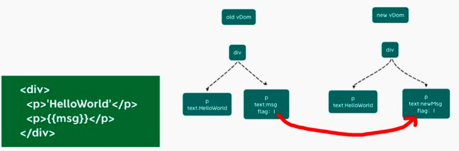

+ vue3的区别
    + https://zhuanlan.zhihu.com/p/350235814
````
1. 按需引用使用的功能模块不再整个引用Vue整个的框架,项目打包时只会打包相应的功能模块应用体积会大大降低
2. 生命周期钩子函数只能在 setup() 期间同步使用
    选项 API 生命周期选项和组合式 API 之间的映射：
    beforeCreate -> use setup()
    created -> use setup()
    beforeMount -> onBeforeMount
    mounted -> onMounted
    beforeUpdate -> onBeforeUpdate
    updated -> onUpdated
    beforeUnmount -> onBeforeUnmount
    unmounted -> onUnmounted
    errorCaptured -> onErrorCaptured
    renderTracked -> onRenderTracked
    renderTriggered -> onRenderTriggered
因为 setup 是围绕 beforeCreate 和 created 生命周期钩子运行的，所以不需要显式地定义它们
3. 使用compositionAPI，增加setup组件选项，增加ref和reactive进行响应式绑定，watch响应式写法更改，computed()计算属性的变化
4. v-model的改变：总所周知在Vue2.0中v-model只能进行动态绑定value值的变化，
但是在Vue3.0中v-mode可以同时绑定多个不同值的写法为v-model:xxx='变量名'，子组件需要更改绑定的值时需要使用setup函数中的第二个参数进行触发更改方法，写法为context.emit('update:xxx', false)
5. 3.0中 v-if优先级高于v-for
6. 自定义指令的API变更：
    bind → beforeMount 指令绑定到元素后发生。只发生一次。
    inserted → mounted  元素插入父 DOM 后发生。
    beforeUpdate：新的！这是在元素本身更新之前调用的，很像组件生命周期钩子。
    update → 移除！有太多的相似之处要更新，所以这是多余的，请改用 updated。
    componentUpdated → updated
    beforeUnmount：新的！与组件生命周期钩子类似，它将在卸载元素之前调用。
    unbind -> unmounted
7. 增加teleport：是一种能够将我们的模板移动到 DOM 中 Vue app 之外的其他位置的技术
````

+ 使用compositionAPI的特点/优点
````
1. 相比options API更加灵活
2. 声明在 setup 函数内，一次组件实例化只调用一次 setup
3. 可以将被多次复用的代码逻辑以函数形式抽取出来并使用
4. 解决mixin命名冲突的问题 类似第3点，函数里面的变量在setup里面使用的时候可以解构重命名，解决命名冲突
````

````
1. ref() 的作用就是把一个值类型的数据变成一个响应式数据
e.g:
let count = ref(100)
如果在函数中要把count++
const add = () => {
    count.value ++; // 通过ref()生产的响应式数据，在js使用数据需要加value，在template中可以直接使用
}

2. reactive() 可以让对象类型变响应式数据
let state = reactive({
    name: 'abc',
    age: 12
})
console.log(state) // Proxy对象
return { state }
在template中：{{state.name}}

3. toRefs() 
let state = reactive({
    name: 'abc',
    age: 12
})
return { ...toRefs(state) }
在template中： {{name}}
在js中：state.name

4. toRef() 单个的
let age = toRef(state, 'age');

5. 通过ref获取dom元素或者组件使用ref声明一个响应式数据
<div ref="h1"></div>

setup(props, ctx) {
    let h1 = ref(null)
    onMounted(() => {
        console.log(h1.value)
    })
    
    return { h1 }
}


````

### vue3的性能提升是怎样体现的？
体现在三个方面：编译阶段优化、源码体积、响应式系统

1. 编译阶段优化：
  主要有：
    1. diff算法提升
      ````
       vue3在diff算法中相比vue2增加了静态标记（补丁标记和动态属性记录）。关于这个静态标记，其作用是为了会发生变化的地方添加一个flag标记，下次发生变化的时候直接找该地方进行比较。
       下图这里，已经标记静态节点的p标签在diff过程中则不会比较，把性能进一步提高。
      ````
   
   ````
   关于静态类型枚举如下
    export const enum PatchFlags {
    TEXT = 1,// 动态的文本节点
    CLASS = 1 << 1,  // 2 动态的 class
    STYLE = 1 << 2,  // 4 动态的 style
    PROPS = 1 << 3,  // 8 动态属性，不包括类名和样式
    FULL_PROPS = 1 << 4,  // 16 动态 key，当 key 变化时需要完整的 diff 算法做比较
    HYDRATE_EVENTS = 1 << 5,  // 32 表示带有事件监听器的节点
    STABLE_FRAGMENT = 1 << 6,   // 64 一个不会改变子节点顺序的 Fragment
    KEYED_FRAGMENT = 1 << 7, // 128 带有 key 属性的 Fragment
    UNKEYED_FRAGMENT = 1 << 8, // 256 子节点没有 key 的 Fragment
    NEED_PATCH = 1 << 9,   // 512
    DYNAMIC_SLOTS = 1 << 10,  // 动态 solt
    HOISTED = -1,  // 特殊标志是负整数表示永远不会用作 diff
    BAIL = -2 // 一个特殊的标志，指代差异算法
    }
   ````
    2. 静态提升
    ````
   Vue3中对不参与更新的元素，会做静态提升，只会被创建一次，在渲染时直接复用
   这样就免去了重复的创建节点，大型应用会受益于这个改动，免去了重复的创建操作，优化了运行时候的内存占用
    
    <span>你好</span>
    <div>{{ message }}</div>
   
    没有做静态提升之前
    export function render(_ctx, _cache, $props, $setup, $data, $options) {
      return (_openBlock(), _createBlock(_Fragment, null, [
        _createVNode("span", null, "你好"),
        _createVNode("div", null, _toDisplayString(_ctx.message), 1 /* TEXT */)
      ], 64 /* STABLE_FRAGMENT */))
    }
   
    做了静态提升之后
    const _hoisted_1 = /*#__PURE__*/_createVNode("span", null, "你好", -1 /* HOISTED */)
    export function render(_ctx, _cache, $props, $setup, $data, $options) {
      return (_openBlock(), _createBlock(_Fragment, null, [
        _hoisted_1,
        _createVNode("div", null, _toDisplayString(_ctx.message), 1 /* TEXT */)
      ], 64 /* STABLE_FRAGMENT */))
    }
    
    // Check the console for the AST
    静态内容_hoisted_1被放置在render 函数外，每次渲染的时候只要取 _hoisted_1 即可
    
    同时 _hoisted_1 被打上了 PatchFlag ，静态标记值为 -1 ，特殊标志是负整数表示永远不会用于 Diff
   ````
    3. 事件监听缓存
    4. SSR优化 
2. 源码体积
````
相比Vue2，Vue3整体体积变小了，除了移出一些不常用的API，再重要的是Tree shanking
任何一个函数，如ref、reavtived、computed等，仅仅在用到的时候才打包，没用到的模块都被摇掉，打包的整体体积变小
````
3. 响应式系统
````
vue2中采用 defineProperty进行深度遍历所有属性，给每个属性添加getter和setter，实现响应式

vue3采用proxy重写了响应式系统，因为proxy可以对整个对象进行监听，所以不需要深度遍历
  可以监听动态属性的添加
  可以监听到数组的索引和数组length属性
  可以监听删除属性
````

###  Tree shaking 特性：
````
Tree shaking 是一种通过清除多余代码方式来优化项目打包体积的技术，简单来讲，就是在保持代码运行结果不变的前提下，去除无用的代码

在Vue2中，无论我们使用什么功能，它们最终都会出现在生产代码中。主要原因是Vue实例在项目中是单例的，捆绑程序无法检测到该对象的哪些属性在代码中被使用到
import Vue from 'vue' Vue.nextTick(() => {})

而Vue3源码引入tree shaking特性，将全局 API 进行分块。如果你不使用其某些功能，它们将不会包含在你的基础包中
import { nextTick, observable } from 'vue'
nextTick(() => {})


Tree shaking是基于ES6模板语法（import与exports），主要是借助ES6模块的静态编译思想，在编译时就能确定模块的依赖关系，以及输入和输出的变量
Tree shaking无非就是做了两件事：
1. 编译阶段利用ES6 Module判断哪些模块已经加载
2. 判断那些模块和变量未被使用或者引用，进而删除对应代码

通过Tree shaking，Vue3给我们带来的好处是：
1. 减少程序体积（更小）
2. 减少程序执行时间（更快）
3. 便于将来对程序架构进行优化（更友好）
````

