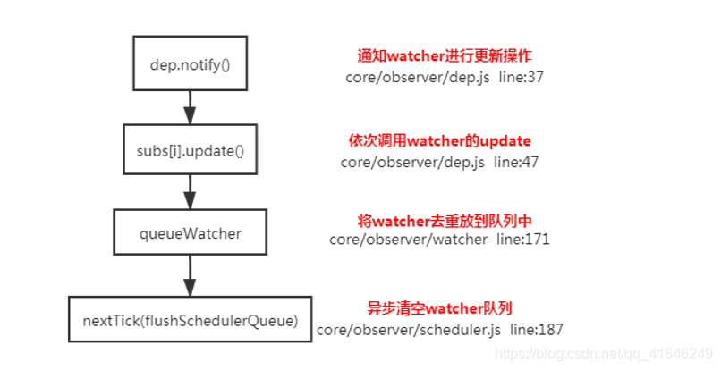
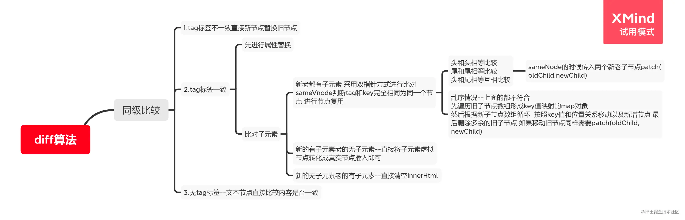
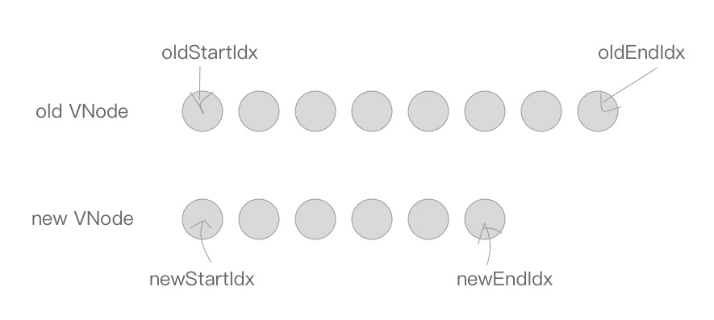

+ 把你了解的vue响应式原理简述一下
````
vue中三个核心类：
1. observer： 给对象的属性添加getter和setter，用来依赖收集和派发更新
2. dep：用来收集对象的响应式对象的依赖关系，每个响应式对象都有一个dep；dep.subs = watcher[] 当数据发生改变的时候会通过dep.notify()通知各个watcher
3. watcher: 观察者对象 有render watcher, computed watcher, user watcher

依赖收集：
1. initState的时候，对computed初始化时，会通知computed watcher依赖收集
2. initState的时候，对监听器watch初始化时，会通知user watcher依赖收集
3. render的时候，会触发render watcher依赖收集

派发更新：
1. 组件中对响应式数据进行修改，会触发setter
2. dep.notify()
3. 遍历所有dep.subs,调用每一个watcher的update方法

````


+ vue中针对7个数组方法的重写
    - vue通过原型拦截的方式重写了数组的7个方法，首先获取到这个数组的Observer。如果有新的值，就调用observeArray对新的值进行监听，然后调用notify，通知render watcher，执行update
    - 核心：
      - arrayMethods 首先继承了 Array，然后对数组中所有能改变数组自身的方法，如 push、pop 等这些方法进行重写。
      - 重写后的方法会先执行它们本身原有的逻辑，并对能增加数组长度的 3 个方法 push、unshift、splice 方法做了判断，获取到插入的值。
      - 然后把新添加的值变成一个响应式对象，并且再调用 ob.dep.notify() 手动触发依赖通知，这就很好地解释了之前的示例中调用 vm.items.splice(newLength) 方法可以检测到变化。

````
// src/core/observer/array.js

// 获取数组的原型Array.prototype，上面有我们常用的数组方法
const arrayProto = Array.prototype
// 创建一个空对象arrayMethods，并将arrayMethods的原型指向Array.prototype
export const arrayMethods = Object.create(arrayProto)

// 列出需要重写的数组方法名
const methodsToPatch = [
  'push',
  'pop',
  'shift',
  'unshift',
  'splice',
  'sort',
  'reverse'
]
// 遍历上述数组方法名，依次将上述重写后的数组方法添加到arrayMethods对象上
methodsToPatch.forEach(function (method) {
  // 保存一份当前的方法名对应的数组原始方法
  const original = arrayProto[method]
  // 将重写后的方法定义到arrayMethods对象上，function mutator() {}就是重写后的方法
  def(arrayMethods, method, function mutator (...args) {
    // 调用数组原始方法，并传入参数args，并将执行结果赋给result
    const result = original.apply(this, args)
    // 当数组调用重写后的方法时，this指向该数组，当该数组为响应式时，就可以获取到其__ob__属性
    const ob = this.__ob__ // Observer对象
    // 获取新插入的值
    let inserted
    switch (method) {
      case 'push':
      case 'unshift':
        inserted = args
        break
      case 'splice':
        inserted = args.slice(2)
        break
    }
    // 把新添加的值变成一个响应式对象
    if (inserted) ob.observeArray(inserted)
    // 将当前数组的变更通知给其订阅者
    ob.dep.notify()
    // 最后返回执行结果result
    return result
  })
})

````

+ 2.0数据劫持（响应式 defineReactive）核心（简单版）
````
let obj = {
    a: 111,
    b: 222
}
function defineReactive(obj, k, value) {
    if (typeof value === 'object') {
        reactify(value)
    }
    Object.defineProperty(obj, k, {
        get() {
            return value
        },
        set(val) {
            value = reactify(val)
        }
    })
}
function reactify(obj) {
    for(let k in obj) {
        defineReactive(obj, k, obj[k])
    }
}
reactify(obj)

````

+ 3.0数据劫持核心
````
let obj = {
    a: 111,
    b: 222
}
let proxyObj = new Proxy(obj, {
    get(target, k) {
        return target[k]
    },
    set(target, k, val) {
        return target[k] = val
    }
})
同时Proxy 并不能监听到内部深层次的对象变化，而 Vue3 的处理方式是在 getter 中去递归响应式，这样的好处是真正访问到的内部属性才会变成响应式，简单的可以说是按需实现响应式，减少性能消耗
````

+ Vue的数据为什么频繁变化但只会更新一次


````
检测到数据变化
开启一个队列
在同一事件循环中缓冲所有数据改变
如果同一个 watcher (watcherId相同)被多次触发，只会被推入到队列中一次

不优化，每一个数据变化都会执行: setter->Dep->Watcher->update->run
优化后：执行顺序update -> queueWatcher -> 维护观察者队列（重复id的Watcher处理） -> waiting标志位处理 -> 处理$nextTick（在为微任务或者宏任务中异步更新DOM）

````

+ computed 的实现原理
````
computed 本质是一个惰性求值的观察者computed watcher。其内部通过 this.dirty 属性标记计算属性是否需要重新求值。

当使用 computed 计算属性时，组件初始化会对每一个计算属性都创建对应的 watcher , 然后在第一次调用自己的 getter 方法时，收集计算属性依赖的所有data，那么所依赖的 data 会收集这个订阅者。
当 computed 的依赖状态发生改变时,就会通知这个惰性的 watcher,computed watcher会将this.dirty设置为true，然后通过 this.dep.subs.length 判断有没有订阅者,
有的话,会再次读取computed，此时copmuted的dirty是true，所以会触发重新计算。然后对比新旧值,如果变化了,会重新渲染。 
(Vue 想确保不仅仅是计算属性依赖的值发生变化，而是当计算属性最终计算的值发生变化时才会触发渲染 watcher 重新渲染，本质上是一种优化。)
没有的话,仅仅把 this.dirty = true (当计算属性依赖于其他数据时，属性并不会立即重新计算，只有之后其他地方需要读取属性的时候，它才会真正计算，即具备 lazy（懒计算）特性。)

computed擅长的场景：一个数据受多个数据影响


computed只有经过observer初始化 创建过computed watcher的属性才可以被监听到
computed: {
    timer: function() {
        return Date.now()
    },
    message: function() {
        return sessionStorage.getItem('xxx')
    }
}
以上两个都是并不会被监听到的


https://zhuanlan.zhihu.com/p/357250216
````

+ watch
````
watch没有缓存性，更多的是观察的作用，可以监听某些数据执行回调。当我们需要深度监听对象中的属性时，可以打开deep：true选项，这样便会对对象中的每一项进行监听。这样会带来性能问题，优化的话可以使用字符串形式监听
注意：Watcher : 观察者对象 , 实例分为渲染 watcher (render watcher),计算属性 watcher (computed watcher),侦听器 watcher（user watcher）三种

watch擅长场景：一个数据影响多个数据
````

+ Watch中的deep:true 是如何实现的
````
当用户指定了 watch 中的deep属性为 true 时，如果当前监控的值是数组类型。会对对象中的每 一项进行求值，此时会将当前 watcher 存入到对应属性的依赖中，这样数组中对象发生变化时也 会通知数据更新
````

+ nextTick()原理
  - 由于Vue DOM更新是异步执行的，即修改数据时，视图不会立即更新，而是会监听数据变化，并缓存在同一事件循环中，等同一数据循环中的所有数据变化完成之后，再统一进行视图更新。为了确保得到更新后的DOM，所以设置了 Vue.nextTick()方法。
  - 同一事件循环中的代码执行完毕 -> DOM 更新 -> nextTick callback触发
  - 应用场景：
    1. 在Vue生命周期的created()钩子函数进行的DOM操作一定要放在Vue.nextTick()的回调函数中。
    原因：是created()钩子函数执行时DOM其实并未进行渲染。
    
    2. 在数据变化后要执行的某个操作，而这个操作需要使用随数据改变而改变的DOM结构的时候，这个操作应该放在Vue.nextTick()的回调函数中。
    原因：Vue异步执行DOM更新，只要观察到数据变化，Vue将开启一个队列，并缓冲在同一事件循环中发生的所有数据改变，如果同一个watcher被多次触发，只会被推入到队列中一次。
       
````
+ 调用nextTick传入cb，cb被推进callbacks回调队列，能力检测，根据能力监测结果的异步方法执行回调队列


nextTick 源码主要分为两块：能力检测和根据能力检测以不同方式执行回调队列。

由于宏任务耗费的时间是大于微任务的，所以在浏览器支持的情况下，优先使用微任务。如果浏览器不支持微任务，再使用宏任务。优先级：Promise > MutationObserver > setImmediate > setTimeout


// 使用 MicroTask 的标识符，这里是因为火狐在<=53时 无法触发微任务，在modules/events.js文件中引用进行安全排除
export let isUsingMicroTask = false 

 // 用来存储所有需要执行的回调函数
const callbacks = []

// 用来标志是否正在执行回调函数
let pending = false 

// 对callbacks进行遍历，然后执行相应的回调函数
function flushCallbacks () {
    pending = false
    // 这里拷贝的原因是：
    // 有的cb 执行过程中又会往callbacks中加入内容
    // 比如 $nextTick的回调函数里还有$nextTick
    // 后者的应该放到下一轮的nextTick 中执行
    // 所以拷贝一份当前的，遍历执行完当前的即可，避免无休止的执行下去
    const copies = callbcks.slice(0)
    callbacks.length = 0
    for(let i = 0; i < copies.length; i++) {
        copies[i]()
    }
}

let timerFunc // 异步执行函数 用于异步延迟调用 flushCallbacks 函数

// 在2.5中，我们使用(宏)任务(与微任务结合使用)。
// 然而，当状态在重新绘制之前发生变化时，就会出现一些微妙的问题
// (例如#6813,out-in转换)。
// 同样，在事件处理程序中使用(宏)任务会导致一些奇怪的行为
// 因此，我们现在再次在任何地方使用微任务。
// 优先使用 Promise
if(typeof Promise !== 'undefined' && isNative(Promise)) {
    const p = Promise.resolve()
    timerFunc = () => {
        p.then(flushCallbacks)
        
        // IOS 的UIWebView, Promise.then 回调被推入 microTask 队列，但是队列可能不会如期执行
        // 因此，添加一个空计时器强制执行 microTask
        if(isIOS) setTimeout(noop)
    }
    isUsingMicroTask = true
} else if(!isIE && typeof MutationObserver !== 'undefined' && (isNative(MutationObserver) || MutationObserver.toString === '[object MutationObserverConstructor]')) {
    // 当 原生Promise 不可用时，使用 原生MutationObserver
    // e.g. PhantomJS, iOS7, Android 4.4
 
    let counter = 1
    // 创建MO实例，监听到DOM变动后会执行回调flushCallbacks
    const observer = new MutationObserver(flushCallbacks)
    const textNode = document.createTextNode(String(counter))
    observer.observe(textNode, {
        characterData: true // 设置true 表示观察目标的改变
    })
    
    // 每次执行timerFunc 都会让文本节点的内容在 0/1之间切换
    // 切换之后将新值复制到 MO 观测的文本节点上
    // 节点内容变化会触发回调
    timerFunc = () => {
        counter = (counter + 1) % 2
        textNode.data = String(counter) // 触发回调
    }
    isUsingMicroTask = true
} else if (typeof setImmediate !== 'undefined' && isNative(setImmediate)) {
    timerFunc = () => {
        setImmediate(flushCallbacks)
    }
} else {
    timerFunc = () => {
        setTimeout(flushCallbacks, 0)
    }
}

export function nextTick(cb? Function, ctx: Object) {
    let _resolve
    // cb 回调函数会统一处理压入callbacks数组
    callbacks.push(() => {
        if(cb) {
            try {
                cb.call(ctx)
            } catch(e) {
                handleError(e, ctx, 'nextTick')
            }
        } else if (_resolve) {
            _resolve(ctx)
        }
    })
    
    // pending 为false 说明本轮事件循环中没有执行过timerFunc()
    if(!pending) {
        pending = true
        timerFunc()
    }
    
    // 当不传入 cb 参数时，提供一个promise化的调用 
    // 如nextTick().then(() => {})
    // 当_resolve执行时，就会跳转到then逻辑中
    if(!cb && typeof Promise !== 'undefined') {
        return new Promise(resolve => {
            _resolve = resolve
        })
    }
}
````

+ keep-alive原理
````
keep-alive实例会缓存对应组件的VNode,如果命中缓存，直接从缓存对象返回对应VNode

第一步：获取keep-alive包裹着的（默认插槽中）第一个子组件对象及其组件名；
第二步：根据设定的黑白名单（如果有）进行条件匹配，决定是否缓存。不匹配，直接返回组件实例（VNode），否则执行第三步；
第三步：根据组件ID和tag生成缓存Key，并在缓存对象中查找是否已缓存过该组件实例。如果存在，直接取出缓存值并更新该key在this.keys中的位置（更新key的位置是实现LRU置换策略的关键），否则执行第四步；
第四步：在this.cache对象中存储该组件实例并保存key值，之后检查缓存的实例数量是否超过max设置值，超过则根据LRU置换策略删除最近最久未使用的实例（即是下标为0的那个key）;
第五步：最后并且很重要，将该组件实例的keepAlive属性值设置为true。

LRU（Least recently used）算法根据数据的历史访问记录来进行淘汰数据，其核心思想是“如果数据最近被访问过，那么将来被访问的几率也更高”。(墨菲定律：越担心的事情越会发生)


### 缓存后如何获取数据
解决方案可以有以下两种：
1. beforeRouteEnter
每次组件渲染的时候，都会执行beforeRouteEnter

beforeRouteEnter(to, from, next){
    next(vm=>{
        console.log(vm)
        // 每次进入路由执行
        vm.getData()  // 获取数据
    })
}

2. actived
在keep-alive缓存的组件被激活的时候，都会执行actived钩子
activated(){
	  this.getData() // 获取数据
},
注意：服务器端渲染期间avtived不被调用

````

+ 为什么访问data属性不需要带data
````
  vue中访问属性代理this.data.xxx 转换 this.xxx的实现
  
  /** 将 某一个对象的属性 访问 映射到 对象的某一个属性成员上 */
  function proxy( target, prop, key ) {
      Object.defineProperty( target, key, {
          enumerable: true,
          configurable: true,
          get () {
            return target[ prop ][ key ];
          },
          set ( newVal ) {
            target[ prop ][ key ] = newVal;
          }
      } );
  }
````

+ v-model原理
````
v-model本质上是语法糖，v-model 在内部为不同的输入元素使用不同的属性并抛出不同的事件。

text 和 textarea 元素使用 value 属性和 input 事件
checkbox 和 radio 使用 checked 属性和 change 事件
select 字段将 value 作为 prop 并将 change 作为事件

<input v-model="sth" />
//  等同于
<input :value="sth" @input="sth = $event.target.value" />
这个语法糖必须是固定的，也就是说属性必须为value，方法名必须为：input。

````

+ Vue.$set()的原理
  + 来源：https://www.jb51.net/article/146580.htm
````
主要分成target是数组、target是对象且key是对象本身的属性、target是对象但是key是新属性三类

// 如果target是一个数组，那么根据key值及数组长度更改数组的长度(取其中较大者)，然后直接使用splice函数修改数组
if (Array.isArray(target) && isValidArrayIndex(key)) {
  target.length = Math.max(target.length, key)
  target.splice(key, 1, val)
  return val
 }
 
// 如果target是一个对象，且key是对象已存在的私有属性，那么直接赋值就可以了，因为这个key必然是被监听过的
if (key in target && !(key in Object.prototype)) {
  target[key] = val
  return val
 }
 
// 如果这个key目前没有存在于对象中，那么会进行赋值并监听。
   // 首先定义变量ob的值为 target.__ob__ ，这个 __ob__ 属性到底是什么对象呢？vue给响应式对象都加了一个 __ob__ 属性，如果一个对象有这个 __ob__ 属性，那么就说明这个对象是响应式对象，我们修改对象已有属性的时候就会触发页面渲染。
   // target._isVue || (ob && ob.vmCount) 的意思是：当前的target对象是vue实例对象或者是根数据对象，那么就会抛出错误警告。
   // if (!ob) 为真说明当前的target对象不是响应式对象，那么直接赋值返回即可。
 const ob = (target: any).__ob__
 if (target._isVue || (ob && ob.vmCount)) {
  process.env.NODE_ENV !== 'production' && warn(
   'Avoid adding reactive properties to a Vue instance or its root $data ' +
   'at runtime - declare it upfront in the data option.'
  )
  return val
 }
 if (!ob) {
  target[key] = val
  return val
 }
 
 // 这里其实才是vue.set()真正处理对象的地方。 defineReactive(ob.value, key, val) 的意思是给新加的属性添加依赖，以后再直接修改这个新的属性的时候就会触发页面渲染。
 // ob.dep.notify() 这句代码的意思是触发当前的依赖（这里的依赖依然可以理解成渲染函数），所以页面就会进行重新渲染。
 defineReactive(ob.value, key, val)
 ob.dep.notify()
 return val

````

+ vue-router原理
    + https://www.jianshu.com/p/4295aec31302（https://zhuanlan.zhihu.com/p/27588422）
````
1）hash 模式的实现原理
早期的前端路由的实现就是基于 location.hash 来实现的。其实现原理很简单，location.hash 的值就是 URL 中 # 后面的内容。比如下面这个网站，它的 location.hash 的值为 '#search'：
hash  路由模式的实现主要是基于下面几个特性：
• URL 中 hash 值只是客户端的一种状态，也就是说当向服务器端发出请求时，hash 部分不会被发送；
• hash 值的改变，都会在浏览器的访问历史中增加一个记录。因此我们能通过浏览器的回退、前进按钮控制hash 的切换；
• 可以通过 a 标签，并设置 href 属性，当用户点击这个标签后，URL 的 hash 值会发生改变；或者使用  JavaScript 来对 loaction.hash 进行赋值，改变 URL 的 hash 值；
• 我们可以使用 hashchange 事件来监听 hash 值的变化，从而对页面进行跳转（渲染）。

2）history 模式的实现原理
HTML5 提供了 History API 来实现 URL 的变化。其中做最主要的 API 有以下两个：history.pushState() 和 history.repalceState()。这两个 API 可以在不进行刷新的情况下，操作浏览器的历史纪录。唯一不同的是，前者是新增一个历史记录，后者是直接替换当前的历史记录，如下所示：
window.history.pushState(null, null, path);
window.history.replaceState(null, null, path);
history 路由模式的实现主要基于存在下面几个特性：
• pushState 和 repalceState 两个 API 来操作实现 URL 的变化 ；
• 我们可以使用 popstate  事件来监听 url 的变化，从而对页面进行跳转（渲染）；
• history.pushState() 或 history.replaceState() 不会触发 popstate 事件，这时我们需要手动触发页面跳转（渲染）。

````

+ vuex原理
````
Vue.use(vuex) Vue.use的一个原则就是执行对象的install这个方法


let Vue = null;
const install = (_vue) => {
    Vue = _vue;
    
    Vue.mixin({ //  利用全局混入和 beforeCreate钩子函数实现了 给每一个组件上边都挂在了一个$store
        beforeCreate() {
            if (this.$options.store) {
                this.$store = this.$options.store;
            } else if (this.$parent) { // 如存在 $parent证明当前组件是根组件的后代组件
                this.$store = this.$parent.$store;
            }
        }
    })
}

Class Store {
    constructor(options) {
    // options : state  ,mutations  actions
        let vm = new Vue({
            data() {
                return {
                    state: options.state
                }
            }
        })
        this.state = vm.state;
        
        this.mutations = {};
        this.mutations = options.mutations || {};
        Object.keys(options.mutations).forEach(key => {
            this.mutations[key] = (option) => {
                mutations[key].call(this, this,state, option)
            }
        })
    }
    commit(type, option) {
    //  type 对应的是 mutations中的函数的名字  option是用户传递的参数
        this.mutations[type](option)
    }
}

export functuon mapState(ary) {
    let obj = {};
    ary.forEach(key => {
        obj[key] = () => {
         // this 是组件的实例
            return this.$store.state[key];
        }
    })
    return obj;
}

export function mapMutations(ary) {
    let obj = {};
    ary.forEach(key => {
        obj[key] = (option) => {
            this.$store.commit(key, option)
        }
    })
    return obj;
}

export default {
  install,
  Store
}
````

+ 虚拟dom
````
其实就是一个js对象，对真实dom做了一层映射，去描述真实dom树

diff算法是通过同层的树节点进行比较而非对树进行逐层搜索遍历的方式，所以时间复杂度只有O(n)，是一种相当高效的算法（vue diff在比较新旧节点的时候只会做同级的比较，不会跨级比较）

+ 通过patch比较同级的节点
+ 判断两个节点是否一样
    + 不一样 -> 用新的虚拟节点替换整个老的虚拟节点
    + 一样 -> 根据子结点的情况接着进行比较 分为4种情况 （patchVNode）
        + 老结点有子结点 新的没
        + 老节点没用子结点 新的有
        + 都只有文本节点
        + 都有子结点
        
        patchVNode做的事：
        + 新旧虚拟dom若是同一个地址 什么都不用做
        + 找到当前节点对应的真实dom elm (获取老/新节点的子结点)
        + 判断新节点的文本节点是否是undefined
            + 不是undefined -> 调用setTextContent 把元素elm中的文本节点设置成新内容
            + 是undefined
                + 比较新旧节点的子结点是否都存在 若都存在但是不一样 调用updateChildren更新
                + 新节点有子结点 老节点没有 调用addVNode将新节点的子结点添加到elm中
                + 新节点没有子结点 老的有 调用removeVNode移除老节点的子结点
                + 老节点的文本节点存在的话 调用setTextContent 把老节点对应元素elm的文本节点设置为空
                

updateChildren：
oldStartIndex跟newStartIndex进行对比 oldEndIndex跟newEndIndex进行对比
oldStartIndex跟newEndIndex进行对比 oldEndIndex跟newStartIndex进行对比
逐个递归

在遍历过程中这几个变量都会向中间靠拢 当oldStartIdx > oldEndIdx或者newStartIdx > newEndIdx时结束循环
在遍历中，如果存在key，并且满足sameVnode，会将该DOM节点进行复用，否则则会创建一个新的DOM节点


虚拟DOM的解析过程：
● 首先对将要插入到文档中的 DOM 树结构进行分析，使用 js 对象将其表示出来，比如一个元素对象，包含 TagName、props 和 Children 这些属性。然后将这个 js 对象树给保存下来，最后再将 DOM 片段插入到文档中。
● 当页面的状态发生改变，需要对页面的 DOM 的结构进行调整的时候，首先根据变更的状态，重新构建起一棵对象树，然后将这棵新的对象树和旧的对象树进行比较，记录下两棵树的的差异。
● 最后将记录的有差异的地方应用到真正的 DOM 树中去，这样视图就更新了。


频繁操作DOM会导致大量的回流和重绘，会造成网页的卡顿。
Virtual Dom将DOM节点抽象为一个JS对象，同时只保留了核心的属性，对Virtual Dom的操作比直接操作DOM更为高效，同时Virtual Dom还配合使用diff算法，每次操作时会比较新老节点的不同，计算出渲染为真实dom 的最小代价操作，再渲染为真实DOM。
实际上这是一种利用JS运算成本来换取DOM执行成本的操作，而JS的运算速度快很多，所以这是一种比较划算的做法。


Vue3的diff对比Vue2的优化部分
Vue2 是全量 Diff（当数据发生变化，它就会新生成一个DOM树，并和之前的DOM树进行比较，找到不同的节点然后更新。）；
Vue3 是静态标记 + 非全量 Diff（Vue 3在创建虚拟DOM树的时候，会根据DOM中的内容会不会发生变化，添加一个静态标记。之后在与上次虚拟节点进行对比的时候，就只会对比这些带有静态标记的节点。）
使用最长递增子序列优化对比流程，可以最大程度的减少 DOM 的移动，达到最少的 DOM 操作


patchKeyedChildren
在 Vue2 里 updateChildren 会进行
头和头比
尾和尾比
头和尾比
尾和头比
都没有命中的对比

在 Vue3 里 patchKeyedChildren 为
头和头比
尾和尾比
基于最长递增子序列进行移动/添加/删除
看个例子，比如
老的 children：[ a, b, c, d, e, f, g ]
新的 children：[ a, b, f, c, d, e, h, g ]
先进行头和头比，发现不同就结束循环，得到 [ a, b ]
再进行尾和尾比，发现不同就结束循环，得到 [ g ]
再保存没有比较过的节点 [ f, c, d, e, h ]，并通过 newIndexToOldIndexMap 拿到在数组里对应的下标，生成数组 [ 5, 2, 3, 4, -1 ]，-1 是老数组里没有的就说明是新增
然后再拿取出数组里的最长递增子序列，也就是 [ 2, 3, 4 ] 对应的节点 [ c, d, e ]
然后只需要把其他剩余的节点，基于 [ c, d, e ] 的位置进行移动/新增/删除就可以了

````



+ slot是什么？有什么作用？原理是什么？
````
slot又名插槽，是Vue的内容分发机制，组件内部的模板引擎使用slot元素作为承载分发内容的出口。
插槽slot是子组件的一个模板标签元素，而这一个标签元素是否显示，以及怎么显示是由父组件决定的。
slot又分三类，默认插槽，具名插槽和作用域插槽。
● 默认插槽：又名匿名插槽，当slot没有指定name属性值的时候一个默认显示插槽，一个组件内只有有一个匿名插槽。
● 具名插槽：带有具体名字的插槽，也就是带有name属性的slot，一个组件可以出现多个具名插槽。
● 作用域插槽：默认插槽、具名插槽的一个变体，可以是匿名插槽，也可以是具名插槽，
该插槽的不同点是在子组件渲染作用域插槽时，可以将子组件内部的数据传递给父组件，让父组件根据子组件的传递过来的数据决定如何渲染该插槽。

实现原理：当子组件vm实例化时，获取到父组件传入的slot标签的内容，存放在vm.$slot中，默认插槽为vm.$slot.default，
具名插槽为vm.$slot.xxx，xxx 为插槽名，当组件执行渲染函数时候，遇到slot标签，使用$slot中的内容进行替换，
此时可以为插槽传递数据，若存在数据，则可称该插槽为作用域插槽。
````

+ Vue模版编译原理（compile SFC）
````
（使用webpack调用vue-loader，发生在$mount阶段。）
vue中的模板template无法被浏览器解析并渲染，因为这不属于浏览器的标准，不是正确的HTML语法，所以需要将template转化成一个JavaScript函数，
这样浏览器就可以执行这一个函数并渲染出对应的HTML元素，就可以让视图跑起来了，这一个转化的过程，就成为模板编译。模板编译又分三个阶段，解析parse，优化optimize，生成generate，最终生成可执行函数render。
● 解析阶段：使用大量的正则表达式对template字符串进行解析，将标签、指令、属性等转化为抽象语法树AST。
● 优化阶段：遍历AST，找到其中的一些静态节点并进行标记，方便在页面重渲染的时候进行diff比较时，直接跳过这一些静态节点，优化runtime的性能（后面更新的时候，只要碰到这个属性，就知道他的所有子孙节点都是静态节点了，而不需要每个子孙节点都要判断一次浪费时间）。
● 生成阶段：根据生成的AST节点，拼接成字符串，而这个字符串可以被转化为函数，函数执行后，就会生成VNode。

https://blog.csdn.net/lznism666/article/details/108738936
https://blog.csdn.net/weixin_41086056/article/details/123441171


Vue3 的编译分为三个阶段，分别是：parse、transform、codegen。
其中 parse 阶段将模板字符串转化为语法抽象树 AST。transform 阶段则是对 AST 进行了一些转换处理，其中最主要的PatchFlags操作。codegen 阶段根据 AST 生成对应的 render 函数字符串。
````