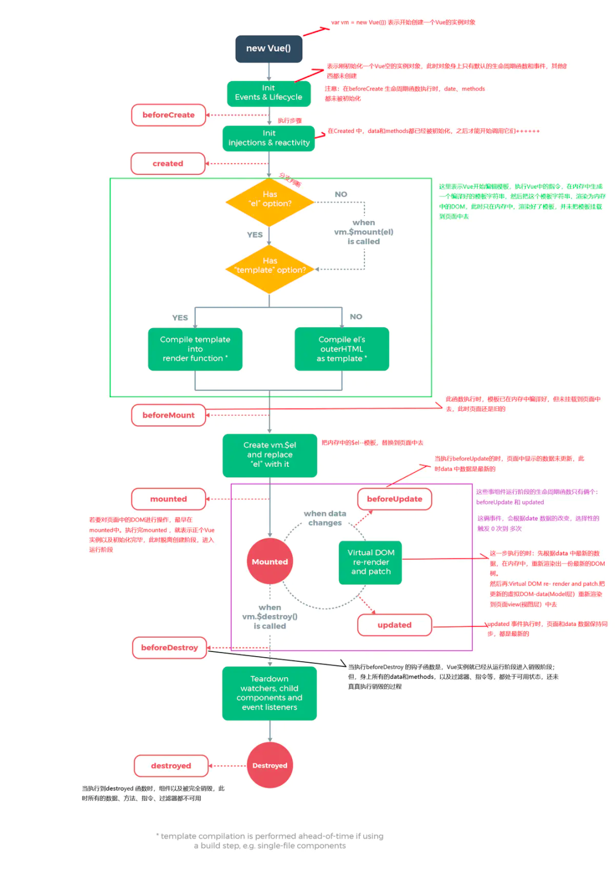

# Vue2.+生命周期

     beforeCreate   //组件实例刚被创建
     created        //创建完成
     beforeMount    //模板编译之前
     mounted        //模板编译之后
     beforeUpdate   //组件更新之前
     updated        //组件更新之后
     activated      //for keep-active 组件被激活时调用
     deactivated    //for keep-active 组件被移除时调用
     beforeDestory  //组件销毁之前
     destoryed      //组件销毁之后

#### 在new Vue 到 vm.$destory的过程经历了什么
当new Vue()后，首先会初始化事件和生命周期，
接着会执行beforeCreate生命周期钩子，在这个钩子里面还拿不到this.$el和this.$data;
接着往下走会初始化inject和将data的数据进行侦测也就是进行双向绑定；
接着会执行create钩子函数，在这个钩子里面能够拿到this.$data还拿不到this.$el;
到这里初始化阶段就走完了。
然后会进入一个模版编译阶段，在这个阶段首先会判断有没有el选项如果有的话就继续往下走，如果没有的话会调用vm.$mount(el);
接着继续判断有没有template选项，如果有的话，会将template提供的模版编译到render函数中；
如果没有的话，会通过el选项选择模版；
到这个编译阶段就结束了。（
温馨提示：这个阶段只有完整版的Vue.js才会经历，也是就是通过cmd引入的方式；在单页面应用中，没有这个编译阶段，因为vue-loader已经提前帮编译好，因此，单页面使用的vue.js是运行时的版本）。
模版编译完之后（这里说的是完整版，如果是运行时的版本会在初始化阶段结束后直接就到挂载阶段），
然后进入挂载阶段，在挂在阶段首先或触发beforeMount钩子，在这个钩子里面只能拿到this.$data还是拿不到this.$el;
接着会执行mounted钩子，在这个钩子里面就既能够拿到this.$el也能拿到this.$data；
到这个挂载阶段就已经走完了，整个实例也已经挂载好了。
当数据发生变更的时候，就会进入更新阶段，首先会触发beforeUpdate钩子，
然后触发updated钩子，这个阶段会重新计算生成新的Vnode,然后通过patch函数里面的diff算法,将新生成的Vnode和缓存中的旧Vnode进行一个比对，最后将差异部分更新到视图中。
当vm.$destory被调用的时候，就会进入卸载阶段，在这个阶段，首先触发beforeDestory钩子接着触发destoryed钩子，在这个阶段Vue会将自身从父组件中删除，取消实例上的所有追踪并且移除所有的事件监听。
到这里Vue整个生命周期就结束了。

#### ✅ 什么是Vue生命周期？
Vue 实例从创建到销毁的过程，就是生命周期。也就是从开始创建、初始化数据、编译模板、挂载Dom→渲染、更新→渲染、卸载等一系列过程，我们称这是 Vue 的生命周期
#### ✅ Vue生命周期的作用是什么？
它的生命周期中有多个事件钩子，让我们在控制整个Vue实例的过程时更容易形成好的逻辑
#### ✅ Vue生命周期总共有几个阶段？
它可以总共分为8个阶段：创建前/后, 载入前/后,更新前/后,销毁前/销毁后
• beforeCreate阶段：vue实例的挂载元素el和数据对象data都是undefined，还没有初始化。
• created阶段：vue实例的数据对象data有了，可以访问里面的数据和方法，未挂载到DOM，el还没有
• beforeMount阶段：vue实例的el和data都初始化了，但是挂载之前为虚拟的dom节点
• mounted阶段：vue实例挂载到真实DOM上，就可以通过DOM获取DOM节点
• beforeUpdate阶段：响应式数据更新时调用，发生在虚拟DOM打补丁之前，适合在更新之前访问现有的DOM，比如手动移除已添加的事件监听器
• updated阶段：虚拟DOM重新渲染和打补丁之后调用，组成新的DOM已经更新，避免在这个钩子函数中操作数据，防止死循环
• beforeDestroy阶段：实例销毁前调用，实例还可以用，this能获取到实例，常用于销毁定时器，解绑事件
• destroyed阶段：实例销毁后调用，调用后所有事件监听器会被移除，所有的子实例都会被销毁

beforeCreate是new Vue()之后触发的第一个钩子，在当前阶段data、methods、computed以及watch上的数据和方法都不能被访问。
created在实例创建完成后发生，当前阶段已经完成了数据观测，也就是可以使用数据，更改数据，在这里更改数据不会触发updated函数。可以做一些初始数据的获取，在当前阶段无法与Dom进行交互，如果非要想，可以通过vm.$nextTick来访问Dom。
beforeMount发生在挂载之前，在这之前template模板已导入渲染函数编译。而当前阶段虚拟Dom已经创建完成，即将开始渲染。在此时也可以对数据进行更改，不会触发updated。
mounted在挂载完成后发生，在当前阶段，真实的Dom挂载完毕，数据完成双向绑定，可以访问到Dom节点，使用$refs属性对Dom进行操作。
beforeUpdate发生在更新之前，也就是响应式数据发生更新，虚拟dom重新渲染之前被触发，你可以在当前阶段进行更改数据，不会造成重渲染。
updated发生在更新完成之后，当前阶段组件Dom已完成更新。要注意的是避免在此期间更改数据，因为这可能会导致无限循环的更新。
beforeDestroy发生在实例销毁之前，在当前阶段实例完全可以被使用，我们可以在这时进行善后收尾工作，比如清除计时器。
destroyed发生在实例销毁之后，这个时候只剩下了dom空壳。组件已被拆解，数据绑定被卸除，监听被移出，子实例也统统被销毁。

#### 第一次页面加载会触发哪几个钩子？
第一次页面加载时会触发 beforeCreate, created, beforeMount, mounted 这几个钩子

#### DOM渲染在哪个周期中就已经完成？
DOM 渲染在 mounted 中就已经完成了

#### 每个生命周期适合哪些场景？
    生命周期钩子的一些使用方法：
    beforecreate : 可以在这加个loading事件，在加载实例时触发
    created : 初始化完成时的事件写在这里，如在这结束loading事件，异步请求也适宜在这里调用
    mounted : 挂载元素，获取到DOM节点
    updated : 如果对数据统一处理，在这里写上相应函数
    beforeDestroy : 可以做一个确认停止事件的确认框
    nextTick : 更新数据后立即操作dom
