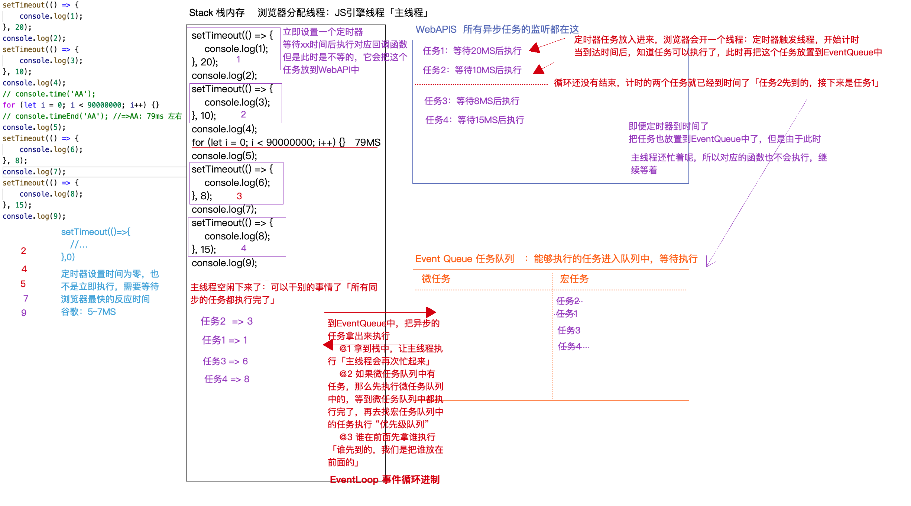
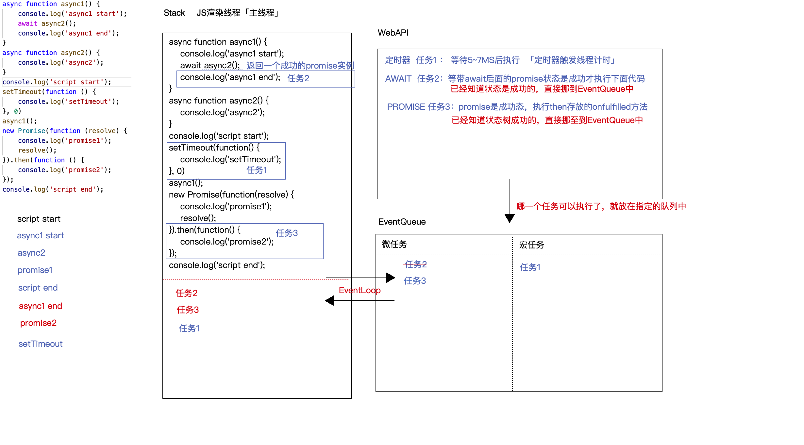
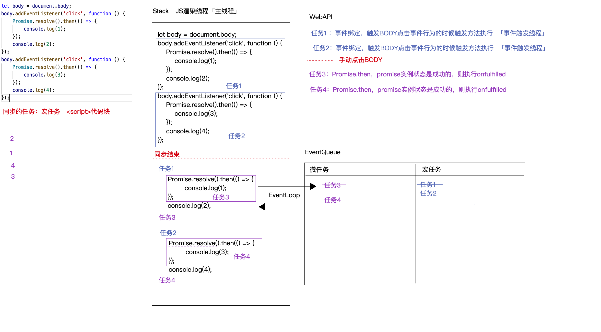
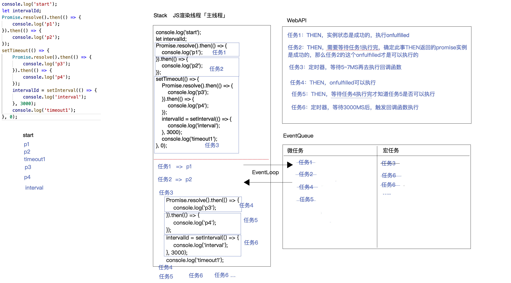
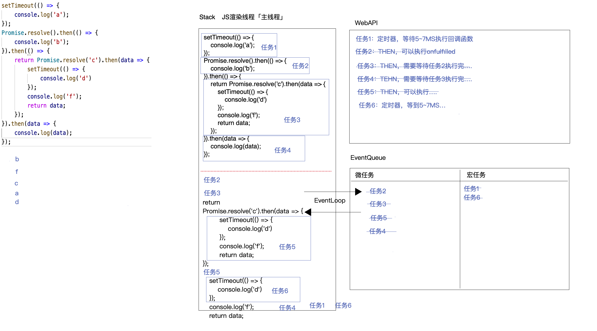
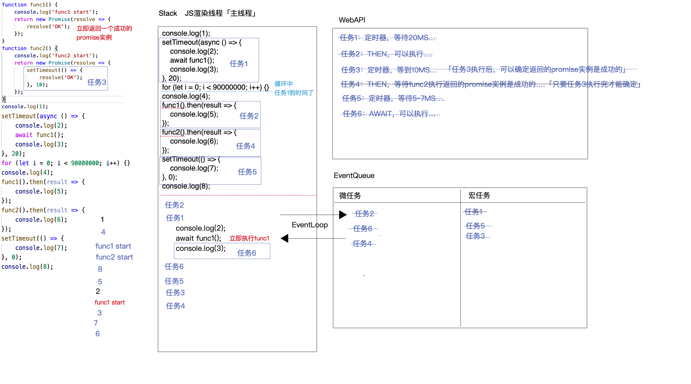

# Event Loop

+ 一个函数的执行栈，一个宏任务队列，一个微任务队列

### exp：
````
console.log('script start');

setTimeout(() => {
  console.log('setTimeout 1');
});

Promise.resolve()
.then(() => {
  console.log('promise 1');
})
.then(() => {
  console.log('promise 2');
});

console.log('script end');
````
运行结果为：
````
script start
script end
promise 1
promise 2
setTimeout 1
````

在运行主程序时会把异步逻辑根据情况推到 Micro Task 或者 Macro Task 栈中，具体规则如下：
1. 以下情况会推到 Micro Task 栈中
   1. process.nextTick
   2. Promise： promise本身不是异步的,是用来管理异步的，但then方法是异步的
   3. Object.observe
   4. MutationObserver

2. 以下情况会推到 Macro Task 栈中
   1. setTimeout
   2. setInterval
   3. setImmediate
   4. I/O
   5. UI render
   
### 总结
事件循环的顺序，决定了 JavaScript 代码的执行顺序。
它从 script (整体代码) 开始第一次循环。之后全局上下文进入函数调用栈。直到调用栈清空(只剩全局)，然后执行所有的 Micro Task。
当所有可执行的 Micro Task 执行完毕之后。循环再次从 Macro Task 开始，找到其中一个任务队列执行完毕，
然后再执行所有的 Micro Task，在执行 Micro Task、Macro Task 的时候同样遵循 Event Loop 原则，就这样一直循环下去。


### EvenLoop + promise + aysnc await
https://juejin.im/post/6844903808200343559?utm_source=gold_browser_extension

在处理一段evenloop执行顺序的时候：


- 第一步确认宏任务，微任务

    - 宏任务：script，setTimeout，setImmediate，promise中的executor
    - 微任务：promise.then，process.nextTick


- 第二步解析“拦路虎”，出现async/await不要慌，他们只在标记的函数中能够作威作福，出了这个函数还是跟着大部队的潮流。
    - await相当于一个promise函数 await后面的内容相当于then之后执行的函数


- 第三步，根据Promise中then使用方式的不同做出不同的判断，是链式还是分别调用。


- 最后一步记住一些特别事件

    - 比如，process.nextTick优先级高于Promise.then


````
setTimeout(() => {
    console.log(1);
}, 20);
console.log(2);
setTimeout(() => {
    console.log(3);
}, 10);
console.log(4);
// console.time('AA');
for (let i = 0; i < 90000000; i++) {
    // do soming
}
// console.timeEnd('AA'); //=>AA: 79ms 左右
console.log(5);
setTimeout(() => {
    console.log(6);
}, 8);
console.log(7);
setTimeout(() => {
    console.log(8);
}, 15);
console.log(9);
// 2 4 5 7 9 3 1 6 8
````


````
async function async1() {
    console.log('async1 start');
    await async2();
    console.log('async1 end');
}
async function async2() {
    console.log('async2');
}
console.log('script start');
setTimeout(function() {
    console.log('setTimeout');
}, 0)
async1();
new Promise(function(resolve) {
    console.log('promise1');
    resolve();
}).then(function() {
    console.log('promise2');
});
console.log('script end');
// script start, async1 start, async2, promise1, script end, async1 end, promise2, setTimeout
````

````
let body = document.body;
body.addEventListener('click', function () {
    Promise.resolve().then(() => {
        console.log(1);
    });
    console.log(2);
});
body.addEventListener('click', function () {
    Promise.resolve().then(() => {
        console.log(3);
    });
    console.log(4);
});
// 2 1 4 3
````

````
console.log('start');
let intervalId;
Promise.resolve().then(() => {
    console.log('p1');
}).then(() => {
    console.log('p2');
});
setTimeout(() => {
    Promise.resolve().then(() => {
        console.log('p3');
    }).then(() => {
        console.log('p4');
    });
    intervalId = setInterval(() => {
        console.log('interval');
    }, 3000);
    console.log('timeout1');
}, 0);
// start, p1, p2, timeout1, p3, p4, interval
````

````
setTimeout(() => {
    console.log('a');
});
Promise.resolve().then(() => {
    console.log('b');
}).then(() => {
    return Promise.resolve('c').then(data => {
        setTimeout(() => {
            console.log('d')
        });
        console.log('f');
        return data;
    });
}).then(data => {
    console.log(data);
});
// b f c a d
````

````
function func1() {
    console.log('func1 start');
    return new Promise(resolve => {
        resolve('OK');
    });
}
function func2() {
    console.log('func2 start');
    return new Promise(resolve => {
        setTimeout(() => {
            resolve('OK');
        }, 10);
    });
}
console.log(1);
setTimeout(async () => {
    console.log(2);
    await func1();
    console.log(3);
}, 20);
for (let i = 0; i < 90000000; i++) {} //循环大约要进行80MS左右
console.log(4);
func1().then(result => {
    console.log(5);
});
func2().then(result => {
    console.log(6);
});
setTimeout(() => {
    console.log(7);
}, 0);
console.log(8);
// 1, 4, func1 start, func2 start, 8, 5, 2, func1 start, 3, 7, 6
````
