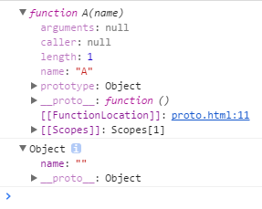

# new流程

##  __ proto__
- proto就是javascript中所谓的原型

举个例子：

   ```` 
   function A (name) {         // 这里是一个构造函数
        thia.name = name
    }
    
    var Aobj = {                // 这里是一个 对对象字面量
        name: ''
    }
    
    // 我们分别打印出来这二个对象看看
    console.dir(A)
    
    console.dir(Aobj)
````
结果如下：

````
这里我们可以很明显的看到 
构造函数的  __proto__ 属性 指向了 function()

对象字面量的  __proto__ 属性 指向了 Object

为什么 指向的 是不一样的呢？

思考下:

确实是 不一样的， 因为 构造函数本身也是一个 函数， 所以它 的原型 指向  function() 

而对象字面量 是一个 对象， 那么他的 原型肯定是指向  Object
````
````
var fn = function(a){
    this.a = a;
}
var obj = {};
//继承
obj.__proto__ = fn.prototype;
//改变this指向
fn.call(obj);
````