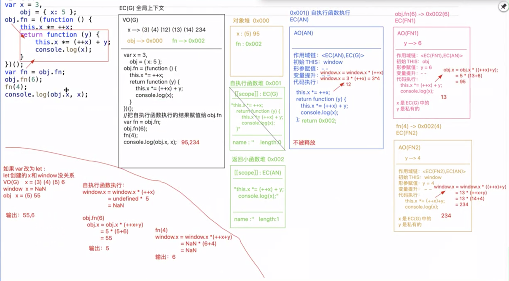

# this
：函数执行的主体(谁执行的函数) 和函数在哪定义和在哪执行没有关系

应用场景：
+ 事件绑定
+ 函数执行【普通函数执行、成员访问、匿名函数、回调函数...】
+ 构造函数
+ 箭头函数
+ 基于call/apply/bind修改this指向

=============

+ 全局上下文有自己的this: window
+ 块级上下文没有自己的this，所用的this都是上级上下文的this 【箭头函数也是】

==============
+ 事件绑定
    + DOM0: xxx.onxxx = function() {}
    + DOM2: 
        xxx.addEventListener('xxx', function() {})
        xxx.attchEvent('onxxx', function() {})
        
    给当前元素的某个事件行为绑定方法【此时是创建方法，方法没执行】，当事件触发，浏览器会把绑定的函数执行，此时函数中的this是当前元素对象本身

+ 函数执行
    + 正常的普通函数执行：看函数执行前是否有"."", 有".""前面是谁this就是谁，没有"."this是window（严格模式下是undefined）
    + 匿名函数：
        + 函数表达式： 等同于普通函数机制
        + 自执行函数: this一般是window/undefined（严格模式下是undefined）
          创建完立即执行的函数：
          (function(){})();~function(){}();!function(){}();+function(){}();
        + 回调函数: this一般是window/undefined（严格模式下是undefined）,
    + 括号表达式：小括号中包含多项，只取最后一项，但是this受影响（window/undefined（严格模式下是undefined））

````
function fn() {
    console.log(this);
}

let obj = {
    name: '123',
    fn
};
fn(); -> window/undefined
obj.fn() -> obj
(obj.fn())() -> obj
(10, obj.fn())() -> window/undefined

[10].forEach(function() {
    console.log(this); -> obj  forEach内部做了处理 第二个参数不传 this就是window，传了就是让this指向他
}, obj);

// 自执行函数
(function x(a) {
    console.log(this);
})(1)

// 回调函数
function fn(callback) {
    callback()
}
fn(function () {
    console.log(this); -> window
})

setTimeout(function() {
  onsole.log(this); -> window
})

2
let obj = {
    // 在obj.fn()赋值的时候，先把自执行函数执行的结果赋值给属性
    fn: (function () {
        // this -> window
        return function () {
            console.log(this);
        }
    })()
};
obj.fn(); // obj
let fn = obj.fn;
fn(); // window

3
var fullName = 'language';
var obj = {
    fullName: 'javascript',
    prop: {
        getFullName: function () {
            return this.fullName;
        }
    }
};
console.log(obj.prop.getFullName()); -> this->obj.prop //undefined
var test = obj.prop.getFullName;
console.log(test()); this->window // 'language'

4
var name = 'window';
var Tom = {
    name: "Tom",
    show: function () {
        // this->window
        console.log(this.name);
    },
    wait: function () {
        // this->Tom
        var fun = this.show;
        // 不管在哪执行的
        fun();
    }
};
Tom.wait(); // "window"

5
window.val = 1;
var json = {
    val: 10,
    dbl: function () {
        this.val *= 2;
    }
}
json.dbl();
var dbl = json.dbl;
dbl();
json.dbl.call(window);
alert(window.val + json.val); // 24

6
(function () {
    var val = 1;
    var json = {
        val: 10,
        dbl: function () {
            val *= 2;       // 让私有变量val=2
        }
    };
    json.dbl();
    alert(json.val + val); // "12"
})();

1
var num = 10;
var obj = {
    num: 20
};
obj.fn = (function (num) {
    this.num = num * 3;
    num++;
    return function (n) {
        this.num += n;
        num++;
        console.log(num);
    }
})(obj.num);
var fn = obj.fn;
fn(5); // 22
obj.fn(10); // 23
console.log(num, obj.num); // 65 30

````


## this是什么

- 当一个函数被调用时，会创建一个活动记录（执行上下文）。这个记录会包含函数在哪里被调用（调用栈）、函数的调用方式、传入的参数信息等。this就是这个记录的一个属性，会在函数执行过程中用到。
- this是在运行时进行绑定的，并不是在编写时绑定，它的上下文取决于调用函数时的各种条件。this的绑定和函数声明的位置没有任何联系，只取决于函数的调用方式。
 

- 箭头函数 vs 普通函数
    1. 语法区别
    2. this区别：箭头函数没有自己的this
    3. 原型区别：箭头函数没有prototype，不能被new
    4. 箭头函数中没有arguments实参集合（只能用rest运算符）
    
- call/apply、bind 都是用来强制改变this指向
- call和apply都是能够把函数执行的，在执行的时候，改变函数中的this指向；区别在于传递实参的方式不一样，call是一个个传递实参，apply需要把实参放在一个数组里面传递
- 真实项目建议用call，三个参数以上性能好一些
- bind不会把函数执行，而是预选处理函数中的this指向和参数
````
获取数组最大值
let arr = [12, 15, 32, 20];
Math.max(arr); // NaN     Math.max要求只能一项项数值 不能直接传递数组
Math.max(12, 15, 32, 20); // 32
Math.max(...arr); // 32 利用ES6的展开运算符
Math.max.apply(Math, arr); // 32 利用apply

````
- ````
  绑定this指向，给函数传递参数并执行函数，返回执行结果
  Function.prototype.call = function(context, ...params) {
   if (context === null) { // context是null则指向window
    context = window;
   }
   if (!/^(object|function)$/i.test(typeof context)) { // 如果是原始值类型的话把原始值转换成对象类型实例
    context = Object(context);
    // context = new context.constructor(context); 把一个原始值类型的值变成一个对象类型的实例 但是symbol和bigInt不允许 因为不能被new
   }
   
   let key = Symbol('KEY'); // 唯一key
   let result;
   context[key] = this; // 给context对象新增key属性并指向this
   result = context[key](...params); // 绑定参数并执行
   delete context[key];// 给context新增的key是多余的 所以执行完了把他删除掉
   return result;
  }
   
  在call基础上再绑一层返回函数（预处理函数：柯里化思想）
  Function.prototype.bind = function (context, ...params) {
   let self = this;
   return function (...args) {
       let params = params.concat(args);
       return self.call(context, ...params);
   }
  }
   
   
   
  var name = 'abc';
  function A(x, y) {
   let res = x + y;
   console.log(res, this.name);
  }
  function B(x, y) {
   let res = x - y;
   console.log(res, this.name);
  }
  B.call(A, 20, 10);// 让B执行，this是A，函数的name是函数自己的名称 -> 10 'A'
  B.call.call.call(A, 20, 10); // 让call方法执行 this是A context是20 params是[10] -> 20[key] = A; 20[key](10) -> 最后还是执行A -> NaN(10+undefined) undefined(20.name)
  Functuon.prototype.call(A, 20, 10); -> Function.prototype是匿名空函数，啥都不会输出
  Functuon.prototype.call.call(A, 20, 10); // NaN undefined
  总结：
  A.call(B,x,y) 最后是执行A，this是B,传递x和y两个参数
  A.call.call(B,x,y);当有多个call的时候 最后是让B执行 this是x 传递值y 
  ````

````
function Parent() {
            this.a = 1;
            this.b = [1, 2, this.a];
            this.c = { demo: 5 };
            this.show = function () {
                console.log(this.a , this.b , this.c.demo );
            }
        }
        function Child() {
            this.a = 2;
            this.change = function () {
                this.b.push(this.a);
                this.a = this.b.length;
                this.c.demo = this.a++;
            }
        }
        Child.prototype = new Parent();
        var parent = new Parent();
        var child1 = new Child();// 两个child实例的__proto__指向Child.prototype指向new Parent出来的实例（两个child实例指向同一个new Parent实例）
        var child2 = new Child();
        child1.a = 11;
        child2.a = 12;
        parent.show();// 1, [1, 2, 1], 5
        child1.show();// 11, [1, 2, 1], 5
        child2.show();// 12, [1, 2, 1], 5
        child1.change(); // -> b: [1, 2, 1, 11] c.demo: 4 a: 5
        child2.change(); // -> b: [1, 2, 1, 11, 12] c.demo: 5 a: 6
        parent.show(); // 1, [1, 2, 1], 5
        child1.show(); // 5, [1, 2, 1, 11, 12], 5
        child2.show(); // 6, [1, 2, 1, 11, 12], 5
````
