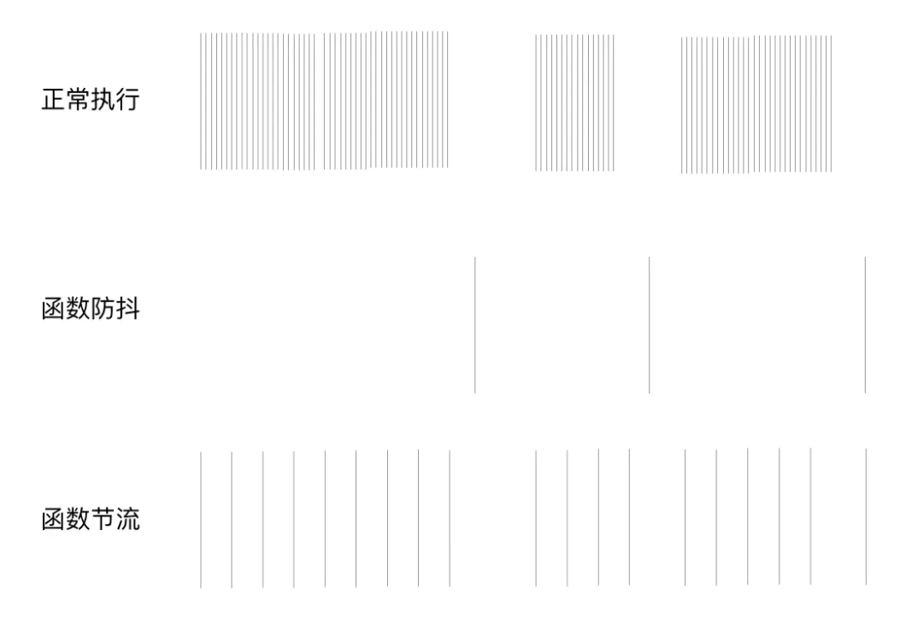

````
let class2type = {},
    toString = class2type.toString, //Object.prototype.toString
    hasOwn = class2type.hasOwnProperty, //Object.prototype.hasOwnProperty
    fnToString = hasOwn.toString, //Function.prototype.toString
    ObjectFunctionString = fnToString.call(Object), //"function Object() { [native code] }"
    getProto = Object.getPrototypeOf;
````

+ 检测是否为函数数据类型的值
````
const isFunction = function isFunction(obj) {
    return typeof obj === "function" && typeof obj.nodeType !== "number" &&
        typeof obj.item !== "function";
};
````

+ 检测是否为window对象
````
const isWindow = function isWindow(obj) {
    return obj != null && obj === obj.window;
};
````

+ 检测数据类型的统一处理方法
````
const toType = function toType(obj) {
    if (obj == null) return obj + "";
    let type = typeof obj;
    if (/(object|function)/i.test(type)) {
        type = toString.call(obj);
        let [, $1 = "object"] = type.match(/^\[object (\w+)\]$/) || [];
        return $1.toLowerCase();
    }
    return type;
};
````

+ 检测是否为一个纯粹的对象「obj.__proto__===Object.prototype || Object.create(null)」
````
const isPlainObject = function isPlainObject(obj) {
    let proto, Ctor;
    if (!obj || toString.call(obj) !== "[object Object]") return false;
    proto = getProto(obj);
    if (!proto) return true;
    Ctor = hasOwn.call(proto, "constructor") && proto.constructor;
    return typeof Ctor === "function" && fnToString.call(Ctor) === ObjectFunctionString;
};
````

+ 检测当前对象是否是空对象
````
const isEmptyObject = function isEmptyObject(obj) {
    if (!obj || !/(object|function)/i.test(typeof obj)) return false;
    let keys = Object.keys(obj);
    if (typeof Symbol !== "undefined") keys = keys.concat(Object.getOwnPropertySymbols(obj));
    return keys.length === 0;
};
````

+ 检测是否为一个有效数字「支持原始值{数字&字符串}&&构造函数创造的Number实例」
````
const isNumeric = function isNumeric(obj) {
    let type = toType(obj);
    return (type === "number" || type === "string") && !isNaN(obj);
};
````

+ 检测是否为数组或者类数组
````
const isArrayLike = function isArrayLike(obj) {
    let length = !!obj && "length" in obj && obj.length,
        type = toType(obj);
    if (isFunction(obj) || isWindow(obj)) return false;
    return type === "array" || length === 0 ||
        typeof length === "number" && length > 0 && (length - 1) in obj;
};
````

+ 合并两个数组
````
把第二个集合放在第一个的末尾，返回第一个
function merge(first, second) {
    var i = first.length;
    for(let a = 0; a < second.length; a++) {
        first[i++] = second[a];
    }
    first.length = i;
    return first;
}

````

+ each实现
````
function each(obj, callback) {
    if (obj == null || typeof obj !== 'object') throw new TypeError()
    if (typeof callback !== 'function') {
        callback = function () {}
    }
    if (Array.isArray(obj)) {
        for (let i = 0; i < obj.length; i++){
            let item = obj[i];
            if (callback.call(item, item, i) === false) break
        }
    } else {
        let keys = Object.keys(obj);
        if (typeof Symbol !== 'undefined') keys = keys.concat(Object.getOwnPropertySymbols(obj));
        for (let i = 0;i < keys.length; i++) {
            let key = keys[i];
            let item = obj[key];
            if (callback.call(item, item, i) === false) break
        }
    }
    return obj;
}

````
+ merge 实现数组/纯粹对象的深浅合并
````
// 第一个参数deep表示是否深度合并;

functionn merge() {
    let target = arguments[0] || [],
        deep = false,
        length = arguments.length, 
        i = 1,
        treated = arguments[length - 1];
    if (Array.isArray(treated) && treated.treated) {
        length --;
    } else {
        treated = [];
        treated.treated = true;
    }
    if (typeof target === 'Boolean') {
        deep = target;
        target = arguments[i];
        i++;
    }
    if (typeof target !== 'object' && !isFunction(targer)) target = {};
    for (; i < length; i++) {
       let options = arguments[i];
       if (options == null) {
        continue;
       }
       each(options, function (copy, name) {
        let clone = target[name],
            copyIsArray = Array.isArray(copy),
            copyIsObject = isPlainObject(copy);
         if (deep && copy && (copyIsArray || copyIsObject)) {
            if (copyIsArray && !Array.isArray(clone)) clone = [];
            if (copyIsObject && !isPlainObject(clone)) clone = {};
            merge(deep, clone, copy, treated);
         } else if (copy !== undefined) {
            target[name] = copy;
         }
       })
    }
    return target;
}

````

+ 分组 groupBy
````
arr是数组
val可以是想要操作的属性名称也可以是操作函数
function groupBy(arr, val) {
    if (!arr || !Array.isArray(arr)) {
        return {}
    }
    
    let group = {}
    arr.forEach(item => {
        let prop = typeof val === 'function' ? val(item) : item[val]
        if(!group[prop]) {
            group[prop] = [item]
        } else {
            group[prop].push(item)
        }
    })
    
    return group
}
````

+ 克隆
  + 浅克隆（二级对象的照抄引用地址，没有重新开辟内存 obj.a === newObj.a）
    + 把对象克隆
        1. newObj = assign({}, obj)
        2. newObj = {...obj}
    + 把数组克隆
        1. splice
        2. [...array]
  + 深克隆
    + JSON.parse(JSON.stringify(obj)) 把字符串检查数组/对象浏览器需要重新开辟内存
        + 弊端： 
          1. 不允许出现套娃操作 => obj.obj会报错
          2. 属性值不能是bigInt   
          3. 丢失一些内容： 属性是Symbol/undefined/function的
          4. 信息可能不准确：正则变空对象、日期对象变字符串、Error对象变空对象
````
function clone() {
    let target = arguments[0] || {}, deep = false, isArray, isObject, type, Ctor, result, treated = arguments[arguments.length - 1];
    !Array.isArray(treated) || !treated.treated ? (treated = [], treated.treated = true) : null;
    
    if (typeof target === 'Boolean') {
        deep = target;
        target = arguments[1];
    }
    if (treated.indexOf(target) > -1) return target;
    treated.push(target);
    
    type = toType(target);
    isArray = Array.isArray(target);
    isObject = isPlainObject(target);
    if (target == null) return target;
    Ctor = target.constructor;
    if (/^(regexp|date)$/i.test(type)) return new Ctor(target);
    if (/^(error)$/i.test(type)) return new Ctor(target.message);
    if (/^(function|generatorfunction)$/i.test(type)) {
            return function proxy() {
                var args = Array.from(arguments);
                return target.apply(this, args);
            };
    }
    if (!isArray && !isObject) return target;
    result = new Ctor();
    each(target, function (copy, name) {
        if (deep) {
            result[name] = clone(deep, copy);
            return;
        }
        result[name] = copy;
    })
    return result;
}

````
````
简易版
function deepClone(object) {
    if (!object || typeof object !== 'object') {
        return
    }
    
    let newObject = Array.isArray(object) ? [] : {}
    
    for (let key in object) {
        if (object.hasOwnProperty(key)) {
            newObject[key] = typeof object[key] === 'object' ? deepClone(object[key]) : object[key]
        }
    }
    
    return newObject
}
````
+ 防抖和节流

````
function debounce(func, wait) {
    let timer;
    return function (...params) {
        let _this = this, result;
        if (timer) {
            clearTimeout(timer);
            timer = null;
        }
        timer = setTimeout(function () => {
            result = func.call(_this, ...params);
        }, wait);
        return result;
    }
}

function throttle(func, wait) {
    let  pre = 0, timer, now = +Date.now(), result, _this = this;
    let remain = wait - (now - pre);
    return function (...params) {
        if (remain <= 0) {
            if (timer) {
                clearTimeout(timer);
                timer = null;
            }
            result = func.call(_this, ...params);
            pre = +Date.now();
        } else if (!timer) {
            timer = setTimeout(function () {
                 if (timer) {
                    clearTimeout(timer);
                    timer = null;
                }
                result = func.call(_this, ...params);
                pre = +Date.now();
            }, remain)
        }  
        return result;
  }
    
}
````

+ reduce
````
let arr = [1, 2, 3, 4];
let total = arr.reduce(function (result, item, index) {
    // reduce：上一次迭代，回调函数处理/返回的结果
    //   第一次迭代,不存在上一次,result是数组第一项的值
    //   相当于数组是从第二项开始迭代
    // item：当前迭代的这一项
    // index：当前迭代的这一项的索引
    
    console.log(result, item); // 1/2   3{1+2}/3    6{3+3}/4
    return result + item;
});
console.log(total);
````
````
Array.prototype.reduce = function(callback, initial) {
    let i = 0, self = this, length = self.length, result = initial, isInit = typeof initial === 'undefined' ? false : true;
    
    // 格式验证
    if (typeof callback !== "function") throw new TypeError(`${callback} is not a function!`);
    if (len === 0 && !isInit) throw new TypeError(`Reduce of empty array with no initial value`);
    if (len === 0 && isInit) return initial;
    if (len === 1 && !isInit) return self[0];
    
    if (!isInit) {
        result = self[0];
        i = 1;
    }
    for (; i < length; i++) {
        result = callback(result, self[i], i);
    }
    return result;
}

let arr = [];
let total = arr.reduce(function (result, item) {
    return result + item;
});
console.log(total); 
````

+ 千分号的实现
````
parseToMoney(1234.56); // return '1,234.56'
parseToMoney(123456789); // return '123,456,789'
parseToMoney(1087654.321); // return '1,087,654.321'


function parseToMoney(num) {
  num = parseFloat(num);
  let [integer, decimal] = String.prototype.split.call(num, '.');
  integer = integer.split('').reverse();
  let length = integer.length;
  let result = [];
  for(let i = 0; i < length; i++) {
  	if (i % 3 === 0 && i !== 0) {
    	result.push(',');
    }
    result.push(integer[i]);
  }
  integer = result.reverse().join('');
  return integer + (decimal ? '.' +decimal : '');
}

function parseToMoney(num) {
 num = parseFloat(num);
  let [integer, decimal] = String.prototype.split.call(num, '.');
  integer = integer.replace(/\d(?=(\d{3})+$)/g, '$&,');
  return integer + (decimal ? '.' + decimal : '');
}

function parseToMoney(num) {
  const num = String(number)
  const reg = /\d{1,3}(?=(\d{3})+$)/g
  const res = num.replace(/^(-?)(\d+)((\.\d+)?)$/, function(match, s1, s2, s3){
    return s1 + s2.replace(reg, '$&,') + s3
  })
  return res
}

````

+ 统计一个字符串出现做多次数的字母
````
方法1：
let str = "abcabcabcbbccccc";
let num = 0;
let target;
let obj = {};

for (let i = 0; i < str.length; i++) {
  let key = str.charAt(i);
	if (obj[key]) {
    	obj[key]++;
    } else {
    	obj[key] = 1;
    }
}

for(let o in obj) {
	if (obj[o] > num) {
    	target = o;
      	num = obj[o];
    }
}

console.log(target, num);


方法2：
// "aaabbbbbcccccccc"

// 定义正则表达式
let re = /(\w)\1+/g;
str.replace(re,($0,$1) => {
    if(num < $0.length){
        num = $0.length;
        char = $1;        
    }
});

````

````
class Student {
  constructor(name) {
    this.name = "Tom";
  }

  getInfo() {
    return {
      name: "Jerry",
      getName() {
        return this.name;
      },
    };
  }
}
let s = new Student();
console.log(s.getInfo().getName()); // Jerry
// 如何打印出Tom，只能修改class中代码

改：
class Student {
  constructor(name) {
    this.name = "Tom";
  }

  getInfo() {
    return {
      name: "Jerry",
      getName: () => {
        return this.name; // 此时this是student的this 箭头函数的this在定义时产生，会捕获其上下文的this
      },
    };
  }
}


````


````
/**
 * 3、实现 getValue 函数，安全的获取目标对象指定 path 的值
 * @params {object | array} value 指定对象
 * @params {string} path 路径描述
 * @params {any} defaultValue 默认值
 */

const object = { 'a': [{ 'b': { 'c': 3 } }] }; // path: 'a[0].b.c'
const array = [{ "a": { b: [1] } }]; // path: '[0].a.b[0]'

function getValue(obj, path, defaultValue) {
    let pathArr = path.split('.');
    let _path = null;
    let result = obj;
    
    while(_path = pathArr.shift()) {
        if (_path.includes('[') && _path.includes(']')){
            _path = _path.split('[')
            let pathName = _path[0];
            let pathIndex = _path[1].split(']')[0];
            result = result[pathName][pathIndex];
        } else {
            result = result[_path];
        }
    }
    
    if (result === undefined) {
        result = defaultValue;
    }
    return result;
}

console.log(getValue(object, 'a[0].b.c', 5))

````

+ 大数相加
````
function maxAdd(a, b) {
	let res = '', c = 0;
	a = a.toString().split('');
	b = b.toString().split('');
	while(a.length || b.length || c) {
		c += ~~a.pop() + ~~b.pop(); // 这里的~运算符是按位非 ~0 = -1     ~~0 = 1    ~~true = 1
		res = c % 10 + res; // res 保存了结果，c保存按位加的结果及进位
		c = c > 9;
	}
	return res.replace(/^0+/, '');
}
maxAdd(Number.MAX_SAFE_INTEGER, '12345');
````

+ promise限制并发请求数量
假如等待请求接口1000个，限制每次只能发出100个。即同一时刻最多有100个正在发送的请求。每当100个之中有一个请求完成时，则从待请求的接口（即剩余的900个待请求接口）中再取出一个发出。保证当前并发度仍旧为100。直至全部接口请求完成。
````
function multiRequest(urls, maxNum) {
 const len = urls.length; // 请求总数量
 const res = new Array(len).fill(0); // 请求结果数组
 let sendCount = 0; // 已发送的请求数量
 let finishCount = 0; // 已完成的请求数量
 return new Promise((resolve, reject) => {
     // 首先发送 maxNum 个请求，注意：请求数可能小于 maxNum，所以也要满足条件2
     // 同步的 创建maxNum个next并行请求 然后才去执行异步的fetch 所以一上来就有5个next并行执行
     while (sendCount < maxNum && sendCount < len) { 
         next();
     }
     function next () {
         let current = sendCount ++; // 当前发送的请求数量，后加一 保存当前请求url的位置
         // 递归出口
         if (finishCount >= len) { 
         // 如果所有请求完成，则解决掉 Promise，终止递归
             resolve(res);
             return;
         }
         const url = urls[current];
         fetch(url).then(result => {
             finishCount ++;
             res[current] = result;
             if (current < len) { // 如果请求没有发送完，继续发送请求
                 next();
             }
         }, err => {
             finishCount ++;
             res[current] = err;
             if (current < len) { // 如果请求没有发送完，继续发送请求
                 next();
             }
         });
     }
 });
}

````

+ 发布订阅
````
class EventCenter{
  // 1. 定义事件容器，用来装事件数组
	let handlers = {}

  // 2. 添加事件方法，参数：事件名 事件方法
  addEventListener(type, handler) {
    // 创建新数组容器
    if (!this.handlers[type]) {
      this.handlers[type] = []
    }
    // 存入事件
    this.handlers[type].push(handler)
  }

  // 3. 触发事件，参数：事件名 事件参数
  dispatchEvent(type, params) {
    // 若没有注册该事件则抛出错误
    if (!this.handlers[type]) {
      return new Error('该事件未注册')
    }
    // 触发事件
    this.handlers[type].forEach(handler => {
      handler(...params)
    })
  }

  // 4. 事件移除，参数：事件名 要删除事件，若无第二个参数则删除该事件的订阅和发布
  removeEventListener(type, handler) {
    if (!this.handlers[type]) {
      return new Error('事件无效')
    }
    if (!handler) {
      // 移除事件
      delete this.handlers[type]
    } else {
      const index = this.handlers[type].findIndex(el => el === handler)
      if (index === -1) {
        return new Error('无该绑定事件')
      }
      // 移除事件
      this.handlers[type].splice(index, 1)
      if (this.handlers[type].length === 0) {
        delete this.handlers[type]
      }
    }
  }
  
   // 绑定的函数只会被调用一次 一旦被调用执行fn回调和removeEventListener移除事件
    once (type, fn) {
        const _this = this;
        // 用于注册
        function dispatchOnce (...args) {
            fn(...args);
            _this.removeEventListener(type, dispatchOnce);
        }
        
        this.addEventListener(type, dispatchOnce);
    }
}
````