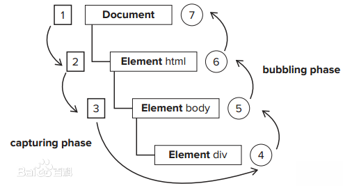

# 事件
- Javascript与HTML之间的交互是通过事件实现的。

## 事件流
- 事件流描述的是从页面中接收事件的顺序
### 事件冒泡
- IE的事件流叫事件冒泡，即时间开始时由最具体的元素接收，然后逐级向上传播到较为不具体的节点。

````
<!DOCTYPE html>
<html>
    <head>
    </head>
    <body>
        <div id="myDiv">clike me</div>
    </body>
</html>
````
以上面的页面为例，如果单击了`<div>`元素，那么这个click事件会按下列顺序传播：
````
[1].<div>
[2].<body>
[3].<html>
[4].document

````


### 事件捕获
- 事件捕获的思想是不太具体的节点应该更早收到事件，而最具体的节点应该最后收到事件
- 事件捕获的用意在于在事件到达预定目标之前捕获它
````
<!DOCTYPE html>
<html>
    <head>
    </head>
    <body>
        <div id="myDiv">clike me</div>
    </body>
</html>
````
以上面的页面为例，如果单击了`<div>`元素，那么这个click事件会按下列顺序传播：
````
[1].document
[2].<html>
[3].<body>
[4].<div>
````
在事件捕获过程中，document对象首先收到click事件，然后事件沿DOM树依次向下，一直传播到事件的实际目标，即<div>元素。

### DOM事件流
- DOM2级事件规定的事件流包括三个阶段：事件捕获阶段、处于目标阶段、事件冒泡阶段。
- 首先发生的是事件捕获，为截获事件提供了机会。然后是实际的目标收到事件。最后一个阶段是冒泡阶段，可以在这个阶段对事件作出响应。


在DOM事件流中，实现的目标在捕获阶段不会收到事件。这意味着在捕获阶段，事件从document到<html>再到<body>后就停止了。<br>
下一阶段是处于目标阶段，于是在`<div>`上发生，并在事件处理被看成冒泡阶段一部分。然后冒泡阶段发生，事件又传播回文档。

### 阻止事件冒泡
1. event.stopPropagation()方法

这是阻止事件的冒泡方法。不让事件向documen上蔓延，但是默认事件任然会执行，当你掉用这个方法的时候，如果点击一个连接，这个连接仍然会被打开，

2. event.preventDefault()方法

这是阻止默认事件的方法。调用此方法是，连接不会被打开，但是会发生冒泡，冒泡会传递到上一层的父元素；

3. event.stopImmediatePropagation()方法
 
 　这个函数用于阻断同一element的事件传播。 例如一个element上定义了多个listener，如果其中一个调用这个方法后面的listener则都不会执行。
 
4. return false

这个方法会同时阻止事件冒泡也会阻止默认事件。写上此代码，连接不会被打开，事件也不会传递到上一层的父元素；可以理解为return false就等于同时调用了event.stopPropagation()和event.preventDefault()

## 事件处理程序（事件绑定）
###### P348
### HTML
````
<input type="button" onclick="fun">
<script>
    function fun(){
    ...
    }
</script>
````
#### 缺点
- 存在时差问题
- 这样扩展事件处理程序的作用域链在不同浏览器中会导致不同结果
- HTML与Javascript代码紧密耦合

### DOM0级方式
````
element.onclick=function(event){

    //...
    
    }
````

#### 1. DOM0绑定的优点
  - 非常简单和稳定，可以确保它在你使用的不同浏览器中运作一致
  
  - 处理事件时，this关键字引用的是当前元素
#### 2. DOM0绑定的缺点 
- 这种方法只会在事件冒泡中运行，而非捕获和冒泡

- 一个元素一次只能绑定一个事件处理函数。新绑定的事件处理函数会覆盖旧的事件处理函数

- 事件对象参数(e)仅非IE浏览器可用

### DOM2级方式
````
element.addEventListener('click', handle, false); //添加
element.addEventListener('click', function(e){   //添加【匿名函数，以后将无法移除】
 
   // ...
 
 }, false);
 
 element.removeEventListener('click',handle，false);//移除
 
 ````
 - 移除传入的参数要与添加时传入的参数相同。这意味着通过addEventListener()添加的匿名函数将无法移除。
 - 第三个参数useCapture：可选。布尔值，指定事件是否在捕获或冒泡阶段执行。
   - 可能值:
     - true  事件句柄在捕获阶段执行
     - false 默认。事件句柄在冒泡阶段执行
   - 大多数情况下，都是将事件处理程序添加到事件流的冒泡阶段
#### 1. DOM2绑定的优点

- 该方法同时支持事件处理的捕获和冒泡阶段。事件阶段取决于addEventListener最后的参数设置：false (冒泡) 或 true (捕获)。

- 在事件处理函数内部，this关键字引用当前元素。

- 事件对象总是可以通过处理函数的第一个参数(e)捕获。

- 可以为同一个元素绑定你所希望的多个事件，同时并不会覆盖先前绑定的事件。事件会按照他们添加的顺序触发。

#### 2. DO绑定的缺点

- IE不支持，你必须使用IE的attachEvent函数替代。
 
## IE方式
````
element.attachEvent('onclick', handle);     //添加  

element.attachEvent('onclick', function(){  //添加【匿名函数，以后将无法移除】
 
    // ...
 
  });
  
element.detachEvent('onclick,handle);      //移除
  
````
- 第一个参数是"onclick"，而非DOM的addEventListener()中的"click"
- 使用addachEvent()添加的事件可以通过detachEvent()来移除，条件是必须提供相同的参数。这意味着匿名函数无法移除。

#### 1. IE方式的优点

- 可以为同一个元素绑定你所希望的多个事件，同时并不会覆盖先前绑定的事件。而事件不是以添加的顺序执行，而是以相反顺序被触发。

#### 2. IE方式的缺点

- IE仅支持事件捕获的冒泡阶段

- 事件监听函数内的this关键字指向了window对象，而不是当前元素（IE的一个巨大缺点）

- 事件对象仅存在与window.event参数中

- 事件必须以ontype的形式命名，比如，onclick而非click

- 仅IE可用。你必须在非IE浏览器中使用DOM2级的addEventListener

#### 与DOM0级的区别

+ 在IE中使用addachEvent()与使用DOM0级方法的主要区别在于事件处理程序的作用域：<br>
  在使用DOM0级方法的情况下，事件处理程序会在所属元素的作用域内运行；<br>
  在使用addachEvent()方法的情况下，事件处理程序会在全局作用域中运行。(this===window)
  
### 跨浏览器的事件处理程序
````
//使用能力检测
var EventUtil={
    addHandler:function(element,type,handler){    //视情况分别使用DOM0级、DOM2级方法或IE方法来添加事件
        if(element.addEventListener){
            element.addEventListener(type,handler,false);
        }
        else if(element.attachEvent){
            element.attachEvent("on"+type,handler):
        }
        else{
            element["on"+type]=handler;             //如果其他方法无效，默认使用DOM0级方法
            }
        },
        removeHandler:function(element,type,handler){
            if(element.removeEventListener){
                    element.removeEventListener(type,handler,false);
                }
            else if(element.detachEvent){
                    element.detachEvent("on"+type,handler):
                }
            else{
                    element["on"+type]=null;
                    }
        }
};
````
