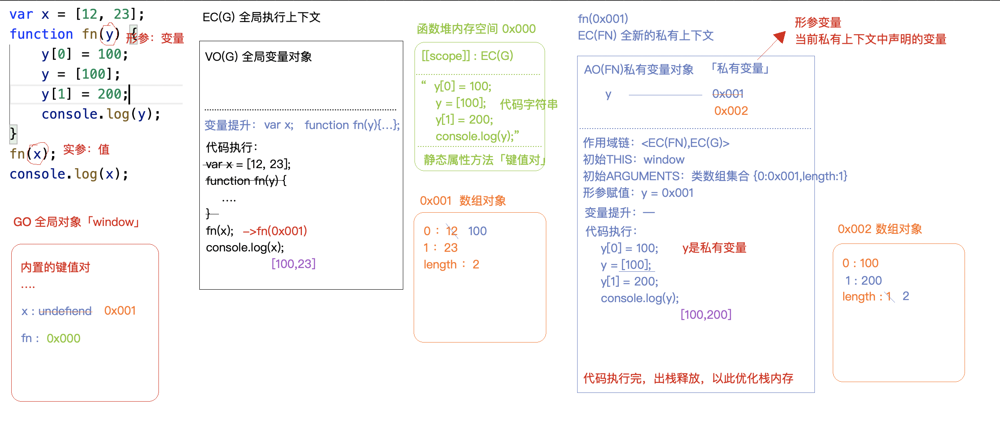
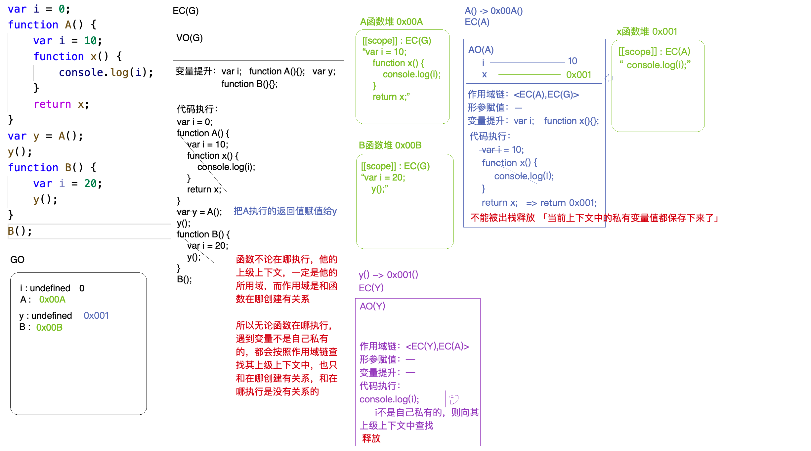
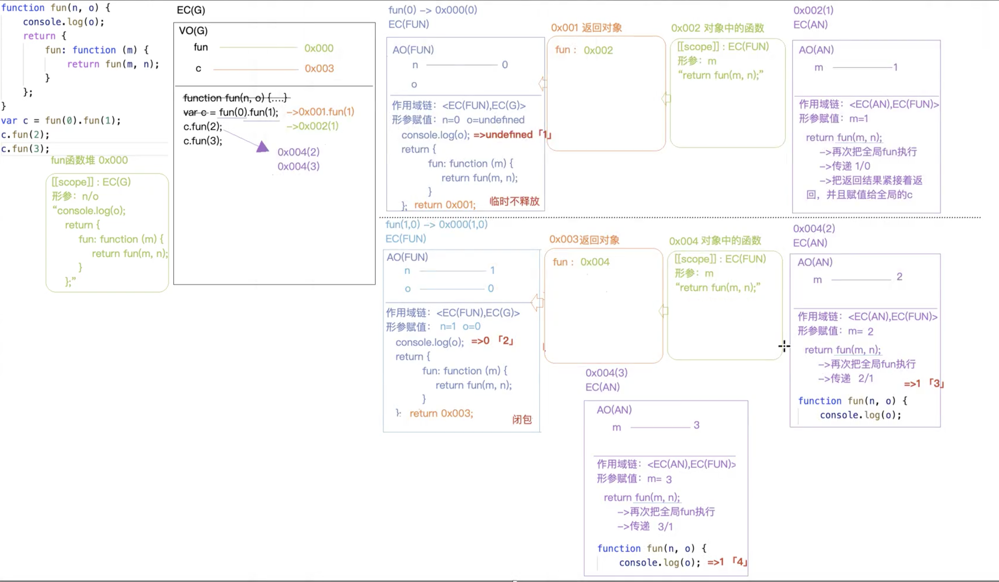
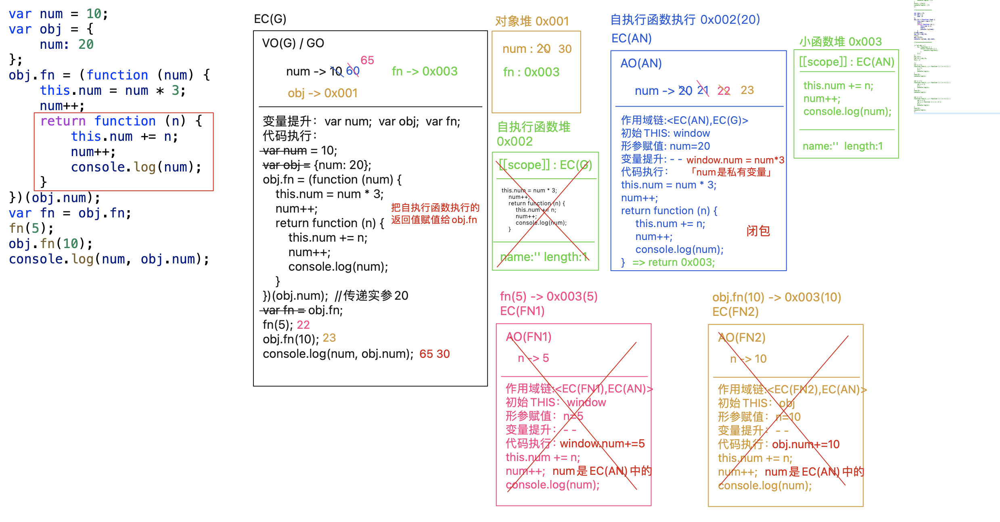
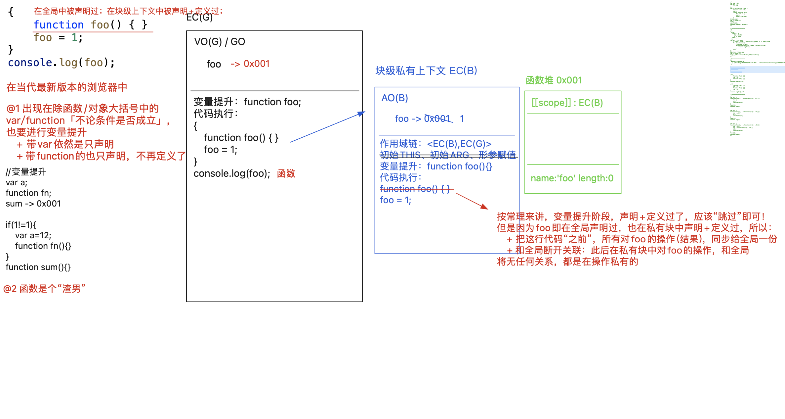
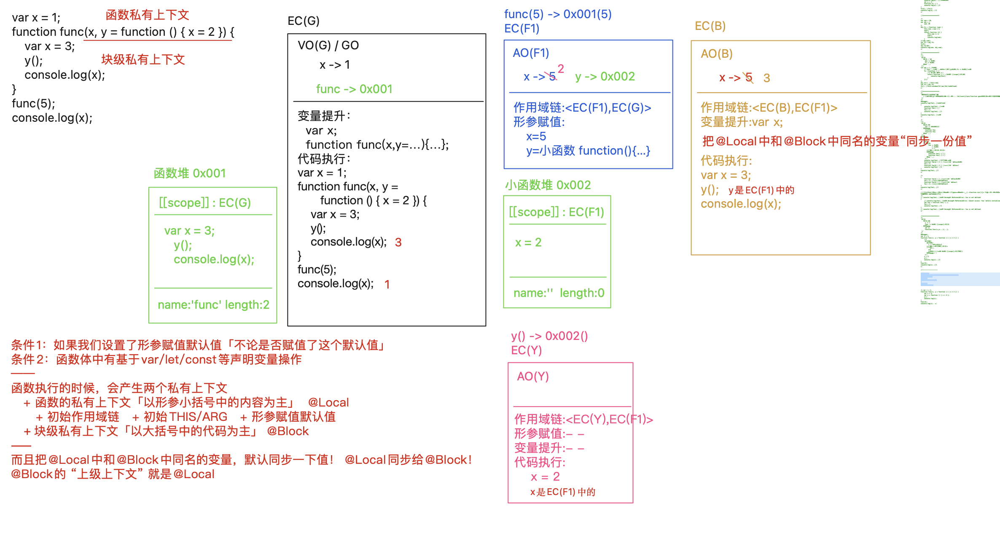

## 函数底层运行机制

+ 在当前上下文（全局上下文/私有上下文/块级上下文），js代码自上而下执行，首先会把带var和function关键字进行变量提升；
带var的只是提前声明，并没有赋值定义；但是带function关键字的是提前声明+赋值（定义）；基于let/const声明的变量不具备这个机制

+ 函数的底层运行机制：
    + 创建函数：声明函数+赋值
        1. 在Heap堆内存中分配一块空间【16进制的内存地址】
        2. 除了存储一些键值对（和对象一样），还做了很多其他的事情：
            1. 声明了函数的作用域[[scope]],作用域的值是当前创建函数时所在的上下文
            2. 把函数体中的代码当做字符串存储到堆内存中
            3. 和对象一样，存储一些键值对【静态私有属性和方法】
        3. 把内存地址赋值给对应的变量【函数名】
    + 执行函数
        1. 形成私有上下文【EC(x)】供后期函数体中的代码执行
            1. 在私有上下文中，有一个后期存储当前上下文中变量的地方【私有变量对象AO】（AO是VO的分支，在函数体，变量对象是AO）
            2. 进栈执行
        2. 在代码执行之前还处理了一些事情：
            1. 作用域链[[scope-chain]]:<形成自己的上下文，函数的作用域（创建时候声明的）> 
            作用：代码执行的时候遇到一个变量，首先看是否是自己上下文的私有变量AO，如果是自己的，接下来对变量的操作和外界没有关系；
            如果不是自己私有的，则继续按照作用域链，查找是否为其上下文中的，如果一直没有，找到EC(G)就结束
            2. 初始化this指向
            3. 初始化arguments【实参集合】
            4. 形参赋值：形参变量也是当前上下文中中的私有对象，要存储到AO中
            5. 变量提升
        3. 代码执行
        4. 一般情况下，代码执行完，当前形成的上下文会出栈释放，以此来优化内存空间
 
 + 例题1：
 
   
+ 函数不论在哪执行，他的上级上下文一定是他的作用域，而作用域是和函数在哪创建有关系，所以无论函数在哪执行，遇到变量不是自己私有的，都会按照作用域链查找上级上下文，
  也只和在哪创建有关系，和在哪执行是没有关系的
+ 每一次函数执行都会形成全新的私有上下文，和之前执行形成的上下文没有必然联系


+ 内存释放（优化）
    + 堆内存： 看当前的堆内存地址是否被其事务（变量事件绑定）所占用，如果被占用不能释放（因为一旦被释放，以后别的东西基于这个地址就找不到堆了），
    如果没有被占用则释放
    + 栈内存（执行上下文）：
        + 全局上下文： 只有在页面被关闭才会被释放
        + 函数执行形成的私有上下文： 一般情况下，在函数代码执行完毕后，私有上下文会自动出栈释放；
          但是有特殊情况无法出栈（当前上下文中的某些内容被上下文以外的事务占用）
          
+ 例题2：

  

+ 函数执行会形成一个私有的上下文：
    + 保护作用：保护私有上下文的私有变量不受外界干扰【防止全局变量污染】（闭包的第一个用途是使我们在函数外部能够访问到函数内部的变量。通过使用闭包，可以通过在外部调用闭包函数，从而在外部访问到函数内部的变量，可以使用这种方法来创建私有变量。）
    + 保存作用：一旦当前上下文不被释放，上下文中的变量及其值都会被保存起来,供其下级上下文调取使用（闭包的另一个用途是使已经运行结束的函数上下文中的变量对象继续留在内存中，因为闭包函数保留了这个变量对象的引用，所以这个变量对象不会被回收。）
+ 我们把函数执行产生的两大作用称为闭包机制（市面上一般认为只有不被释放的上下文才算闭包）

````
作业题
2
var a = 4;
function b(x, y, a) {
    console.log(a); // 3
    arguments[2] = 10;
    console.log(a); // 10 -> 在js非严格模式下 初始化arguments和形参赋值后,会让arguments中的每一项和形参变量建立关联关系，后面一个改另一个也改
}
a = b(1, 2, 3);
console.log(a); // undefined

3
var a = 9;
function fn() {
    a = 0;
    return function (b) {
        return b + a++;
    }
}
var f = fn();
console.log(f(5));// 5
console.log(fn()(5)); // 5   先执行fn() 返回匿名函数（此时匿名函数临时不被释放 因为还需要被使用 使用完则被释放）
console.log(f(5)); // 6
console.log(a); // 2


6
var x = 5,
    y = 6; -> 等同 var x =5; var y = 6;但如果是 var x=y=10;则是 y=10;var x=10; y是不带var的
function func() { 
    x += y;
    func = function (y) { 
        console.log(y + (--x)); 
    };
    console.log(x, y);
}
func(4); // 11 6 这里不释放闭包 因为有匿名函数赋值给了全局变量func
func(3); // 13
console.log(x, y); // 10 6

10 下面代码输出的结果是多少，为什么？如何改造一下，就能让其输出 20 10？
var b = 10;
(function b() {
    b = 20; -> 修改无效
    console.log(b); // function b() { b = 20;console.log(b);}
})();
console.log(b); // 10

改成
var b = 10;
(function b() {
    var b = 20;
    console.log(b);
})();
console.log(b);
解析：
匿名函数具名化：原本应该是匿名函数 但是设置了名字
和正式的具名函数还是有很大区别的
1. 具名化的名字不允许在所处的上下文中使用【不能在外部使用】，因为所处的上下文不会声明这个变量
2. 但是可以在函数内部使用 相当于在函数私有上下文AO中声明一个b变量，赋值为当前函数
3. 直接修改这个函数名字的值是不生效的
4. 这个函数名字的值默认是函数本身，优先级比较低，但凡在函数中使用let/const/var/function重新声明过这个b，以重新声明的为主


7 闭包作用域套娃题
function fun(n, o) {
    console.log(o);
    return {
        fun: function (m) {
            return fun(m, n);
        }
    };
}
var c = fun(0).fun(1); // undefined // 0
c.fun(2); // 1
c.fun(3); // 1
解析如下：
````



````
console.log(foo); // undefined
{
    console.log(foo); // 函数
    function foo(){}
    foo = 1;
    console.log(foo); // 1
}
console.log(foo); // 函数


====================================


VO(G)/GO
    foo -> (函数2) -> 1
  变量提升
    function foo
    function foo

{
    EC()
        foo -> 函数1 -> 函数2 -> 1
    变量提升
        function foo
        function foo
    
    console.log(foo); // 函数2
    function foo() { 函数1 } =》 让全局的foo=函数2
    foo = 1;
    function foo() { 函数2 } =》 让全局的foo=1
    console.log(foo); // 1
}
console.log(foo); // 1


=================================================


var x = 1;
function func (x, y = function() { x=2 }){
    EC(Func)
      AO(func)
        x = (5) -> (3) -> (2)
      形参赋值
        x = 5
        y = function

    x = 3;
    y();
    console.log(x); // 2
}
func(5);
console.log(x); // 1

------------------------------

// 
函数一旦设定形参赋值默认值（无论是否生效），并且函数体中有基于let/const/var声明的变量（无论是别的变量还是跟形参相同的变量；let/const不允许重复声明），都会产生一种新的机制：
函数执行产生私有上下文A【作用域链、初始this、初始arguments、形参赋值】，接下来会把函数体处理，抛离开上下文A，形成一个全新的块级私有上下文B来进行处理（B的上级上下文是A）

var x = 1;
function func(x, y = function(){x = 2})  {
    console.log(x); // 5 -> 如果函数体中声明的变量和形参一致，则在块级上下文B的开始会把形参的值同步给这个变量
    var x = 3; 
    y(); // 执行的是上级上下文中的y
    console.log(x); // 3
}
func(5);
console.log(x); // 1

````



+ 如何回答闭包才能吊打面试官（拒绝背书式回答，用故事润色）
    1. stack、heap、ec、vo、ao、go、scope、scope-chain
    2. 浏览器垃圾回收机制：标记清除、引用计数
    3. 实际应用及优缺点
    4. 进阶：单例模式、惰性函数、柯里化函数、compose组合函数
    5. 再进阶：手撕源码（jQuery、lodash）
    6. 集大成：插件组件封装
    
+ 不用展开太细；引导面试官；剧本精神
````
闭包就是函数运行时候的一种机制。我们函数中的代码执行的时候是在内存中执行的，内存中有栈内存和堆内存；栈内存用来创建上下文，让代码进来执行，形成环境区分...堆内存用来存对象类型的...
函数进栈执行，一般情况下执行完会被出栈释放，但是有些情况不会被出栈释放，比方说他某些东西被上下文以外的东西占用了就不会出栈释放，这也是由于浏览器的垃圾回收机制所导致的。
这样不被释放的话我们之前存的那些变量也就不会被释放了，这样也就产生了一个闭包的机制，这样那些存下来的变量的值也可以供其下级上下文通过作用域链调取使用。
我个人觉得闭包在。。。使用场景还是挺多的。
因为他不被释放，所以栈内存空间会越来越大，这样对代码运行性能会有影响，所以我认为闭包不能被滥用。
然后我研究过发现很多框架组件的源码中也很多利用到了闭包的机制，包括模块化开发的单例模式、用柯里化函数来进行预存储。
像lodash源码里面也很多利用到闭包的机制。我看了一些源码之后发现这些源码的思想很不错，然后在平时的工作中为了让团队提高效率，所以写了一些公共的方法库，然后把一些功能封装成插件组件，里面利用到闭包的也不少。
````

+ 单例模式
    + 每一个对象都是一个单独的内存空间，我们把描述同一件事务的属性和方法都存储到这个空间中：避免全局污染，而且可以实现相互之间的引用 => 最简单的单例模式
        1. 每一个对象都是Object这个类的单独实例
        2. 每一个对象都是一个堆内存空间，储存自己的私有键值对【私有化】
        3. person1/2除了被称为对象名，也可以成为命名空间nameSpace
        4. 后面可以基于命名空间，访问到指定空间的内容【相互引用】
        ````
          let person1 = {
            name: 'a',
            age: 12,
            fn() {}
          };
          let person2 = {
            name: 'b',
            age: 10,
            handle() {
                person1.fn()
            }
          }
        ````
    + 闭包+单例=高级单例模式
        + 在JavaScript中，没有支持声明私有变量，但我们可以使用闭包来模拟私有方法
    ````
      let AModule = (function() {
        let name = 'a';
        let age = 12;
        const sum = function() {};
        const fn = function() {};
        // 基于return的方式，将当前模块需要给其他模块使用的内容暴露出去
        return {
            sum
        };
      })()
      let BModule = (function() {
        const fn = function() {
            AModule.sum()
        }
        return {
            fn
        }
      })()
    ````
    ````
      var Counter = (function() {
      var privateCounter = 0;
      function changeBy(val) {
        privateCounter += val;
      }
      return {
        increment: function() {
          changeBy(1);
        },
        decrement: function() {
          changeBy(-1);
        },
        value: function() {
          return privateCounter;
        }
      }
    })();
    
    var Counter1 = makeCounter();
    var Counter2 = makeCounter();
    console.log(Counter1.value()); /* logs 0 */
    Counter1.increment();
    Counter1.increment();
    console.log(Counter1.value()); /* logs 2 */
    Counter1.decrement();
    console.log(Counter1.value()); /* logs 1 */
    console.log(Counter2.value()); /* logs 0 */

    两个计数器 Counter1 和 Counter2 是维护它们各自的独立性的，每次调用其中一个计数器时，通过改变这个变量的值，会改变这个闭包的词法环境，不会影响另一个闭包中的变量
    ````
    + AMD require.js
    + CommonJS(Node)
    + CMD (适配到浏览器的CommonJs)
    + ES6Module

+ 惰性函数
    + 惰性函数的本质就是函数重写。所谓惰性载入，指函数执行的分支只会发生一次，有两种实现惰性载入的方式
    1. 第一种是在函数被调用时，再处理函数。函数在第一次调用时，该函数会被覆盖为另外一个按合适方式执行的函数，这样任何对原函数的调用都不用再经过执行的分支了。
       在这个惰性载入的addEvent()中，if语句的每个分支都会为addEvent变量赋值，有效覆盖了原函数。
       最后一步便是调用了新赋函数。下一次调用addEvent()时，便会直接调用新赋值的函数，这样就不用再执行if语句了
    ````
      function addEvent(type, element, fun) {
        if (element.addEventListener) {
            addEvent = function (type, element, fun) {
                element.addEventListener(type, fun, false);
            }
        }
        else if(element.attachEvent){
            addEvent = function (type, element, fun) {
                element.attachEvent('on' + type, fun);
            }
        }
        else{
            addEvent = function (type, element, fun) {
                element['on' + type] = fun;
            }
        }
        return addEvent(type, element, fun);
    }
    ````
    2. 第二种是声明函数时就指定适当的函数。把嗅探浏览器的操作提前到代码加载的时候，在代码加载的时候就立刻进行一次判断，以便让addEvent返回一个包裹了正确逻辑的函数
    ````
      var addEvent = (function () {
        if (document.addEventListener) {
            return function (type, element, fun) {
                element.addEventListener(type, fun, false);
            }
        }
        else if (document.attachEvent) {
            return function (type, element, fun) {
                element.attachEvent('on' + type, fun);
            }
        }
        else {
            return function (type, element, fun) {
                element['on' + type] = fun;
            }
        }
    })();
    ````

+ 函数柯理化
    + 柯里化的目的在于避免频繁调用具有相同参数函数的同时，又能够轻松的重用
    + 利用闭包的“保存”作用，我们可以把一些信息预先存储起来「预处理」，供其下级上下文中后期拿来使用，我们把这种预先存储/预先处理的机制称之为“函数柯理化”
    ````
    // 假设我们有一个求长方形面积的函数
    function getArea(width, height) {
    return width * height
    }
    // 如果我们碰到的长方形的宽老是10
    const area1 = getArea(10, 20)
    const area2 = getArea(10, 30)
    const area3 = getArea(10, 40)
    
    // 我们可以使用闭包柯里化这个计算面积的函数
    function getArea(width) {
    return height => {
    return width * height
    }
    }
    
    const getTenWidthArea = getArea(10)
    // 之后碰到宽度为10的长方形就可以这样计算面积
    const area1 = getTenWidthArea(20)
    
    // 而且如果遇到宽度偶尔变化也可以轻松复用
    const getTwentyWidthArea = getArea(20)
    ````
    ````
    let res = fn(1, 2)(3);
    console.log(res); //=>6
    题目： 实现fn()
  
    const fn = function fn(...params) {
    // 基于ES6剩余运算符获取传递的实参集合「数组集合」
    // 基于arguments获取「类数组集合」
        return function proxy(...args) {
            params = params.concat(args);
            // 数组求和
            return params.reduce((result, item) => result + item);
        };
    };
    ````
    ````
    let add = curring();
    let res = add(1)(2)(3);
    console.log(res); //->6
    
    add = curring();
    res = add(1, 2, 3)(4);
    console.log(res); //->10
    
    add = curring();
    res = add(1)(2)(3)(4)(5);
    console.log(res); //->15
    题目： 实现curring()
  
  
    function curring() {
        // 在闭包中创建一个params集合，用来存储每一次add执行传递进来的实参值
        let list = [];
        const add = function (...args) {
            list = [...list, ...args];
            return add;
        }
        // 基于重构转换为字符串的步骤，我们实现最后的求和操作
        add[valueOf] = function () {
            return list.reduct(function (result, item) => result + item)
        }
        return add;
    }
  
    // 不论是alert还是console.log，再输出函数的时候，都是要把函数转换为字符串，然后再输出，只不过表现形式不同
    //   @1 首先调用 Symbol.toPrimitive 获取原始值，如果不存在这个属性
    //   @2 再调用 valueOf 获取原始值，如果获取的不是原始值
    //   @3 再调用 toString 获取字符串
    //   @4 如果最后想要的是数字，则再Number一下
    ````
+ 函数组合
    + 在函数式编程当中有一个很重要的概念就是函数组合， 实际上就是把处理数据的函数像管道一样连接起来， 然后让数据穿过管道得到最终的结果
    ````
    const add1 = x => x + 1;
    const mul3 = x => x * 3;
    const div2 = x => x / 2;
    div2(mul3(add1(add1(0)))); //=>3
    
    而这样的写法可读性明显太差了，我们可以构建一个compose函数，它接受任意多个函数作为参数（这些函数都只接受一个参数），然后compose返回的也是一个函数，达到以下的效果：
    const operate = compose(div2, mul3, add1, add1)
    operate(0) //=>相当于div2(mul3(add1(add1(0))))
    operate(2) //=>相当于div2(mul3(add1(add1(2))))
    
    简而言之：compose可以把类似于f(g(h(x)))这种写法简化成compose(f, g, h)(x)，请你完成 compose函数的编写
    
    function compose (...args) {
        let length = args.length;
        if (length === 0) return x => x;
        if (length === 1) return args[0];
        return function (x) {
            return args.reduceRight((result, func) => {
                return func(result)
            }, x)
        }
    }
    ````
  
  