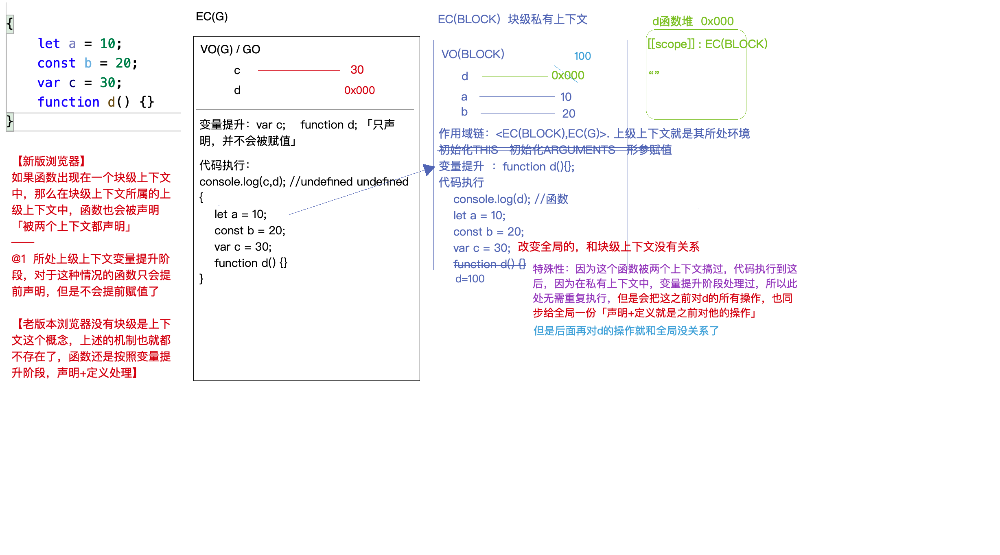
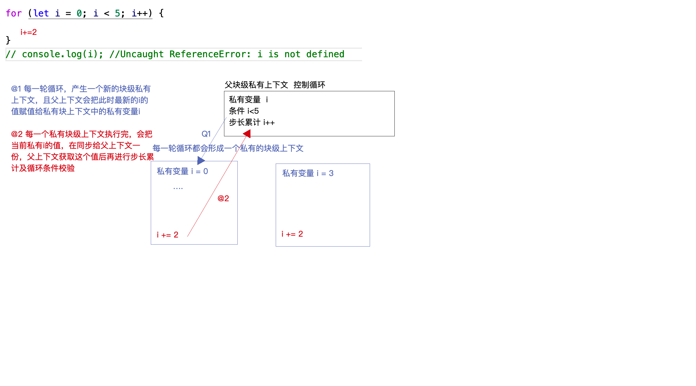

+ 在除函数/对象之外的大括号中，如果出现let/const/function这些关键字,那么当前大括号所处的代码块就会产生一个块级上下文;
  在此上下文中，基于let/const/function声明的变量都是私有变量；特殊性：function在当前上下文和其上级上下文中都会被声明，
  基于var声明的变量既不会产生块级上下文也不受块级上下文影响
  
+ 在块级上下文中 function就和let/const类似 不允许被重复声明
  

````
console.log(c, d); // undefined undefined
{
    console.log(d); // 函数
    let a = 10;
    const b = 20;
    var c = 30;
    function d() {}
    d = 100;
    console.log(a, b, c, d); // 10 20 30 100
}
console.log(c, d); // 30 函数
console.log(a, b); // 报错 a is not defined

````



````
for (let i = 0; i < 5; i++) { // 父块级私有上下文
    i += 2;     // 每轮形成私有块级上下文
}
````


+ const 
    + 基于const声明的变量不允许指针重新指向
    ````
    const a = { // a -> 0x001
      name: 'tozlam'
    }
    a.name = 'zijian' // 这样是可以的
  ````
  

+ let & const & var 
    + 变量提升 var存在变量提升 let不存在这个机制
    ````
       console.log(n); // undefined
       console.log(m); // 报错
       var n = 10;
       let m = 20;
    ````
    + 和全局GO的关系 全局上下文中，let声明的变量存储到VO(G)中，基于var的存储到GO中
    ````
    var n = 10;
    let m = 20;
    console.log(window.n, window.m); // 10, undefined -> GO中查找
   ````
    + 重复声明 在相同的上下文中，var可以重复声明一个变量 但是let不允许【不论之前基于何种方式在当前上下文中声明过变量，则不允许在用let/const重复声明】
    ````
    // Uncaught SyntaxError: Identifier 'n' has already been declared -> 在所有代码还没执行之前就报错了
  【在词法分析阶段就已经分析出语法错误：重复声明了】
    console.log(n);
    var n = 10;
    let n = 20;
    ````
   + 块级上下文
   + 暂时性死区
    
````
for(var i = 0; i < 5; i++) {
    setTimeout(() => {
        console.log(i); // 5 5 5 5 5
    }, 0);
}
1. 循环中的i是全局上下文的
2. 定时器是异步的
3. 循环结束(此时i = 5)，设置了5个定时器,到时间后分别把五个定时器触发执行
4. 定时器中的回调函数执行，形成私有上下文，遇到i不是私有变量，是全局的，此时i是5

解决方法：闭包（let/自己写闭包/setTimeout第三个参数）
1. 
for(let i = 0; i < 5; i++) { 
// 每一次循环产生一个私有的块级上下文
// 每一个块级上下文中都有一个私有变量i
    setTimeout(() => {
        console.log(i); 
    }, 0);
}
2.
for(var i = 0; i < 5; i++) {
    // 自己在每一轮循环构建私有上下文[闭包]
    (function(i){
     // i私有变量
     setTimeout(() => {
        console.log(i);
    }, 0);
    })(i) // 把每一轮循环的i作为实参传递给私有上下文中的i
}
3.
for(var i = 0; i < 5; i++) {
    setTimeout(() => {
        console.log(i); // 5 5 5 5 5
    }, 0, i); // 定时器第三个参数是传递给定时器回调的形成的值【定时器内部也是按照闭包机制处理的：把每一次传递的值预先存储起来，后期定时器执行再取出使用】
}
````