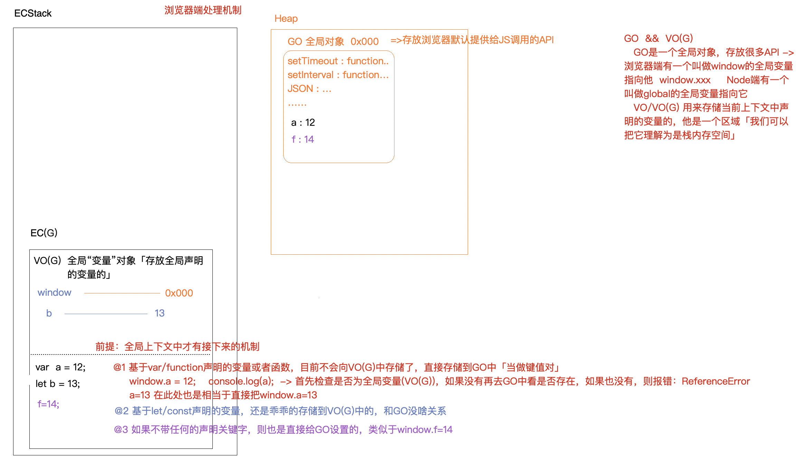

## 堆 栈 数组

- EC「Execution Context」 上下文
- GO 全局对象
      
      GO是一个全局对象，存放很多API -> 浏览器端有一个叫做window的全局变量指向他  window.xxx     
      Node端有一个叫做global的全局变量指向它

- VO 变量对象

    VO/VO(G) 用来存储当前上下文中声明的变量的，他是一个区域「我们可以把它理解为是栈内存空间」
    
-  

````
var a = {
    n: 1
};
var b = a;
a.x = a = {
    n: 2
};
console.log(a.x); // undefined -> 访问对象中的某个成员，如果不存在不会报错，但是结果是undefined
console.log(b); // {n: 1, x: {n: 2}}

a.x 成员访问 优先级最高
正常从右到左

a = b = 12
创建12
b = 12
a = 12

a.x = a = 12
创建12
a.x = 12
a = 12
````
- 


### 数组
数组是特殊对象 
特殊：对象的键（属性名）不能是一个对象类型 如果是一个对象则会转换为字符串类型(toString)作为属性名

````
eg1:
let obj = {
    [{name: 10}]: 2 -> "[object, object]: 2"
}

eg2:
let a = {c: 1}
let b = {d: 2}
let obj = {
    [a]: 10
}
obj[b] = 20
console.log(obj) -> {"[object, object]": 20}
````

- 

### 栈
先进后出

````
面试题：实现十进制转二进制

class Stack() {
    container = [];
    enter(ele) {
        this.container.unshift(ele)
    }
    leave(ele) {
        this.container.shift()
    }
    size() {
        return this.container.length
    }
    value() {
        // 获取栈的内容 slice实现浅拷贝 目的是保证外部接收到的内容再操作的时候不会直接影响到container
        return this.container.slice()
    }
}

function decimal2binary(decimal) {
    if (decimal === 0) return 0;
    let negative = decimal < 0;
    decimal = Math.abs(decimal);
    
    let merchant = Math.floor(decimal / 2),
        remainer = decimal % 2,
        sk = new Stack;
    sk.enter(remainer);
    
    while(merchant > 0) {
        remainer = merchant % 2;
        sk.enter(remainer);
        merchant = Math.floor(merchant / 2);
    }
    
    return `${negative? '-' : ''}${sk.value().join('')}`;
}
````