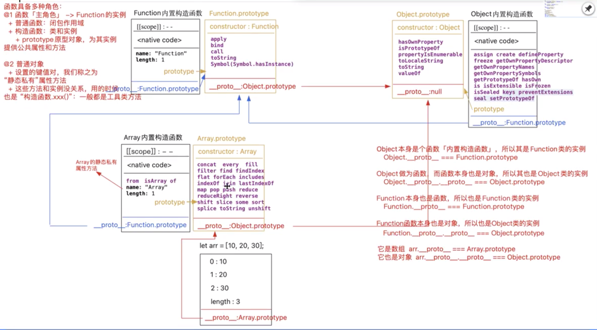
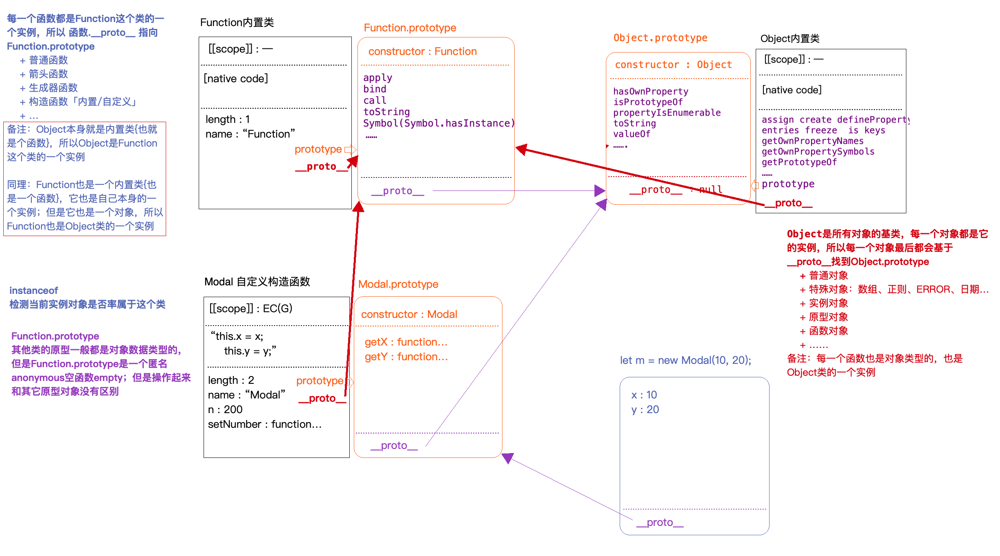
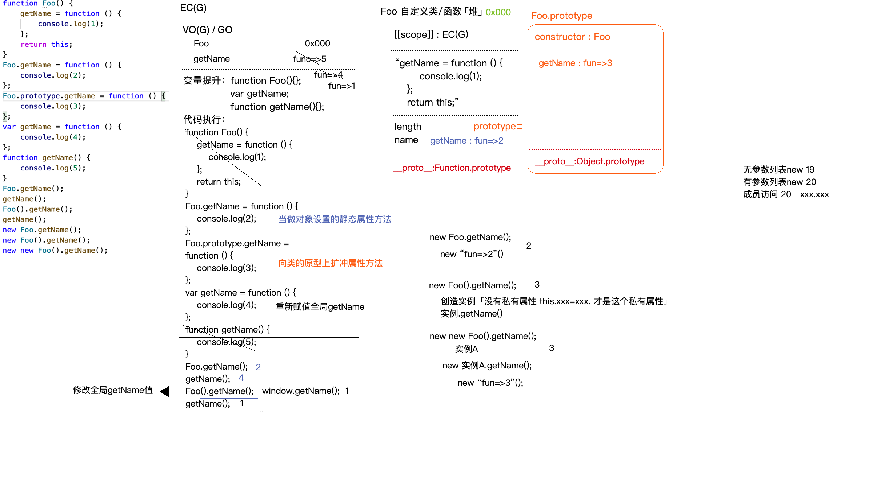

# 面向对象
+ 面向对象是一种强大的、非常方便的、用来构建和管理整个知识体系的思想
+ 具象化：
    + 类
    + 实例：
        + 每个实例都有私有的属性和方法
        + 每个实例也具备赋予他们的公共的属性和方法【公有化】

JS语言本身就是基于类和实例构建和组成的 =>内置类
数据类型所属的类
Number  每一个number类型的值都是这个类的一个实例
String
Boolean
Symbol
BigInt
Object 每一个对象都是Object类的实例
+ Object
+ Array
+ RegExp
+ Date
+ Error
+ Function
.....

 DOM元素/集合所属的类

 box元素对象 -> HTMLDivElement
-> HTMLParagraphElement  -> HTMLElement -> Element -> Node -> EventTarget -> Object
-> ...

document文档对象 -> HTMLDocument -> Document -> Node ...

节点集合 -> NodeList -> Object
...

每一个元素标签对象基本都有自己所属的类


````
1.下面代码输出结果是什么？为啥？
let obj = {
    2: 3,   // 1
    3: 4,   // 2
    length: 2,  // 4
    // 把需要借用的方法当做赋值 赋值给对象的私有属性push，后期基于obj.push其实就是调用Array.prototype.push方法执行
    push: Array.prototype.push
}
obj.push(1); -> obj[2] = 1;obj.length++;
obj.push(2); -> obj[3] = 2;obj.length++;
console.log(obj); 

正常情况下，只有数组才能使用push方法（数组才是Array类的实例），其余的像类数组、普通对象是无法调取这个方法的（基于__proto__找不到Array.prototype.push）

push机制：
Array.prtotype.push = function push(item) {
    // 向末尾新增一项
    this[this.length] = item;
    this.length ++;
    return this.length;
}

鸭子类型：数组中的方法大部分都可以被类数组借用「直接赋值私有属性 & call改变this」：因为类数组结构和数组结构很相似，操作数组的代码，同样也能操作类数组
2. let utils = (function(){
   
    function toArray(){
      // 把类数组集合变为数组集合
      // @1 return [...arguments];
      // @2 return Array.from(arguments);
      // @3 循环
      // @4 数组中的方法大部分都可以被类数组借用「直接赋值私有属性 & call改变this」：
         因为类数组结构和数组结构很相似，操作数组的代码，同样也能操作类数组
         -> 数组截取 
            arr.slice(n, m) -> 返回一个全新的数组
            arr.slice(n) 从n截取到末尾
            arr.slice(0) 或者 arr.slice() 数组的浅克隆
                 -> arguments.slice = Array.prototype.slice;
                    return arguments.slice;
                 -> return [].slice.call(arguments)
    }
    return {
        toArray
    };
})();
let ary = utils.toArray(10,20,30); //=>[10,20,30]
ary = utils.toArray('A',10,20,30); //=>['A',10,20,30]


````

 ======
 
+ prototype和__proto__
    + 大部分函数都具有prototype(原型对象/显式原型)属性，属性值本身是一个对象(浏览器会默认为其开辟一个堆内存，用来存储实例可调用的属性和方法)；
    在prototype中有一个默认的属性constructor(构造函数)，属性值是当前函数本身。
      + 不具备prototype的函数： 箭头函数、基于ES6给对象某个成员赋值函数值的快捷函数 （const fn = () => {}； let obj = {sum() {}}）
    + 每一个对象数据类型的值都具备一个属性__proto__(原型链/隐式原型)，属性值指向自己所属类的原型prototype
        + 实例.__proto__ === 所属类.prototype

+ Object 对象直接继承自 Function 对象
+ Function对象的__proto__会指向自己的原型对象，最终还是继承自Object对象

每个对象都有 __proto__ 属性，此属性指向该对象的构造函数的原型。
对象可以通过 __proto__ 与上游的构造函数的原型对象连接起来，⽽上游的原型对象也有⼀个 __proto__ ，这样就形成了原型链。

````
function Fn() {
    this.x = 100;
    this.y = 200;
    this.getX = function () {
        console.log(this.x);
    }
}
Fn.prototype.getX = function () {
    console.log(this.x);
};
Fn.prototype.getY = function () {
    console.log(this.y);
};
let f1 = new Fn;
let f2 = new Fn;
console.log(f1.getX === f2.getX); // false
console.log(f1.getY === f2.getY); // true
console.log(f1.__proto__.getY === Fn.prototype.getY); // true
console.log(f1.__proto__.getX === f2.getX); // false
console.log(f1.getX === Fn.prototype.getX); // false
console.log(f1.constructor); // Fn()
console.log(Fn.prototype.__proto__.constructor);// Object()
f1.getX();// 100
f1.__proto__.getX();// undefined
f2.getY();// 200
Fn.prototype.getY();// undefined
````

````
function C1(name) {
    if (name) {
        this.name = name;
    }
}
function C2(name) {
    this.name = name;
}
function C3(name) {
    this.name = name || 'join';
}
C1.prototype.name = 'Tom';
C2.prototype.name = 'Tom';
C3.prototype.name = 'Tom';
alert((new C1().name) + (new C2().name) + (new C3().name)); // 'Tomundefinedjoin'
````

````
创建值的两种方式：
1. 字面量
2. 构造函数

两种方案创建的结果是不一样的：
字面量方案创造的是标准原始值类型
构造函数方案创造的是当前类的实例（对象数据类型）
但无论如何都是所属类的实例,都可以调用所属类原型上的方法

let n = 10;
let m = new Number(10);
console.log(typeof n) // "number"
console.log(typeof m) // "object"

console.log(m.fixed(2)) // m是标准的实例对象，基于__proto__调用Number.prototype上的方法
console.log(n.fixed(2)) // 进行"装箱"操作 首先会把原始值类型的n变为对象实例类型的(new Number(n))

console.log(n + 10) 
console.log(m + 10) // 进行"拆箱"操作 首先会把m变成原始值类型【Symbol.toPrimitive/valueOf】,再进行计算
````

+ 检测公有和私有对象
    + 检测是否私有对象：Object.prototype.hasOwnProperty
    + in 检测当前对象是否有这个属性（公有或私有）：原理是检测私有属性是否有，没有的话按照原型链一级一级向上查找，直到Object.prototype为止，只要能找到结果就是true
    
````
面试题：检测属性是否是对象的公有属性
思路： 跳过私有的按照原型链查找

方法1：
Object,prototype.hasPubProperty = function (attr) {
    let self = this, proto = Object.getPrototypeOf(self);
    while(proto){
        if (proto.hasOwnPrototype(attr)){
            return true;
        }
        proto = proto.getPrototypeOf(proto);
    }
    return false;
}

方法2：
Object,prototype.hasPubProperty = function (attr) {
    let self = this, proto = Object.getPrototypeOf(self);
    return attr in proto;
}
````

+ for in有很多问题
    1. 循环性能比较差，因为在迭代的时候除了迭代所有私有属性，其原型上的公有属性也会被迭代【前提：能够被迭代的属性都是可枚举的属性（一般内置属性是不可枚举的，自定义属性是可枚举的）】
      所以使用for in循环可以手动去除对公有属性的迭代
     ````
        能不用for in就不用 即时用了也要加上去除公有属性迭代
        for (let key in obj){
          if(!obj.hasOwnProperty(key)) break;
          ...
        }
     ````
    2. 优先迭代所有数字属性名（从小到大），其次才迭代非数字属性名的，与自己编写的属性顺序不完全一致；不能迭代Symbol类型的私有属性
      ````
      Object.keys(obj) 获取obj对象所有非Symbol且可枚举的私有属性
      Object.getOwnPropertyNames(obj) 获取obj对象所有非Symbol的私有属性（包括不可枚举的）
      Object.getOwnPropertySymbol(obj) 获取obj对象所有Symbol类型的私有属性
      ````
       
+ for..of适用遍历数/数组对象/字符串/map/set等拥有迭代器对象的集合.但是不能遍历对象,因为没有迭代器对象.与forEach()不同的是，它可以正确响应break、continue和return语句


````
基于ES6中的CLASS重构下面的代码
// 构造函数体
function Modal(x,y){
    this.x=x;
    this.y=y;
}
// 原型对象上扩展的供其实例使用的公共属性方法 m.z/m.getX/m.getY
Modal.prototype.z=10;
Modal.prototype.getX=function(){
    console.log(this.x);
}
Modal.prototype.getY=function(){
    console.log(this.y);
}
// 把函数当做一个对象，给其设置一个静态私有属性方法（和实例没关系）
Modal.n=200;
Modal.setNumber=function(n){
    this.n=n;
};
let m = new Model(10,20);


class Modal{
    constructor(x, y) {
        this.x = x;
        this.y = y;
    }
    
    // 这样处理也是给实例设置私有属性
    // z = 10;
    // say1 = () => {}
    // say2 = function () {}
    
    // 向类的原型上扩充方法
    // 1. 语法上必须这样写，无法扩充公有属性
    // 2. 扩充的方法是没有prototype的
    // 3. 并且这些方法是不可枚举的属性（ES5中基于类prototype设置的公有方法是可枚举的）
    getX() {}
    getY() {}
    
    // 当做对象 设置静态私有属性
    static n = 200;
    stactc setNumber() {}
}
Modal.prototype.z = 10;
````



````
functionFoo(){
    getName = function () {
       console.log(1);
    };
    return this;
}
Foo.getName = function () { // 当做对象设置的静态属性方法
    console.log(2);
};
Foo.prototype.getName = function () {
    console.log(3);
};
var getName = function () {
    console.log(4);
};
function getName() {
    console.log(5);
}
Foo.getName();// 2
getName();// 4
Foo().getName(); // 1
getName();// 1
// 运算符优先级： 无参数列表new 19  有参数列表new 20  成员访问xxx.xx 20
new Foo.getName(); // 2 -> new "func=>2"
new Foo().getName();// 3 -> new "func=>3"
new new Foo().getName();// 3 -> new 实例.getName() -> new "func=>3"

````


````
function Fn() {
    let a = 1;
    this.a = a;
}
Fn.prototype.say = function () {
    this.a = 2;
}
Fn.prototype = new Fn;
let f1 = new Fn;

Fn.prototype.b = function () {
    this.a = 3;
};
console.log(f1.a); // 1
console.log(f1.prototype); // undefined
console.log(f1.b); // function() {this.a = 3}
console.log(f1.hasOwnProperty('b')); // false
console.log('b' in f1); // true
console.log(f1.constructor == Fn); // true
````
````
function fun() {
    this.a = 0;
    this.b = function () {
        alert(this.a);
    }
}
fun.prototype = {
    b: function () {
        this.a = 20;
        alert(this.a);
    },
    c: function () {
        this.a = 30;
        alert(this.a)
    }
}
var my_fun = new fun();
my_fun.b();// 0
my_fun.c();// 30
````
````
/*
 * 编写queryURLParams方法实现如下的效果（至少两种方案）
 */
let url="http://www.zhufengpeixun.cn/?lx=1&from=wx#video";
console.log(url.queryURLParams("from")); //=>"wx"
console.log(url.queryURLParams("_HASH")); //=>"video"

/*
 * 编写queryURLParams方法实现如下的效果（至少两种方案）
 *   @1 获取URL地址中，问号参数值「或者哈希值」
 *   {
 *      lx:'1',
 *      from:'wx',
 *      _HASH:'video'
 *   }
 * 
 * 课外东西
 *   @2 'lx=1&from=wx'  被叫做 urlencoded 格式字符串「x-www-form-urlencoded」
 *      类库：Qs.stringify/parse 实现urlencoded格式字符串和对象之间的转换
 *      URLSearchParams
 */
 
 方法1：
  String.prototype.queryURLParams = function queryURLParams(attr) {
    // this -> url
    let self = this,
        link = document.createElement('a'),
        obj = {};
    link.href = self;
    let {
        search,
        hash
    } = link;
    if (hash) obj['_HASH'] = hash.substring(1);
    if (search) {
        search = search.substring(1).split('&');
        search.forEach(item => {
            let [key, value] = item.split('=');
            obj[key] = value;
        });
    }
    return typeof attr !== "undefined" ? obj[attr] : obj;
}; 

方法2：
String.prototype.queryURLParams = function queryURLParams(attr) {
    // this -> url
    let self = this,
        obj = {};
    self.replace(/#([^?=&#]+)/g, (_, $1) => obj['_HASH'] = $1);
    self.replace(/([^?=&#]+)=([^?=&#]+)/g, (_, $1, $2) => obj[$1] = $2);
    return typeof attr !== "undefined" ? obj[attr] : obj;
};
````